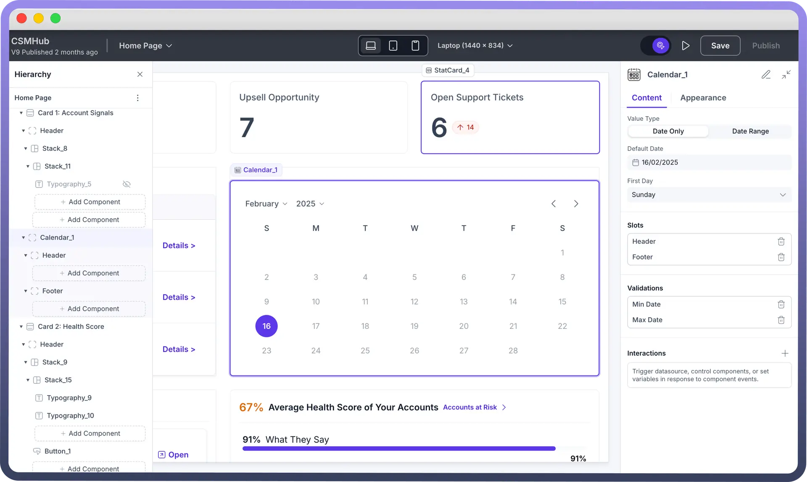
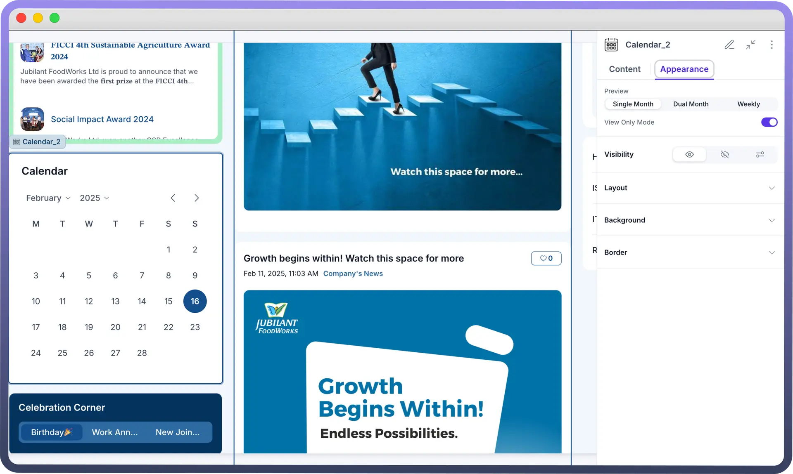

# Calendar

Source: https://www.unifyapps.com/docs/unify-applications/calendar
Section: applications

---

## Overview

The Calendar component is a date-picker widget that allows users to view and select dates in a calendar format. It's essential for applications requiring date selection functionality, such as booking systems, scheduling interfaces, or any form that needs date input. The component offers month-year navigation and a grid-based date display for date selection.

## Configuring Key Properties of Calendar

**Value Types**

Choose between single date or date range selection based on your application needs:

- `Date Only`: Allows selection of a single date
- `Date Range`: Enables selection of a start and end date, creating a date span

**Default Date** 
Configure the initial date selection through the Content tab in MM/DD/YYYY format (e.g., 02/15/2025).

**First Day Settings**

Choose which day starts your week (Sunday/Monday) using the "First Day" dropdown

> **Note:** By default first day is set as Monday.

**Slots Customization**

1. **Header Slot**
  - Default header displays "`Calendar`" text
  - Add custom components via "`Add Component`" in Header section
  - Useful for adding titles, icons, or additional controls
2. **Footer Slot**
  - Optional area below calendar grid
  - Add components through "`Add Component`" in Footer section
  - Ideal for action buttons or supplementary information

**Validation Settings**

Set date constraints by specifying minimum and maximum selectable dates to control user input and ensure date selections fall within allowed ranges.

- `Min Date`: Set earliest selectable date
- `Max Date`: Set latest selectable date

## Interactions

Calendar supports **On Change** events. On Change triggers an action when a date or date range is selected. You can use this functionality to trigger data sources, set variables with the selected date/date range, or execute specific automations based on the date selection.

> **Note:** Enable `View Only` mode to make the calendar non-selectable, useful when you want to display dates without allowing user interaction.

## Appearance

Choose how your calendar is displayed to users with three different view options:

- `Single Month`: Traditional one-month view for basic date selection
- `Dual Month`: Side-by-side view of two consecutive months, ideal for date range selection
- `Weekly`: Compact week-based view for focused scheduling and short-term planning.

> **Note:** You can refer to Appearance Settings documentation to know more about defining Layout for each component.
