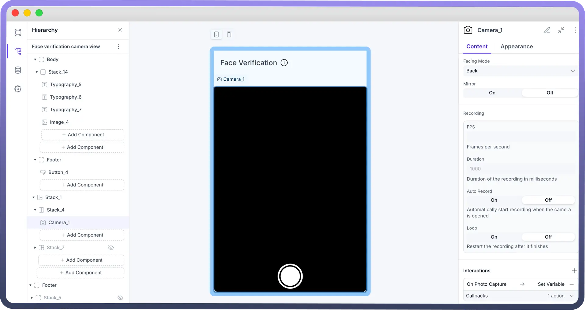
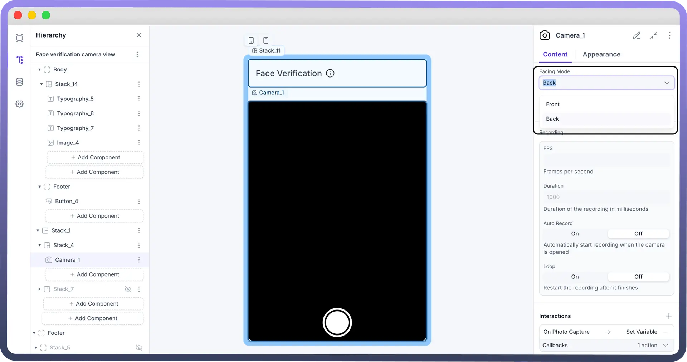
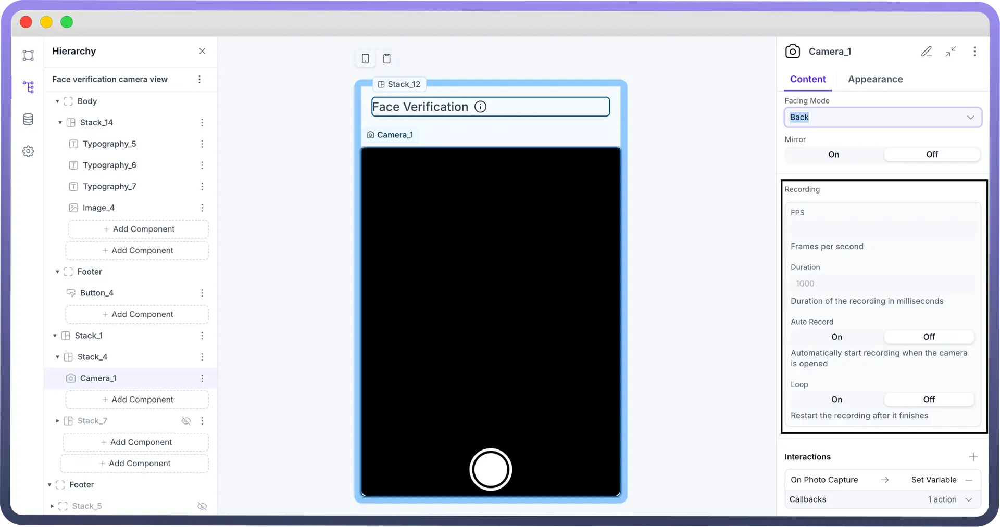
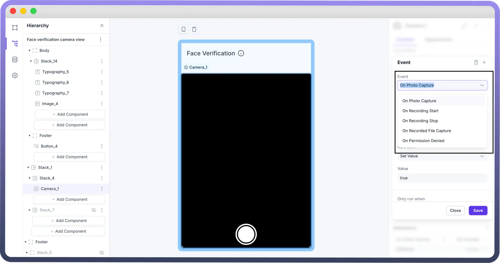
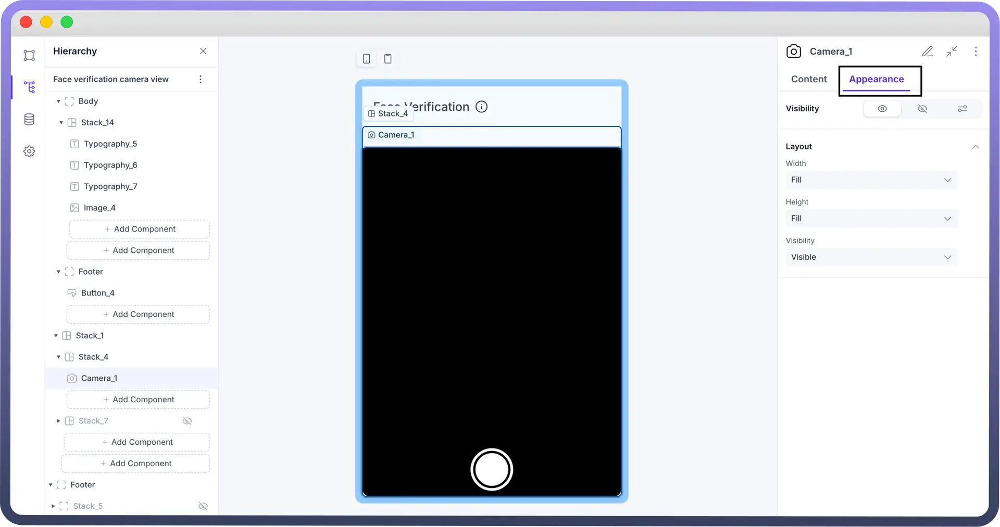

# Camera

Source: https://www.unifyapps.com/docs/unify-applications/camera
Section: applications

---

## Overview

The Camera component allows users to integrate photo and video capture functionality into their applications. It offers configurable options for camera selection, recording behavior, and user experience customization. The Camera component is used in use cases that require identity verification, attendance tracking, document scanning, etc.

## Configuring the Camera  Component

Once the Camera  component is added, you can configure its properties through the right-side configuration panel.

**Facing Mode**

Select whether the camera should default to the `front` or `back` view based on the application's requirements.

**Mirror**

Enable or disable `mirroring` to adjust how the camera feed is displayed, particularly useful for front-facing cameras.

**Recording**

`FPS` (Frames Per Second): Set the desired frame rate for video recording to control video quality

`Duration`: Define the maximum length of each recording session, ensuring consistency and limiting file size as needed.

`Auto-Start Recording`: Enable or disable automatic recording when the camera component is initialized.

`Loop Recording`: Choose whether the recording should automatically restart once it reaches the defined duration, useful for continuous capture scenarios.

## Defining Interactions for Camera Component

The Camera component supports interactions on events like

1. On Photo Capture
2. On Recording Start
3. On Recording Stop
4. On Recording File Capture
5. On Permission Denied **Note:** You can refer to Interaction settings documentation to know more about setting interactions for each component.

  

## Customizing the Appearance

Control the layout or visibility for the camera in the appearance section.

## Best Practices for Camera Component

- **Optimize Defaults:** Set sensible default values for FPS, duration, and auto-start to balance quality and performance.
- **Test Across Devices:** Verify that camera functionality, recording quality, and interactions perform well on different devices and browsers.
