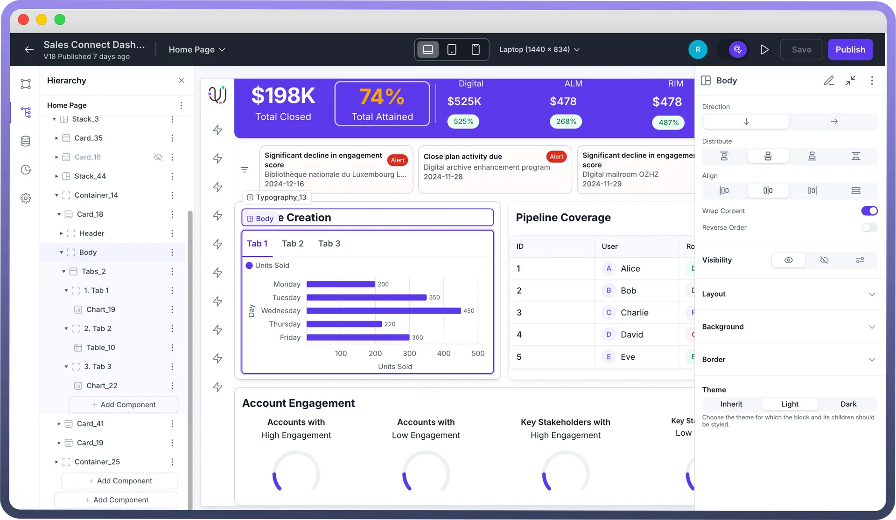

# Card

Source: https://www.unifyapps.com/docs/unify-applications/card
Section: applications

---

## Overview

The Card is used for creating widgets and complex layouts. It consists of 2 main sections: a Header and a Body. The Header appears at the top of the card, while the Body covers the remaining space. We can also add a footer to the card if needed. Additionally, the Card has a border by default, giving it a widget-like appearance.

## Key Properties

- `Header and Body`**:** The Card’s Header and Body work like the Stack component, supporting direction and alignment for precise content organization. **Note:** You can refer to the [Stacks Article](https://www.unifyapps.com/docs/unify-applications/stack) for the same.

  

- `Collapsible`**:** Cards can be made collapsible, so you can choose if they start open or closed.
- `Interactions`**:** Define the interactions that should occur when the card is clicked. Click the "`+`" button under "Interactions" to add a new interaction, such as triggering a data source or navigating to another page & many more. **Note:** You can refer to the [Interactions article](https://www.unifyapps.com/docs/unify-applications/handle-interactions-in-interface) for the same.

## Configuring a Card

- Select the Card component from the list from the left pane of the application.
- By default, the Card includes a Header and Body section, where you can add various components.
- The Card Header comes with a default state which contains a Typography component displaying "`Card title`".
- Customize the "`On Click`" behavior by adding interactions if needed.
- Adjust the Card's appearance and settings to fit your design requirements.

## Appearance and Customization

| Property | Description |
|---|---|
| `Show Divider` | This setting controls the divider line between the Header and Body; toggle it off to hide the line. |
| `Theme` | Specifies the theme styling for the Card and its components, with options typically including Light and Dark. |
| `Background color` | Sets the background color for the Card. Includes a range of color choices to match your design theme. |
| `Border width` | Defines the thickness of the Card’s border. Options typically include none, xs, mg, and xl, etc. |

## Defining Permissions

The Card component allows you to set visibility permissions based on the permissions granted to the logged-in user. This ensures that only authorized users can view or interact with the Card.

## Best Practices

- **Optimize for Readability and Focus:** Use the Card's Header and Body sections to clearly organize information, with the most important details in the Header and supportive content in the Body.
- **Combine with Other Layout Components:** Use Cards in combination with stacks and containers to create more complex and structured layouts.
- **Consistent Spacing:** Utilize the Gap property to ensure consistent spacing between elements, providing a cleaner look.
