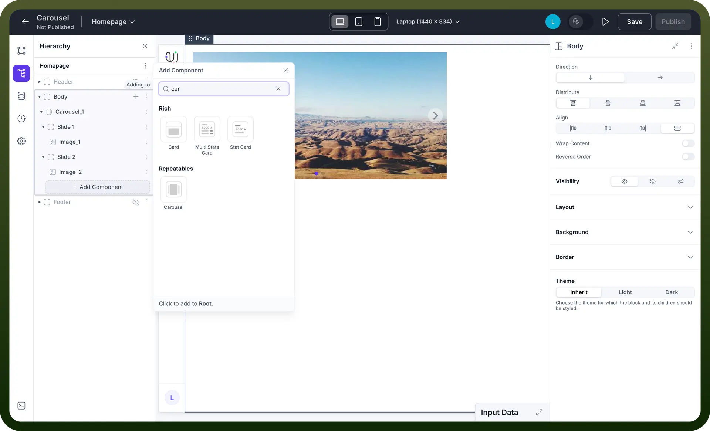
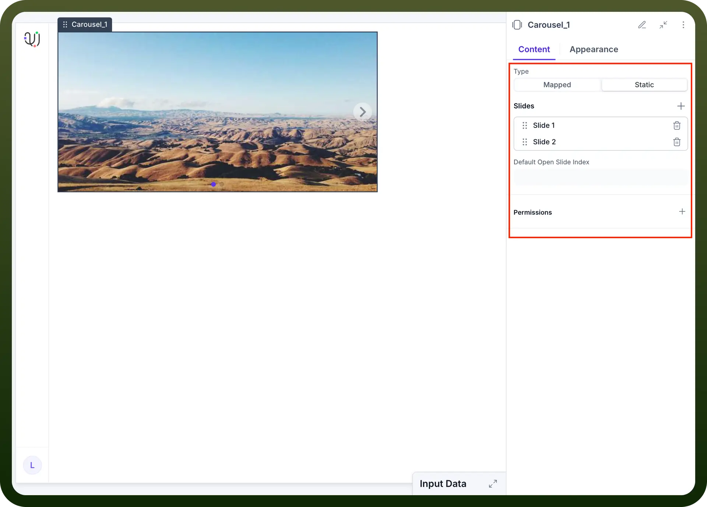
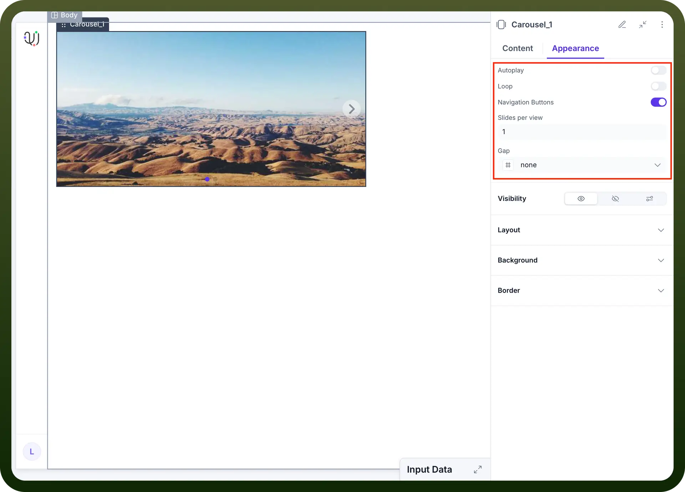
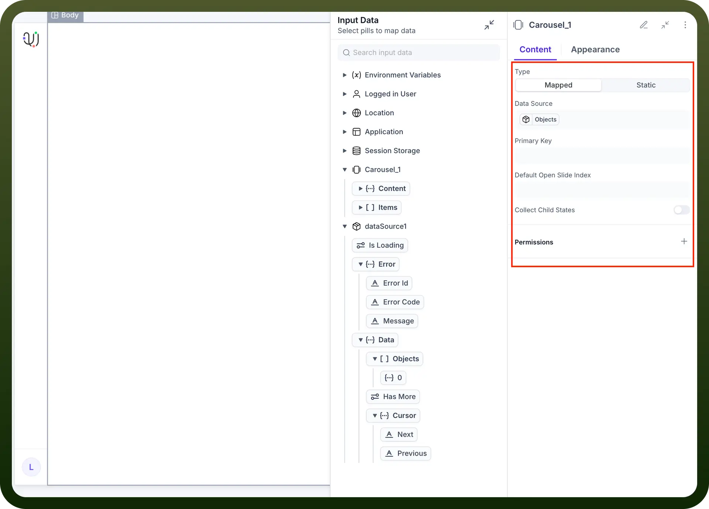

# Carousel component

Source: https://www.unifyapps.com/docs/unify-applications/carousel
Section: applications

---

## Overview

Carousel by UnifyApps delivers a dynamic, interactive slideshow component that enables you to showcase multiple pieces of content in an engaging, space-efficient format. This versatile component allows you to create compelling visual presentations, image galleries, product showcases, and content rotations that capture user attention while maintaining a clean interface design.

## Use Cases

**Product Showcases and E-commerce**: Display multiple product images, features, or variations in a single container, allowing customers to browse through different views seamlessly while maximizing screen real estate.

**Content Highlights and Featured Items**: Rotate through featured articles, testimonials, announcements, or promotional content to keep your interface fresh and draw attention to important information.

**Media Galleries and Portfolios**: Create stunning visual presentations for photography, artwork, case studies, or project portfolios that allow users to explore content at their own pace.

**Dashboard Widgets and Data Visualization**: Present multiple charts, metrics, or data views in a rotating format, perfect for executive dashboards or monitoring interfaces where space is premium.

## Component Configuration

### Carousel Structure

The Carousel component organizes multiple slides into a navigable sequence with smooth transitions and intuitive controls for optimal user experience.

**Key Elements:**

- **Slide Container**: Houses individual slides with content or media
- **Navigation Controls**: Arrow buttons for manual slide navigation
- **Indicator Dots**: Visual markers showing current position and total slides
- **Auto-rotation**: Optional automatic slide progression with configurable timing

### Content Configuration

Configure the slides and media that will be displayed within your Carousel component.

**Content Settings:**

- `Type`: Choose between Mapped (dynamic data-driven) or Static slide configuration
- `Slides`: Add, remove, and organize the sequence of carousel slides
  - Slide 1
  - Slide 2
  - Slide 3

- `Data Source`: Connect to external data for dynamic content population
- `Primary Key`: Define unique identifiers for mapped content
- `Default Slide`: Set which slide should be displayed initially
- `Collect Child States`: Gather interaction data from slide components

## Adding Carousel to Your Application

The Carousel component integrates seamlessly into your application interface and can be configured within any container element.

**Implementation Steps:**

1. Navigate to your application builder interface
2. Select the parent container where you want to add the carousel (e.g., Stack, Body, Section)
3. Click "`Add Component`" and search for "`carousel`"
4. Select the Carousel component from the Repeatables section
5. Configure your carousel content and slides
6. Customize appearance and behavior settings

## Appearance Configuration

Tailor the visual presentation of the Carousel component to align with your application's design language and enhance user engagement.

**Appearance Settings:**

- `Autoplay`: Enable automatic slide progression with customizable intervals
- `Loop`: Allow continuous cycling through slides (seamless transition from last to first)
- `Navigation Buttons`: Toggle visibility of previous/next arrow controls
- `Slides per View`: Configure how many slides are visible simultaneously
- `Gap`: Adjust spacing between slides for optimal visual separation
- `Visibility`: Control when and how the carousel appears to users
- `Layout`: Configure positioning, dimensions, and responsive behavior
- `Background`: Customize backdrop styling and visual treatment
- `Border`: Define edge styling and visual boundaries

**Typical Content Types:**

- High-resolution images and graphics
- Product photography and variations
- Video content and multimedia
- Text-based slides with rich formatting
- Mixed media presentations
- Interactive components and widgets

## Implementation Steps

**Plan Your Content:**

- Identify the type of content to be displayed
- Determine optimal slide count and sequence
- Consider user interaction patterns and navigation preferences
- Plan responsive behavior across different screen sizes

**Add the Carousel Component:**

- Navigate to your application builder
- Select the appropriate parent container
- Add the Carousel component from the Repeatables section

**Configure Content:**

- Add each required slide with appropriate content
- Set up data binding for dynamic content if needed
- Configure slide transitions and timing
- Define navigation and interaction behaviors

**Set Up Navigation:**

- Enable/disable automatic progression
- Configure manual navigation controls
- Set up indicator dots and position markers
- Define loop behavior and slide boundaries

**Customize Appearance:**

- Set slide dimensions and aspect ratios
- Adjust spacing and gap configurations
- Customize navigation button styling
- Configure responsive behavior for different devices

## Data Handling

### Mapped vs. Static Configuration

**Mapped Configuration:**

- Dynamically generate slides based on external data sources
- Perfect for product catalogs, news feeds, or user-generated content
- Automatically updates when source data changes
- Supports conditional slide creation and customization

**Static Configuration:**

- Pre-defined slides with fixed content structure
- Ideal for marketing carousels, feature highlights, or curated showcases
- Simpler to configure for consistent, branded presentations
- Full control over individual slide content and styling

### Slide Interactions

Configure user interactions and system responses for enhanced carousel functionality:

**Common Interactions:**

- **On Slide Change**: Trigger analytics tracking or content loading
- **Data Binding**: Connect slide content to dynamic data sources
- **Conditional Display**: Show/hide slides based on user preferences or data
- **Event Triggering**: Initiate actions when users interact with specific slides
