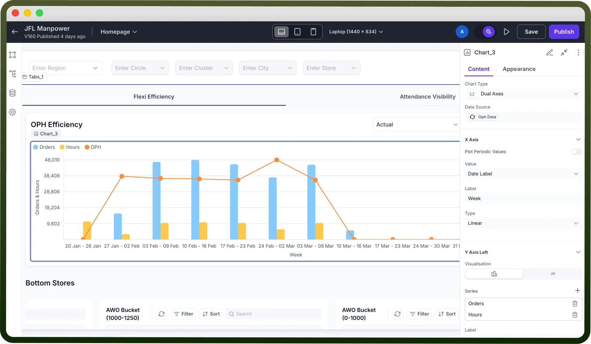

# Chart component

Source: https://www.unifyapps.com/docs/unify-applications/chart
Section: applications

---

## Overview

The **Chart Component** allows users to visually represent data through customizable charts.

This component supports dynamic chart rendering using structured JSON data or by linking the chart to a data source and provides configuration options for both axes, including labels, data grouping, and value formatting. You have the options to select from over 12 different chart types including Bar, Chart, Gauge, Heat Map etc. Ideal for dashboard visualizations, this component helps users quickly turn raw data into meaningful insights. Using charts enables the users to simplify complex datasets and make dashboards more engaging and insightful.

## How to Use?

1. **Add the Chart Component**
  - Select the **Chart** component from the component panel.
2. **Bind Data Source**
  - Link the chart to a data source (API, database table, or static JSON) using the Data Source column.
  - Ensure your data structure includes labels and numeric values as needed for chart rendering
3. **Choose Chart Type**
  - Select from chart types: Bar, Line, Pie, Doughnut, or Column.
  - Choose the most appropriate visualization based on the data’s nature (e.g., use Pie for parts of a whole, Line for trends)
4. **Configure Chart Settings**
  - **X-Axis** and **Y-Axis** fields - Including Value, label, Grouping etc
  - **Color Themes** and **Legends**
  - Customize chart title, axis labels, and tooltip content via the settings panel

### Example

Imagine you are creating a **Sales Dashboard** for regional managers to track performance across zones. The **Chart component** can be used to:

- Display monthly sales trends (Line Chart)
- Compare product category-wise revenue (Bar Chart)
- Visualize region-wise contribution (Pie Chart)

## Best Practices

1. **Select the right chart type**: Match the chart to your data—avoid line charts for categorical data or pie charts for too many slices.
2. **Keep it clean**: Limit data points to avoid visual clutter. Use filters to segment if needed.
3. **Label smartly**: Ensure axis labels and legends are clear and concise.
4. **Use colors with meaning**: Stick to color themes that are accessible and intuitive. Use consistent colors across charts for similar categories.
