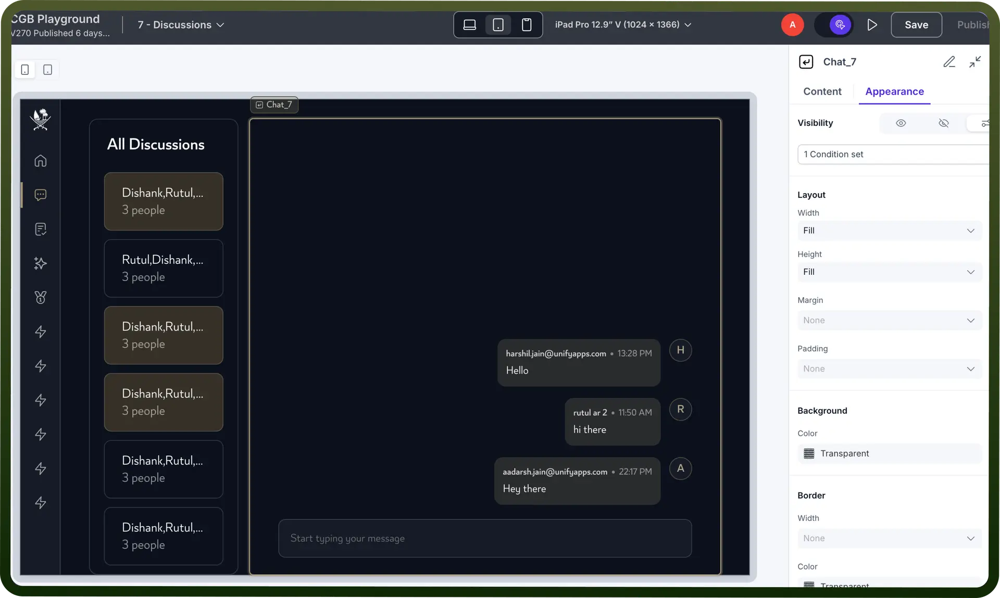
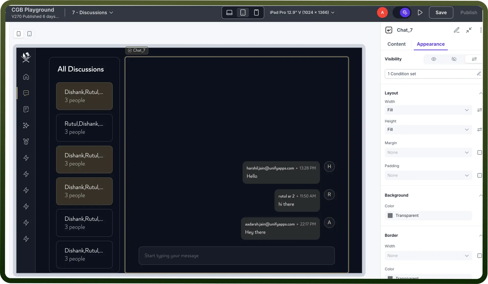
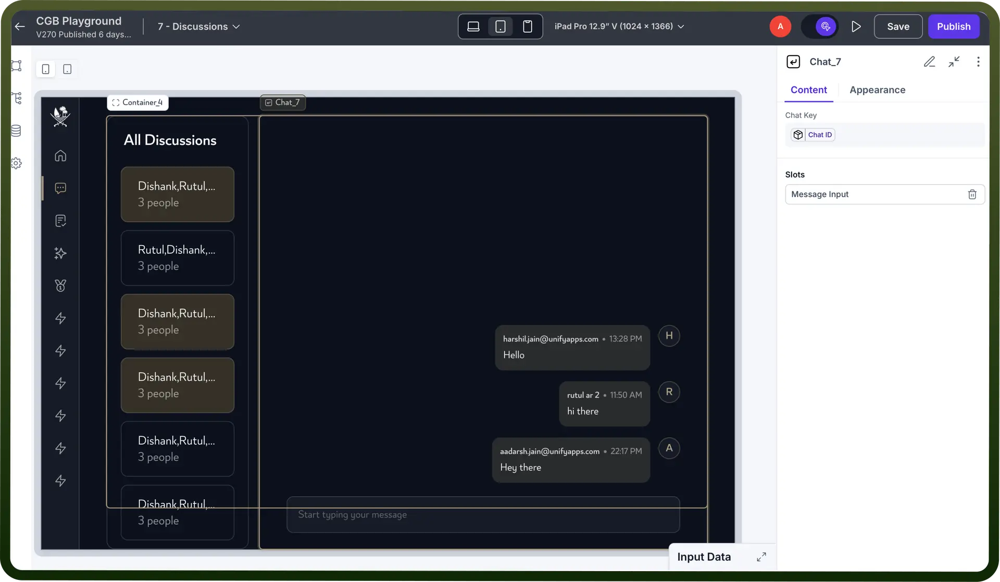

# Chat component

Source: https://www.unifyapps.com/docs/unify-applications/chat
Section: applications

---

## Overview

The Chat component enables seamless communication between users by providing a structured and interactive messaging experience. It is widely used across various platforms, from customer support systems to collaborative workspaces, ensuring efficient and organized conversations.  Employees can engage in discussions, share updates, and collaborate in real time, streamlining workflows and improving productivity.

## Configuring the Chat Component

The Chat component has three key parts:

- `Message Display/Input Panel`: Shows past messages for easy reference and interaction.
- `Stack`: Organizes messages sequentially for a clear conversation flow.
- `Message Input Field`: Allows message entry with configurable options like input modes, placeholders, attachments, and emojis.

### Chat ID System

Each chat session has a unique `Chat ID`, generated based on user IDs and stored in a `Chat object`:

- **One-on-One Chats**: When two unique users start a conversation, a **Chat object** is created with a Chat ID that combines both users' IDs (e.g., UserID1_UserID2). This Chat object must be stored — **if not stored**, a **new Chat ID will be generated** the next time those two users interact, leading to duplicate or fragmented conversations.
- **Group Chats**: In group conversations, the Chat ID is generated using all participant IDs or a unique group identifier, and the chat thread is stored similarly to maintain structure and history.

Storing the Chat object ensures that users can always retrieve the correct, consistent chat history without creating duplicate chats.

## Configuring Content

As the Chat component consists of three sub-components, accessing a chat requires only the chat ID. However, for the message input, additional configurations are needed, such as

- **Mode:** The message input supports Compact and Comfortable modes. Compact Mode provides a minimal and space-efficient design, making it ideal for interfaces where conserving space is a priority. Comfortable Mode offers more spacing between elements, making text easier to read and providing a more relaxed typing experience, which is useful for longer messages or detailed conversations.
- **Variant:** Choose between Rich Text and Plain Text input. Rich Text allows users to format their messages with bold, italics, links, and other styling options, making it ideal for structured or visually enhanced communication. Plain Text keeps messages simple without any formatting, ensuring a lightweight and straightforward chat experience.
- **Placeholder:** Customize the placeholder text to provide users with guidance on what to type. This can be useful for indicating expected input, such as "Type your message here..." or specific instructions based on context, like "Ask a question..." in a chatbot scenario.
- **Enter Button Action:** Configure whether pressing the Enter key sends the message immediately or adds a new line. This ensures flexibility based on user needs—sending messages quickly in fast-paced chats or allowing multiline messages in detailed discussions.
- **Actions:** Enhance the message input field with interactive features like Add Attachment, Custom Action, Send Message, and Emoji Picker. Add Attachment enables users to upload files, images, or documents within the conversation. Custom Action allows integrating additional functionalities tailored to specific needs. Send Message ensures smooth submission of messages, while the Emoji Picker adds expressive communication elements, making interactions more engaging.

## Customizing the Appearance

Use the **Appearance** settings to fine-tune the look and functionality of the Chat components, allowing them to blend seamlessly with your application's design and user experience.

> **Note:** You can refer to Appearance Settings documentation to know more about defining Layout for each component .

### Defining Permissions

Every component allows you to set visibility permissions based on the permissions granted to the logged-in user. This ensures that only authorized users can view and interact with the component.

> **Note:** You can refer to Permissions documentation to know more about defining permissions for each component.

## Best Practices for Using Chat Component

- **Customize Input Behavior:** Set placeholders for guidance and define the Enter key action for better usability.
- **Enhance with Actions:** Enable attachments, emoji pickers, and custom actions to improve user interaction.
- **Ensure Accessibility:** Use clear fonts, proper contrast, and keyboard-friendly navigation for inclusivity.
