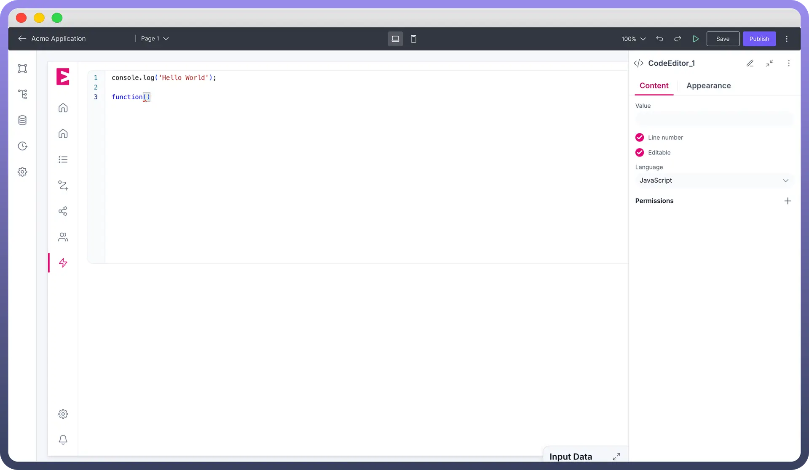
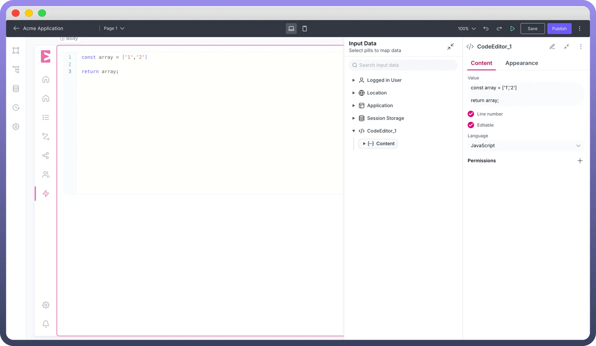

# Code Editor

Source: https://www.unifyapps.com/docs/unify-applications/code-editor
Section: applications

---

## Overview

The code editor component allows users to input code within your application, with options for configuring values and language to fetch inbuilt libraries for the selected language.

## Configuring the Code Editor Component

Once the code editor component is added, you can configure its properties through the right-side configuration panel.

### Setting Value and Code Input options

- **Default Value**: This correctly sets initial text that appears in the field when it loads. This can serve as an example, placeholder, or suggested entry to guide users on what to input.
- **Editable**: This option determines whether users can interact with and modify the code in the editor. When enabled, users can type, delete, and manipulate the content. When disabled, the code becomes read-only, which can be useful for displaying examples that shouldn't be changed.
- **Line Numbers**: This feature displays line numbers along the left side of the code editor, making it easier to reference specific parts of the code and navigate through longer snippets.

### Language Selection

When a specific programming language is selected:

1. The editor applies appropriate syntax highlighting for that language
2. The editor can provide syntax error checking/linting
3. Autocomplete functionality becomes available with suggestions from the language's standard libraries and syntax
4. The editor may adjust indentation rules based on the language's conventions

This improves the user experience by providing language-specific assistance while coding.
