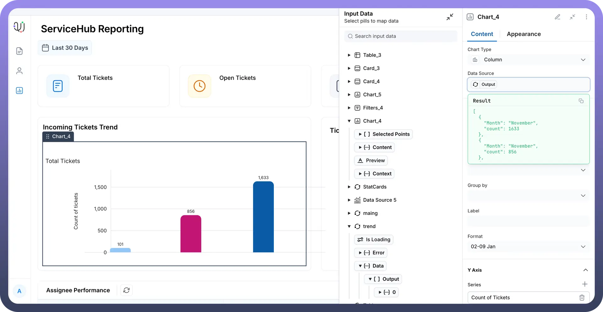
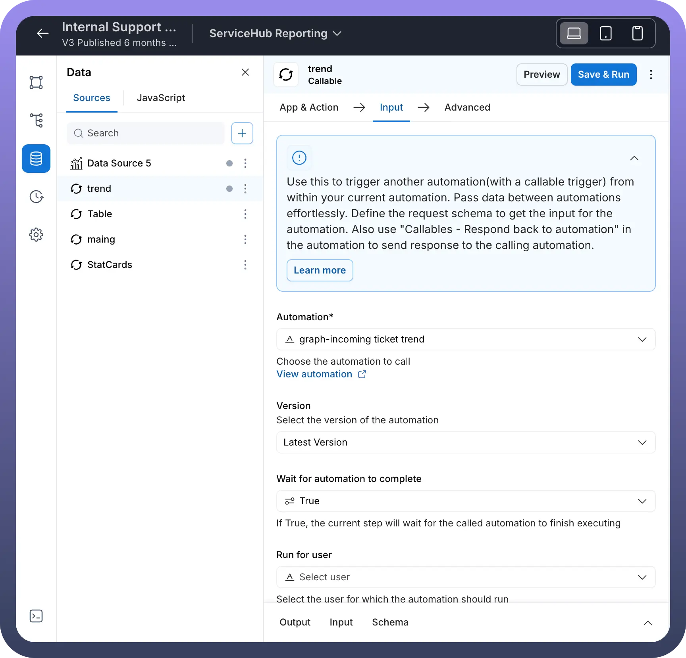
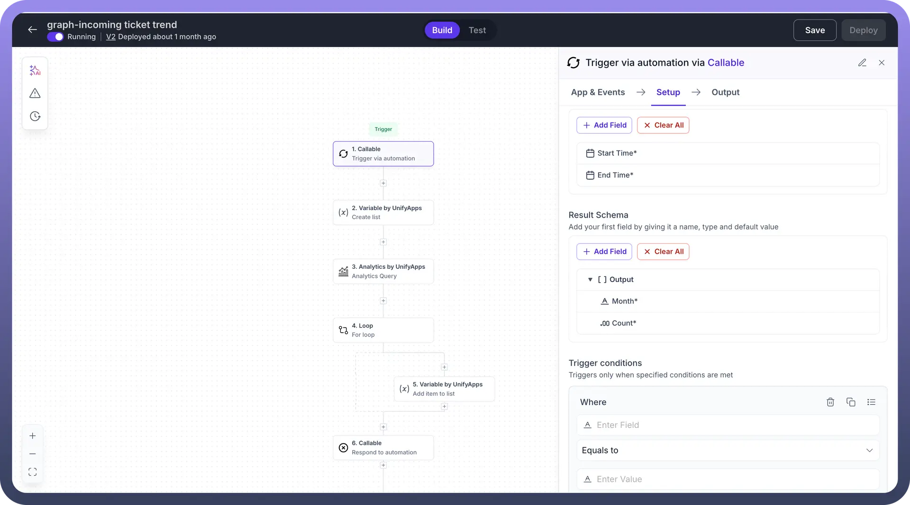
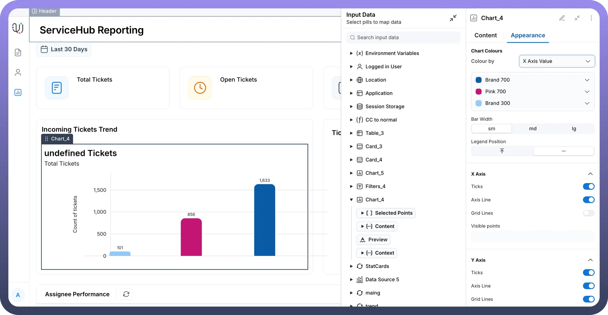

# Column Chart

Source: https://www.unifyapps.com/docs/unify-applications/column-chart
Section: applications

---

## Overview

The Column Chart component is a powerful data visualization tool designed to display quantitative information through vertical bars or columns. This chart type excels at comparing values across different categories or showing trends over time periods, making it ideal for business metrics, performance tracking, and analytical reporting. Column charts are particularly effective for visualizing ticket volumes, trend analysis, and performance metrics where clear visual comparison between different time periods or categories is essential.

## When to Use a Column Chart?

Column charts are particularly valuable when you need to

1. **Monthly Performance Tracking**: Display ticket volumes, sales figures, or user activity across different months to identify seasonal patterns and growth trends. Track performance changes over time periods effectively.
2. **Team Comparison Analysis**: Compare performance metrics across different teams, departments, or regions to identify top performers and areas needing improvement. Visualize which teams exceed expectations and need support.
3. **Priority-Based Reporting**: Show distribution of tickets, tasks, or issues across different priority levels (Critical, High, Medium, Low) to help managers understand workload distribution and resource allocation needs. Assess workload balance and resource allocation across priority levels.
4. **Category Performance Visualization**: Display performance across different service categories, product lines, or customer segments to understand which areas generate the most activity or revenue. Identify highest performing categories and revenue generating segments.
5. **Threshold and Goal Tracking**: Compare actual performance against targets or thresholds across different time periods or categories. Show progress toward goals with clear visual indicators. Compare actual results against established targets and thresholds.

## How to configure a Column chart?

Below are the details mentioned which describe each configuration option for Column charts in Unify’s Application builder:

### Basic Configuration

**Chart Type**

- **Column:** Defines the visualization type as a vertical bar/column chart
- This determines how your data will be displayed (columns rising vertically from the X-axis)

**Data Source**

- This is where the input values for the chart can be mapped
- For e.g in the screenshot below, we have mapped a data source “`trend -> Output`”, to display the values
- In turn the datasource “`trend`” fetches values for the chart via an automation “`graph-incoming ticket trend`” as mentioned in the screenshot
- This automation is used to fetch all the values for the chart

  

  

  

### X Axis Configuration

**Plot Periodic Values**

- Toggle switch that enables/disables periodic plotting on the X-axis
- When enabled, allows for time-based or sequential data representation

**Value**

- Defines what data field is used for the X-axis values
- In this case, it's set to display “`Count`” as the horizontal axis categories

**Group by**

- Allows you to group data points by specific categories or dimensions
- Helps organize data into meaningful segments for comparison

### Y Axis Configuration

**Series**

- Defines what metric is being measured and displayed as column heights
- This is the primary data being visualized (the vertical values)

**Label**

- Text label that identifies what the Y-axis represents
- Provides context for users about what the numbers mean

**Type**

- Here the output type can be defined in which form the numbers on the chart ned to be display
- Different options are available like : `Number`, `Currency`, `Percentage`, `Duration` etc.

### Advanced X Axis Settings (When Plot Periodic Values is enabled)

**Start value**

- `Month`: Defines the beginning point of your time series
- Sets which month the chart should start displaying from

**End value**

- Defines the ending point of your time series
- Sets the range limit for your periodic data

**Format**

- `02-09 Jan`: Specifies how date/time values are displayed
- Controls the visual format of X-axis labels

## Appearance Tab Parameters

### Chart Colors

**Colour by**

- Determines how colors are applied to the chart elements
- 3 options are available:
  - **Series** : Applies same color to all chart and elements
  - **X axis value**: Each bar on the x-axis can have different colors
  - **Conditions**: Set conditional colors for each data element

    

### Bar Styling

**Bar Width**

- Options: sm, md, lg
- Controls the thickness of the columns
- Affects visual density and readability

**Legend Position**

- Controls where the chart legend appears
- Options typically include top, bottom, left, right, or hidden

### X Axis Appearance

**Ticks**

- Toggle to show/hide tick marks on the X-axis
- Helps users identify specific values along the horizontal axis

**Axis Line**

- Toggle to show/hide the main X-axis line
- Provides visual structure to the chart

**Grid Lines**

- Toggle to show/hide vertical grid lines
- Helps users read values more accurately across the chart

### Y Axis Appearance

**Ticks**

- Toggle to show/hide tick marks on the Y-axis
- Provides reference points for reading values

**Axis Line**

- Toggle to show/hide the main Y-axis line
- Gives structure to the vertical axis

**Grid Lines**

- Toggle to show/hide horizontal grid lines
- Makes it easier to read exact values across different columns

## Key Configuration Tips

1. **Data Source Connection:** Ensure your Output data source provides the correct data structure with the fields you're referencing in Value and Series settings.
2. **Periodic Values**: When plotting time-based data (like months), enable "`Plot Periodic Values`" and configure Start/End values appropriately.
3. **Visual Clarity:** Use appropriate Bar Width and enable Grid Lines for better readability, especially with multiple data points.
4. **Color Consistency**: Choose colors that align with your application's branding and provide good contrast.
5. **Responsive Design:** Consider how the chart will appear on different screen sizes when setting dimensions and text sizes.
