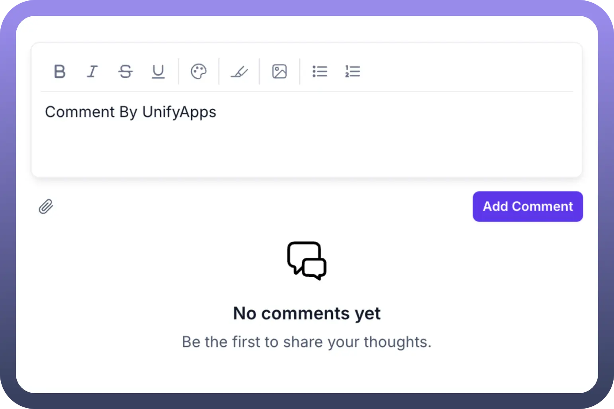
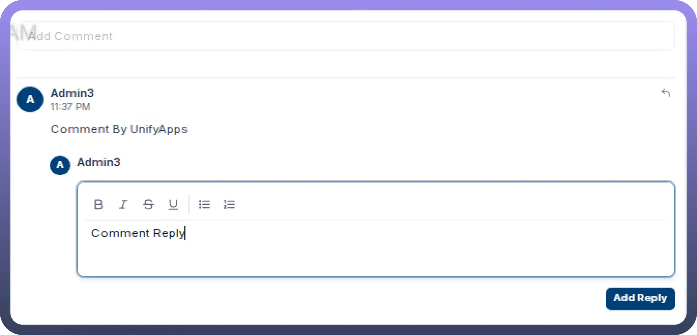

# Comments

Source: https://www.unifyapps.com/docs/unify-applications/comments
Section: applications

---

## Overview

The **Comments** feature in UnifyApps is an interactive communication tool that enables users to add feedback, suggestions, and discussions directly within your application. This feature enhances collaboration by allowing users to share their thoughts on content, receive responses, and engage in threaded conversations. Comments functionality transforms static content into dynamic discussion spaces, improving user engagement and providing valuable insights.

## Key Features of Comments

1. **Add Comment:**
  - Users can add new comments to any enabled content area
  - Rich text formatting options including bold, italic, strikethrough, and underline
  - Support for both bulleted and numbered lists for structured feedback
2. **View and Manage Comments:**
  - All comments are displayed chronologically in a dedicated comments section
  - Each comment displays the user name and timestamp for proper attribution
3. **Reply to Comments:**
  - Users can respond directly to existing comments
  - Threaded replies maintain context for conversation clarity
  - Rich text editing options available for replies as well

## Actions

1. **Create Comment:**
  - Users enter comment text in the provided rich text editor
  - Text formatting options include bold, italic, strikethrough, underline
  - Click "`Add Comment`" button to save and display the comment

    

2. **Reply to Comment:**
  - Select the specific comment to respond to
  - Enter reply text in the reply editor with formatting options
  - Click "`Add Reply`" to submit the response
  - Replies appear nested under the original comment

    

3. **Delete Comment/Reply:**
  - Comments can be removed by their authors
  - Deleting a parent comment provides options for handling nested replies
4. **Add Attachments:**
  - Ability to add attachments to comments for file sharing and reference
5. **User Mentions:**
  - User mention for real time collaboration

## Best Practices

1. Configure email notifications for comment activity to keep relevant users informed
2. Establish clear commenting guidelines for your application users
3. Consider implementing approval workflows for sensitive or public-facing content
4. Regularly review and respond to comments to encourage continued engagement
5. Use analytics to identify patterns in comment activity and user engagement
