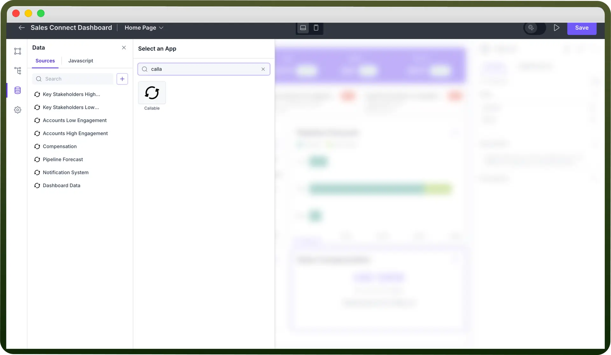
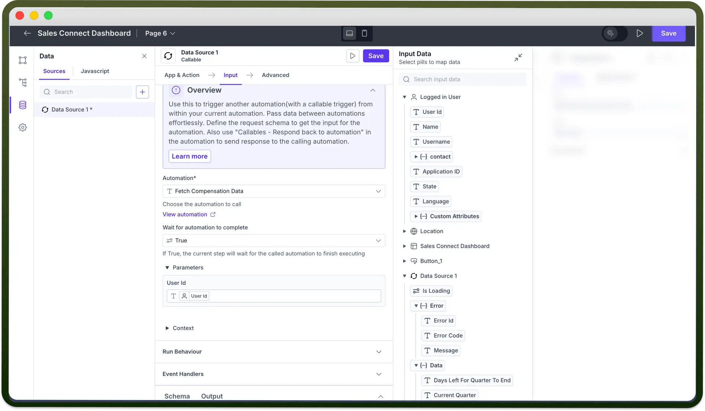
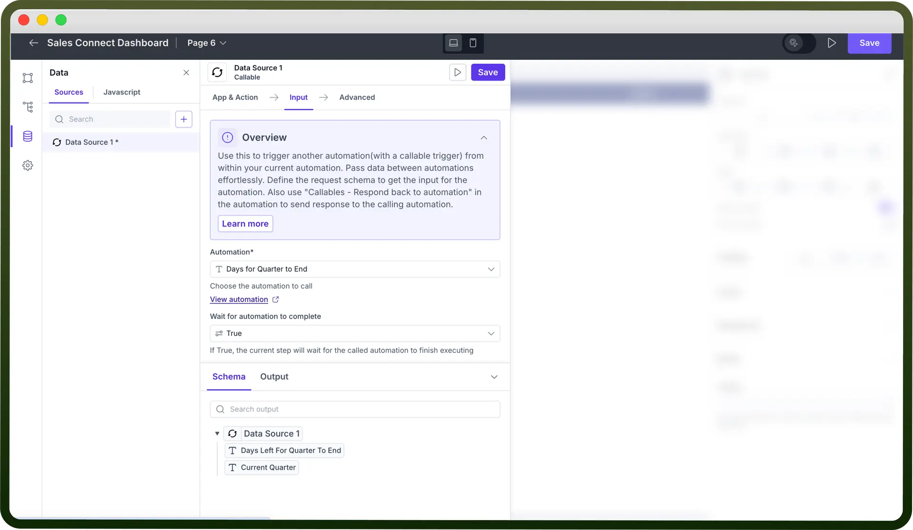

# Callable by UnifyApps

Source: https://www.unifyapps.com/docs/unify-applications/connect-to-data-source-callable-by-unifyapps
Section: applications

---

## Overview

The Callable is a type of a data source that lets you call an automation and receive its output to use in other components of your low-code application. Callable is used for handling complex data integrations from multiple sources.

Here’s a quick guide on how to set up a callable and use its output as data pills in your app.

## Adding Callable as a data source

The following steps are required to add a Callable as a data source:

- Open the “`Data source`” section in the left panel.
- Click the "`+`" button to create a new data source.
- Search for “`Callable`” and select it from the list.

  

## Configuring the Callable

After adding Callable as a data source, you can use it to trigger an automation. To do this, select the “`Call automation`” option after selecting Callable.

### Defining Input for the Callable

- `Select Automation`**:** Pick the automation you want to run from your app. **Note:** You can refer to [Callable by UnifyApps](https://www.unifyapps.com/docs/unify-automations/callable-trigger-from-automation) Documentation for the creating your first Callable Automation.
- `Parameters`**:** If the automation needs any specific inputs, enter them here. You can also map the input in the form of data pills as shown in the image below.

  

### Reviewing Output of the Callable

After configuring the Callable, you can view its output schema. This schema helps identify the right data pills to map to other components in your app. You can also run a preview test to see the automation's output directly.

### Utilizing the Output of Callable

Once the Callable setup is complete, its output data pills can be used across other components in your application. These data pills, which contain the automation's output, can be mapped directly to different components as needed.
