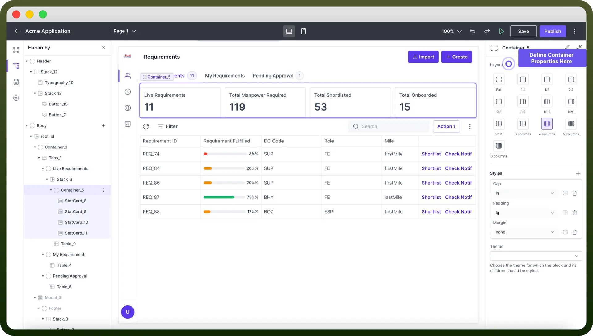
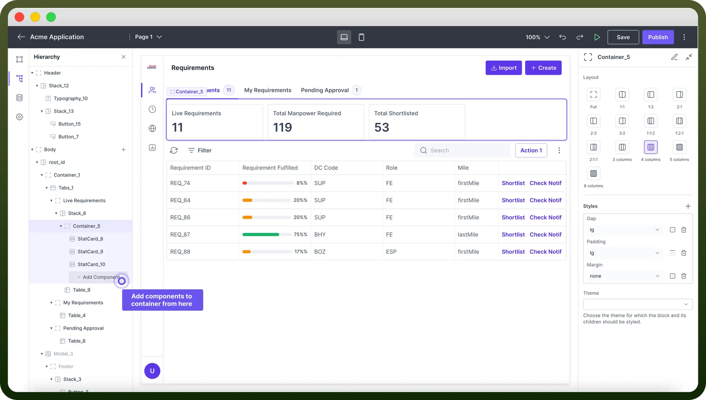

# Container component

Source: https://www.unifyapps.com/docs/unify-applications/container
Section: applications

---

## Introduction

Container is a layout component that **groups** and **organizes** UI components into a rigid layout. A container can hold a fixed number of components within it.

This article will guide you through configuring Containers.

## Primary Use Cases

1. **Grouping Related Components**: Containers can be used for grouping form `fields`, `buttons`, and `labels` within a single container to create a unified form section.
2. **Crafting Flexible Web Layouts Using Containers :** Containers can be used with adaptable column layouts to vary the number of displayed items according to screen size (e.g., changing from a `4-column` layout to a `2-column` layout)
3. **Applying Consistent Styling** : It can be used for applying a specific `padding` or `margin` to all components within a container for a uniform look and feel.

## Configure a Container

1. **Choosing the Layout options**
  - Users can select from various column layouts (e.g. - **full** , **1:1** , **1:2** , **2:1**) to control the distribution of content.
  - Users can also select from various options ranging from single to multiple columns (**up to 6**), enabling defined breakdown of containers into columns.

    

2. **Adding components in your Container**
  - Once the layout of the container has been selected you would find it in hierarchy with segregations as defined in the previous step.
  - Select and add the desired components (e.g., `text`, `images`, `charts`) to the container as per your design. **Note:** You can also have a container, or a stack inside a container allowing you to control the layout in all possible ways.

    

## Style your Container

You can adjust the **gap, padding, and margins** to arrange and style the child components in the container.

"Also, by clicking the ‘`+`’ button inside appearance you get access to more styling options like adjusting the **container height, width** etc. "

You can also choose the theme for the container and its children from the `theme` dropdown.

Details about the styling can be found in the table below:

| **Attributes** | **Properties** |
|---|---|
| `Padding` | Add space inside an element's border to create **separation** between the content and the border. |
| `Height` | Set the height of an element to control its **vertical** size. |
| `Min-Height` | Define the minimum height an element can be, ensuring it doesn't **shrink** below this value. |
| `Max-Height` | Specify the maximum height an element can reach, preventing it from **growing** too tall. |
| `Gap` | Set the space between rows and columns in a grid or flex container to create **consistent** spacing. |
| `Margin` | Set the outer space around an element to create **distance** between it and surrounding elements. |

> **Note:** For more detailed information on styling a component, refer to the [Appearance](/docs/unify-applications/container) article.
