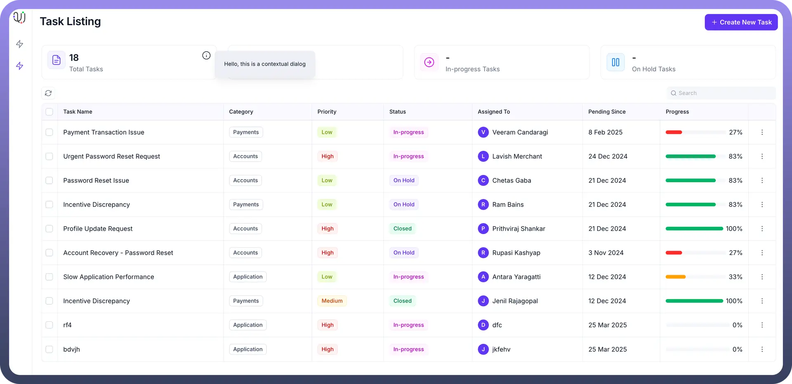
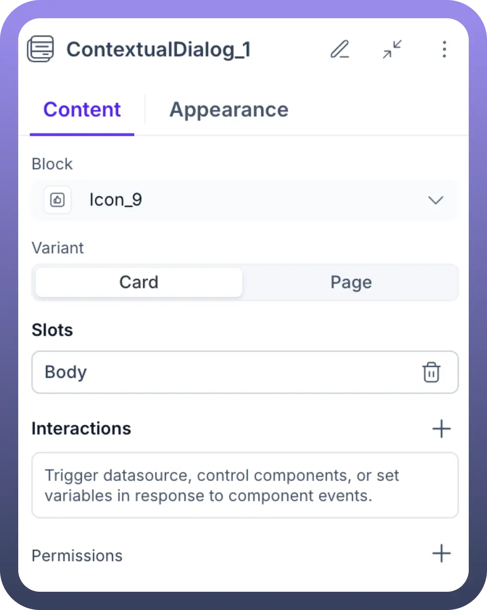
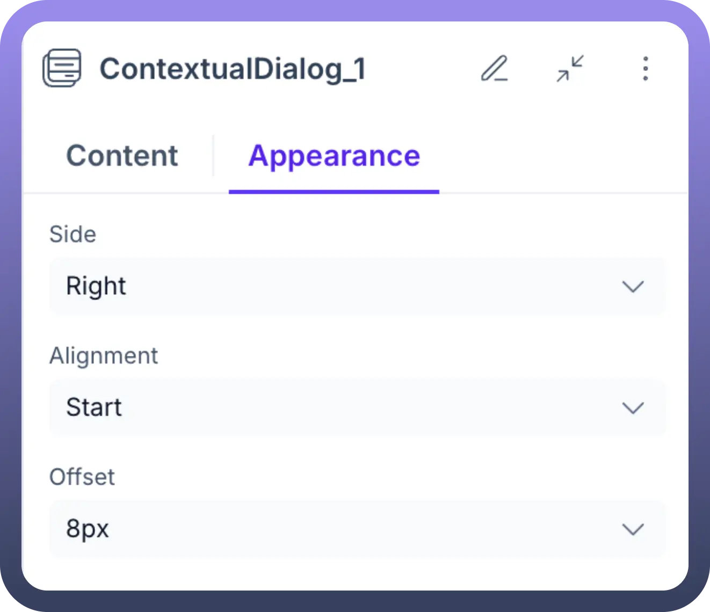
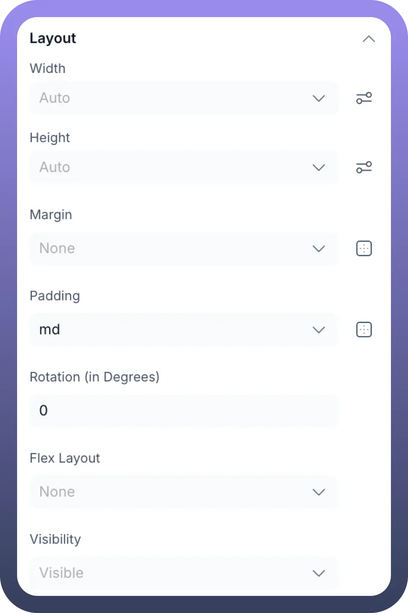
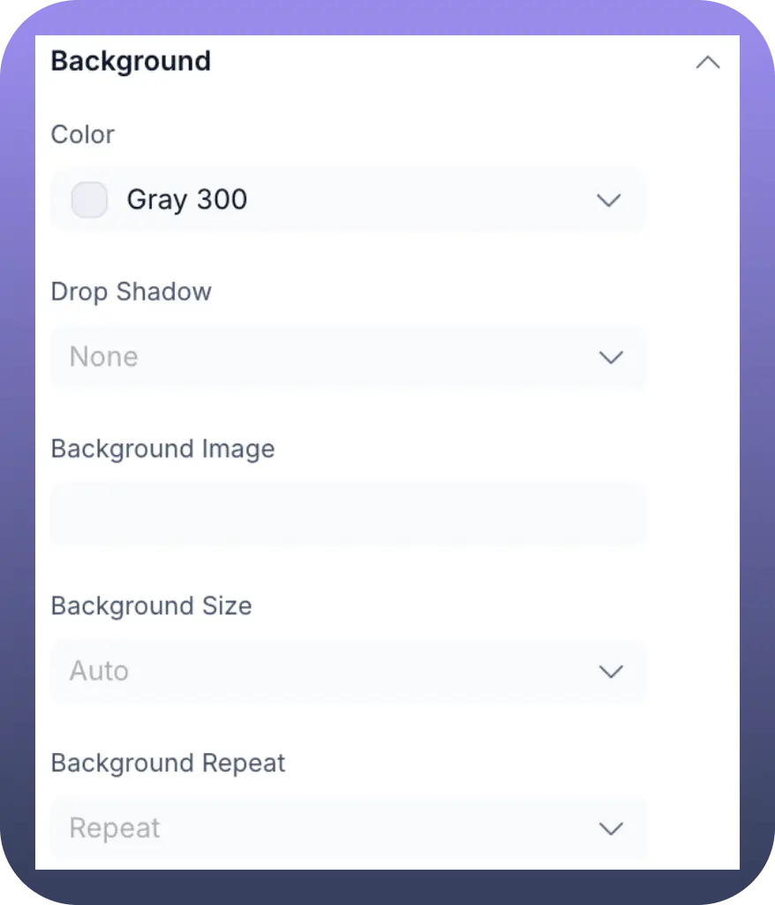
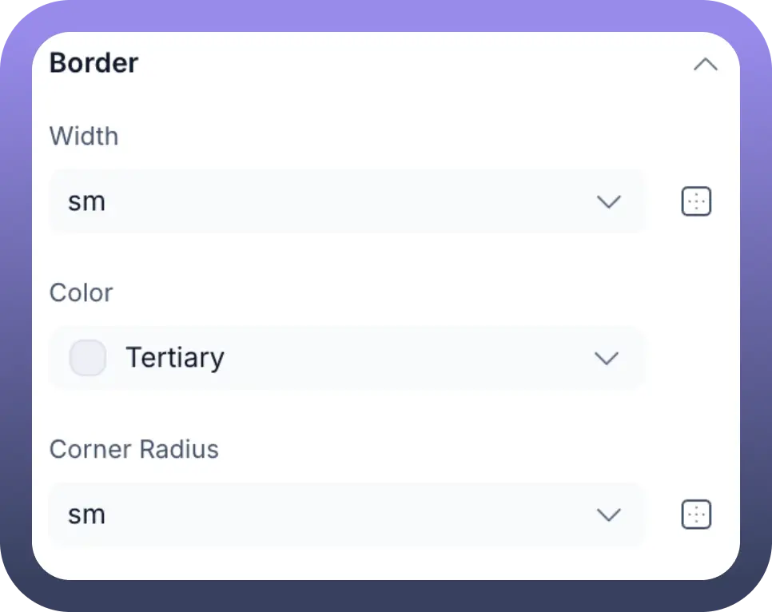

# Contextual Dialog

Source: https://www.unifyapps.com/docs/unify-applications/contextual-dialog
Section: applications

---

## Overview

The **Contextual Dialog** component is an interactive UI element used to display information or related actions in a pop-up window when a user interacts with (typically clicks on) another component within your application. It's useful for showing details on demand, providing quick access to forms, or embedding related content without navigating away from the current view.

By default, the Contextual Dialog includes a **Body** slot where you can add other components or display an entire application page.

## When to Use a Contextual Dialog?

The Contextual Dialog is particularly useful when you want to:

- **Show more details on demand:** Instead of cluttering your main interface with too much information, you can reveal additional details (like specifications of a product, full text of a note, or extended user profile information) only when the user explicitly requests it by clicking on an item.
- **Provide quick access to actions or forms:** Allow users to perform actions (like editing a record, assigning a task, or adding a comment) or fill out small forms without navigating to a separate page. This keeps the user in their current workflow and reduces friction.
- **Embed related content seamlessly:** Display supplementary information, help text, or even entire related application pages (using the "`Page`" variant) directly in context, preventing the user from losing their place.
- **Reduce interface complexity:** By hiding secondary information or actions within a contextual dialog, you can create cleaner, more focused user interfaces, making it easier for users to concentrate on primary tasks.

Essentially, if you need to present focused content or actions related to a specific element on the screen, without a full page reload or navigation, the Contextual Dialog is an excellent choice.

## Key Properties / Configuration (Content Tab)

The `Content` tab is where you define what triggers the dialog, what type of content it shows, and how users can interact with it.

- **Block:**
  - This property links the Contextual Dialog to a specific trigger component in your application.
  - Select the component (e.g., an icon, button, or list item) from your application canvas that, when clicked by the user, will cause this dialog to appear. For example, if you select Icon_1, clicking on Icon_1 will open the dialog.
- **Variant:**
  - This setting determines the primary content mode of the dialog.
  - `Card`**:** (Default) When selected, the dialog functions as a flexible container. You can add various UI components (like Text, Forms, Buttons, etc.) directly into the `Body` slot of the dialog to build custom content. This is ideal for displaying specific information, quick actions, or simple forms related to the trigger component.
  - `Page`**:** When selected, this option allows you to embed an entire existing page from your application within the dialog. A dropdown will appear, letting you choose which page to display. The dialog will then show a full preview of that selected page (e.g., a task listing page with a table).
- **Slots:**
  - `Body`**:** This is the main content area of the dialog.
    - If `Variant` is Card, you populate this Body by dragging and dropping other components into it.
    - If `Variant` is Page, this Body automatically displays the selected application page.
- **Interactions:**
  - Define actions that can be triggered from within the Contextual Dialog itself. This could be when a button inside the dialog's Body is clicked, or data is submitted from a form within the dialog.
  - You can trigger data sources, control other components, set variables, or navigate in response to these internal events.
- **Permissions:**
  - Standard Unify Applications feature to control the visibility of the Contextual Dialog based on the logged-in user's role or specific conditions.

## Appearance Customization (Appearance Tab)

The `Appearance` tab allows you to control the positioning, size, and visual styling of the Contextual Dialog.

### Positioning Relative to Trigger ("Block")

- **Side:** Choose which side of the "Block" component the dialog should appear on (e.g., Bottom, Top, Left, Right).
- **Alignment:** Fine-tune the dialog's alignment along the chosen Side (e.g., Start, Center, End).
- **Offset:** Specify a distance (e.g., 0px, 10px) to offset the dialog from the "Block" component, creating space if needed.

### Dialog Layout & Styling

- **Layout (General):**
  - `Width` / `Height`: Set fixed or automatic dimensions for the dialog. Use Min Width/Max Width and Min Height/Max Height for responsive sizing.
  - `Margin` / `Padding`: Control external spacing (margin) and internal spacing (padding) of the dialog container.
  - `Rotation`: Rotate the dialog in degrees if needed.
  - `Flex Layout`: Apply flexbox properties if the dialog's internal Body content needs specific flex alignment (more relevant for Card variant with multiple child components).
  - `Visibility`: A basic toggle for the dialog's visibility, often controlled dynamically via the Visibility settings in the Content tab.

- **Background:**
  - `Color`**:** Set the background color of the dialog.
  - `Drop Shadow`**:** Apply a shadow effect to make the dialog appear elevated.
  - `Background Image`**:** Set an image as the dialog's background.
  - `Background Size`**:** Control how the background image scales (e.g., Auto, Cover, Contain).
  - `Background Repeat`**:** Determine if and how the background image repeats.
- **Border:**
  - `Width`**:** Set the thickness of the dialog's border.
  - `Color`**:** Choose the colour of the border.
  - `Corner Radius`**:** Apply rounded corners to the dialog.

## Use Cases

- **Detailed Views:** Clicking an item in a list or a user avatar to show more details in a dialog without leaving the main page.
- **Quick Actions:** Presenting edit, delete, or other action buttons when an element is clicked.
- **Inline Forms:** Allowing users to quickly submit data (like a comment or a status update) related to a specific item.
- **Information Pop-ups:** Displaying help text, warnings, or supplementary information when a user clicks an info icon.
- **Page Previews:** Using the Page variant to show a snapshot or an interactive preview of another section of the application.
