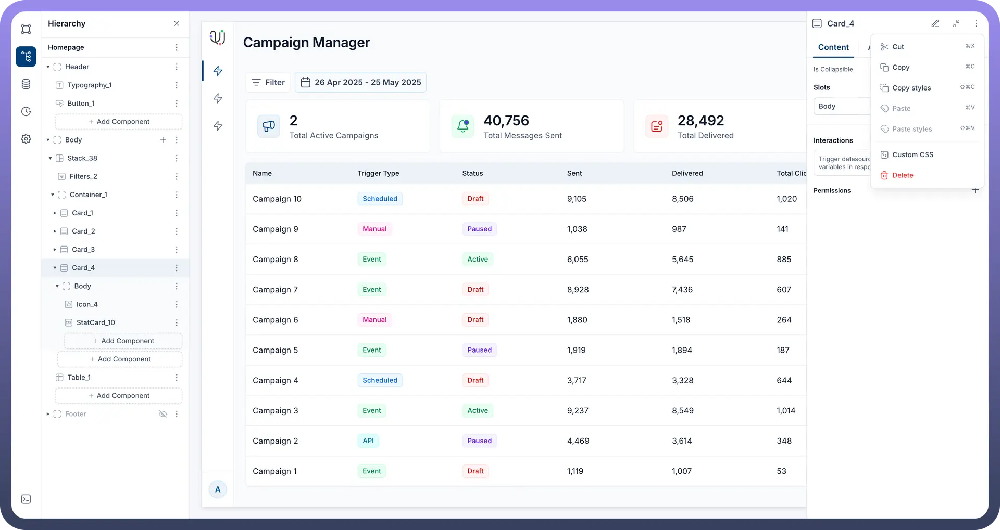
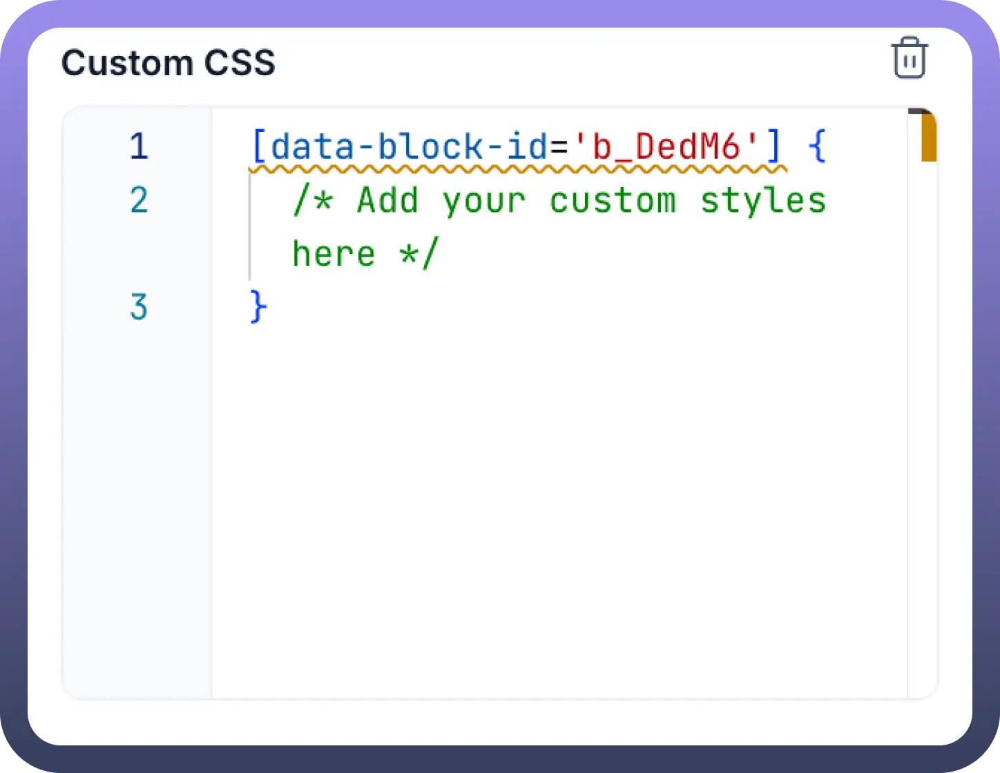

# Custom CSS

Source: https://www.unifyapps.com/docs/unify-applications/custom-css
Section: applications

---

## Overview

Unify Applications provide a rich set of built-in styling options for components through the Appearance tab in the properties panel. However, for users who require more granular control or wish to implement unique visual treatments beyond the standard options, the **Custom CSS** feature offers an advanced way to directly apply Cascading Style Sheets (CSS) to components.

Using Custom CSS allows for pixel-perfect adjustments, unique branding implementations, advanced hover effects, custom fonts, and other sophisticated styling modifications.

## Accessing the Custom CSS Feature

You can apply Custom CSS to virtually any component within your Unify application, from large containers to individual elements.

1. **Select the Component:** On the application canvas or in the hierarchy panel, click to select the component you wish to style.
2. **Open the Menu:** In the component's properties panel (usually at the top right of the panel) or directly on the selected component, click the **three-dot (ellipsis) icon** to open the component menu.
3. **Choose Custom CSS:** From the dropdown menu, select the **Custom CSS** option.



## Using the Custom CSS Editor

Once you select "`Custom CSS`" a dedicated section will appear at the bottom of the selected component's properties panel.

- **CSS Input Area:** This section provides a text area where you can write your CSS rules.
- **Default Selector:** The editor will often pre-fill with a default CSS selector: `[data-block-id='root_id'] { /* Add your custom styles here */ }`
- **Understanding [data-block-id='root_id']**: This selector is crucial. It automatically targets the specific instance of the component you have selected. The 'root_id' part is a placeholder that the Unify Apps platform intelligently replaces with the unique ID of your selected component. **You do not need to manually change '**`root_id`**'.** This ensures your styles are scoped to that component only and do not unintentionally affect others.
- **Removing Custom CSS:** A delete icon (often a trash can symbol) is typically present next to or within the Custom CSS section, allowing you to remove all custom CSS applied to that specific component.



## Applying Styles

To apply styles, you'll write standard CSS rules within the provided text area. The [data-block-id='root_id'] selector directly targets the main container or the entirety of the selected component.

For example, to change the background color and add a border to the selected component:

```
[data-block-id='root_id'] {
    background-color: lightblue;
    border: 1px solid navy;
    padding: 10px; /* Example of adding padding */
}
```

If you want to style a specific part of what appears to be a larger, composite component (e.g., the header text within a card, or an icon within a button), the recommended Unify Apps approach is to select that smaller, specific element directly in the hierarchy or on the canvas (if it's a distinct component) and apply Custom CSS to it. Each component, even granular ones, should have its own Custom CSS option accessible via its three-dot menu. This ensures that styles are precisely targeted using the auto-generated [data-block-id='root_id'] for that specific sub-component.

## Common Use Cases

Custom CSS can be used for a variety of advanced styling needs:

- **Overriding Default Styles:** Change specific default appearances that aren't configurable through the standard properties panel.
- **Unique Hover Effects or Animations:** Implement custom transitions, transformations, or animations on user interaction.
- **Custom Fonts:** Apply fonts not available in the standard Unify Apps font selection (ensure fonts are web-accessible).
- **Fine-tuning Layout:** Achieve precise control over spacing, alignment, or positioning that might be difficult with standard layout tools alone.
- **Complex Visual Treatments:** Create custom gradients, multi-layer borders, pseudo-elements (::before, ::after) for decorative effects.
- **Hiding Components:** While visibility can be controlled via properties, custom CSS (display: none;) can also be used to hide components.

## Best Practices

- **Target Precisely:** Always select the most specific component you intend to style before adding Custom CSS. This leverages the platform's automatic scoping via [data-block-id='root_id'].
- **Use Comments:** Add comments (/* your comment here */) to your custom CSS to explain complex rules or the purpose of certain styles. This helps with future maintenance.
- **Test Thoroughly:** After applying custom CSS, test your application on different screen sizes and, if your application uses themes (e.g., Light/Dark), test on all applicable themes to ensure consistent and desired appearance.
- **Minimize Custom CSS:** Rely on the standard styling options in the Appearance tab whenever possible. Use custom CSS as a tool for enhancements that cannot be achieved otherwise. Overuse can make applications harder to maintain.
- **Beware of !important:** Use !important very sparingly, as it can make debugging CSS specificity issues difficult.
- **Platform Updates:** Be aware that while the [data-block-id='root_id'] selector provides good scoping, underlying default styles or component structures might subtly change with platform updates, potentially affecting your custom styles. Regularly review your custom styles after platform updates.

## Limitations and Considerations

- **CSS Specificity:** Your custom CSS rules will interact with the platform's existing stylesheets. Understanding CSS specificity (how browsers decide which rule applies if multiple rules target the same element) is important. The [data-block-id='root_id'] attribute selector has high specificity, which is generally helpful.
- **Maintenance:** Custom CSS adds another layer to maintain. Keep it organized and well-commented.
- **Performance:** While usually minor, overly complex or inefficient CSS selectors can potentially impact page rendering performance.
- **Responsiveness:** Ensure your custom CSS does not negatively impact the responsiveness of your application. Test on various devices.

This guide provides a starting point for using the Custom CSS feature in Unify Applications. For more complex scenarios, further experimentation will be beneficial.
