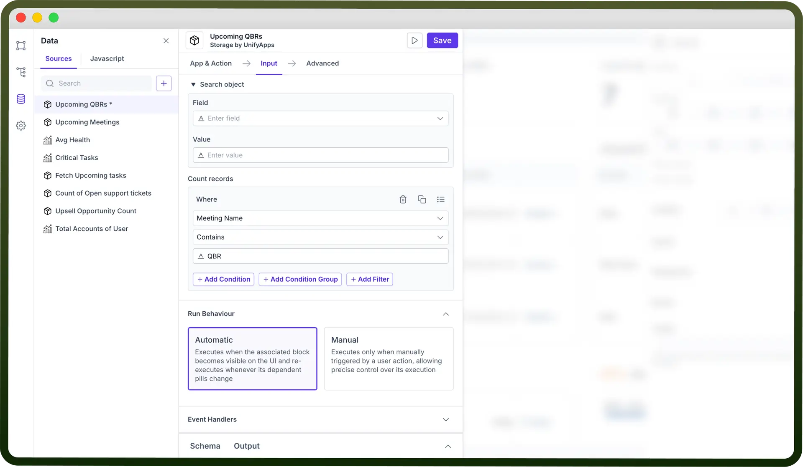
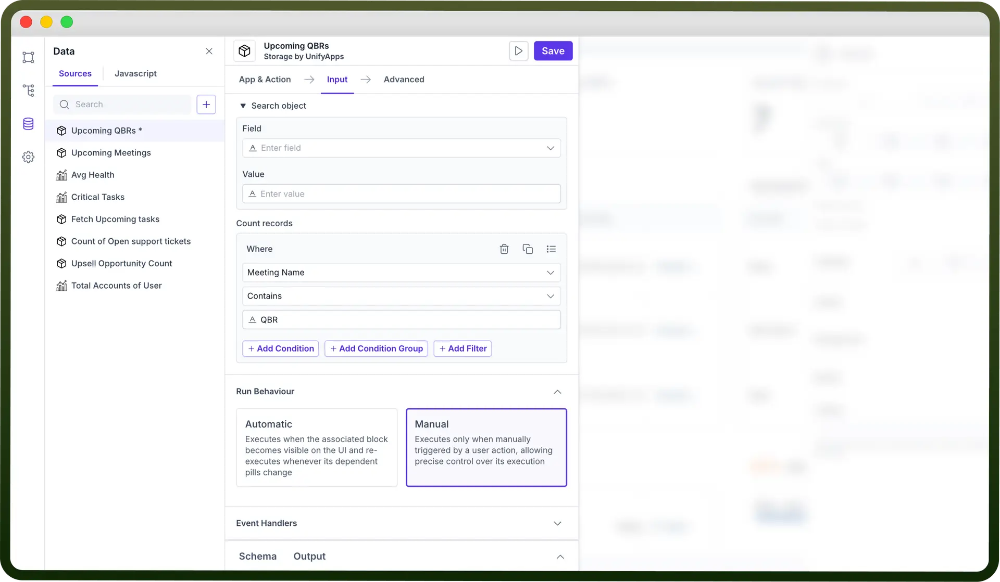
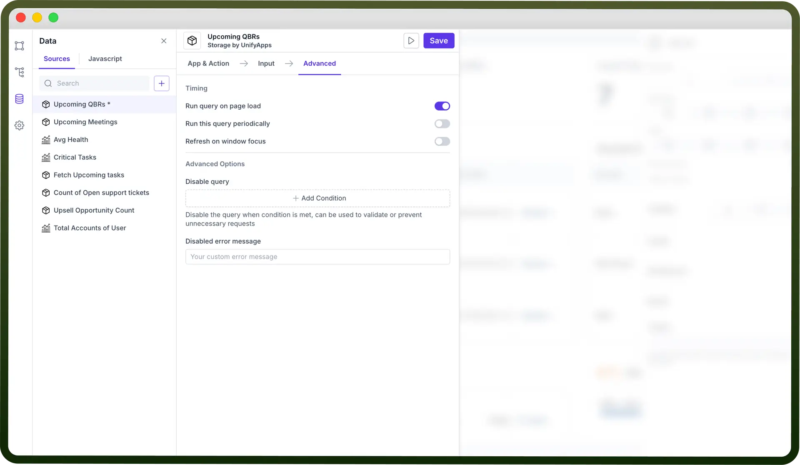
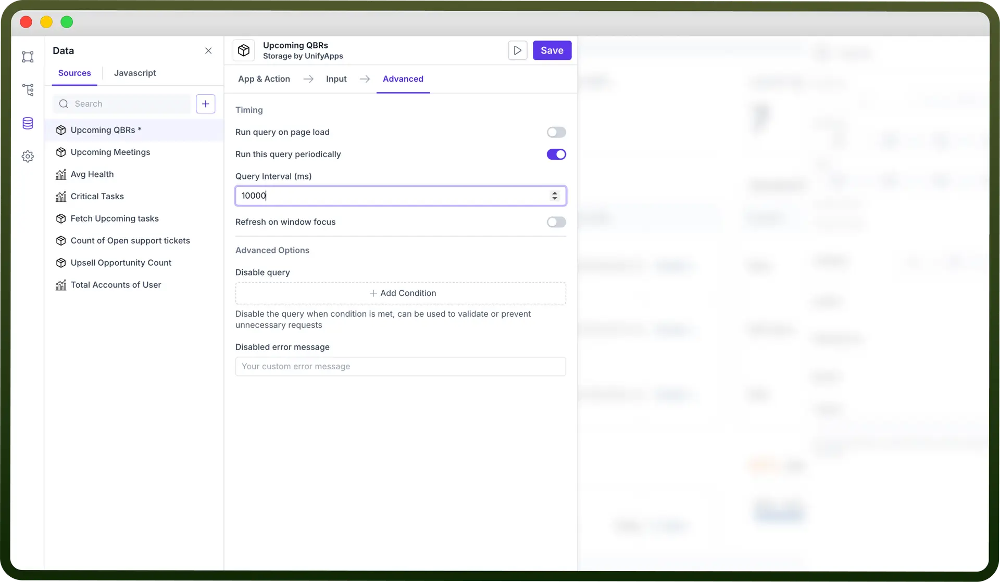
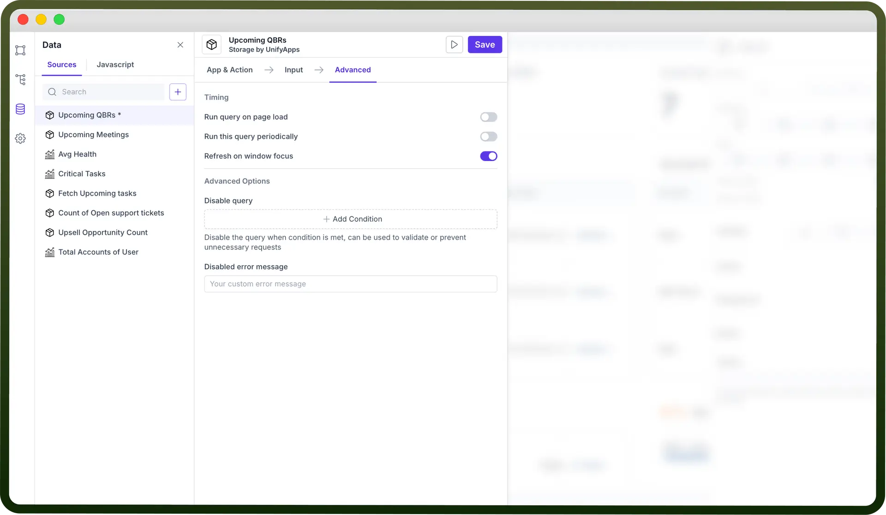
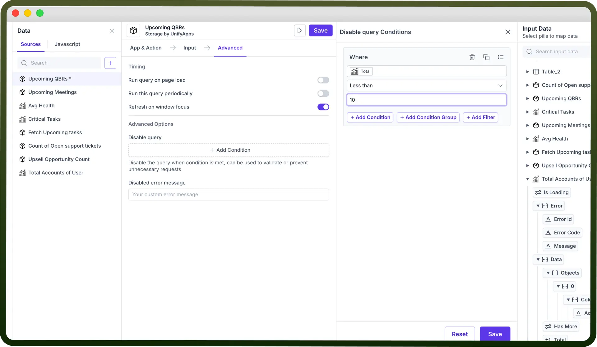
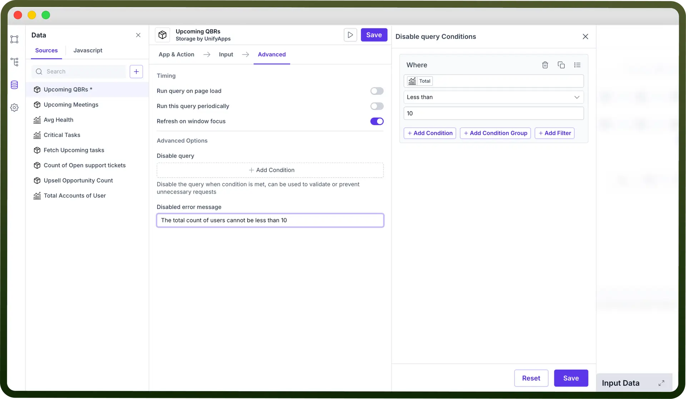

# Data Source Settings

Source: https://www.unifyapps.com/docs/unify-applications/data-source-settings
Section: applications

---

## Overview

Query execution behavior can be configured in both web and mobile apps, allowing queries to run automatically or manually based on your preferences. Additionally, there are options to customize this behavior further depending on whether the query is retrieving data or making modifications. By understanding and adjusting these settings, you can optimize query performance and enhance overall app efficiency, ensuring smoother data management and better control over app functionality.

## Run Behavior Options

| Run Behaviour | Description |
|---|---|
| `Automatic` | Queries set to run automatically execute as soon as their associated block becomes visible on the user interface (UI) |
| `Manual` | Queries set to run manually only execute when they are explicitly triggered by a user action, such as clicking a button |

## Running a Query Automatically

Running a query automatically means the query executes on its own without user input, typically triggered by certain conditions, such as loading a page or when specific data changes. This ensures real-time data updates and a seamless user experience without manual intervention

Go to `Run Behaviour` in input tab > Select `Automatic`

## Running a Query Manually

For queries that read large datasets, it is recommended to configure them for manual execution. Frequent automatic execution of such queries can lead to performance issues or cause rate limits with external data sources.

Go to `Run Behaviour` in input tab > Select `Manual`

## Additional Run Behavior Options

In addition to running queries automatically or manually, you can configure additional options in the Advanced tab. Available options depend on the query's run behavior.

### Running a query on page load

- By default, automatic queries execute when the app page first loads, ensuring that the user sees the most recent data immediately.
- You can also enable this behavior for manual queries by navigating to the Advanced tab and selecting the option Run this query on page load. This will allow the query to run automatically when the app loads, even if it is typically triggered manually.

  

### Running a query periodically

- You can set queries to run at regular intervals, which can be useful for keeping data updated without user input. For example, if your app relies on real-time data, periodic query execution ensures that users always see the most current information.
- To enable this, go to the Advanced tab and check the option Run this query periodically. You’ll then need to specify the interval at which the query will re-execute, in milliseconds. For example, setting the interval to 10000 will cause the query to run every 10 seconds.

  

### Refreshing a query on window focus

You can configure queries to refresh whenever the app window regains focus, ensuring that users see the latest data each time they return to the app.

### Preventing queries from running

- In more complex applications, where multiple queries are involved, it may be necessary to prevent certain queries from running until specific conditions are met. You can prevent a query from executing by adding conditions where you can map the difference.
- If a condition is set where the Count of total users is less than 10, the query will fail to execute.

  

- You can configure a Disabled error message to be displayed when a query fails due to the Disabled condition being set.

  
