# Data table component

Source: https://www.unifyapps.com/docs/unify-applications/data-table
Section: applications

---

## Overview

The **Data Table** component is a powerful and flexible way to display structured data in a tabular format within your low-code applications. It allows users to view, sort, filter, and interact with rows of data coming from static input or dynamic sources such as from an object, or a data source.

## Configuring a Data Table

You may configure the Data Table component by following the below steps:

1. Add a Data Table from your component list to your canvas’ body.
2. In the `Source` section of the content tab, choose whether you want to use a `static array` (for prototyping / testing) or map it to a `live data source` like a data source or an object.
  - The data mapped to the component in any case should be an array of object(s). In the screenshot example:

    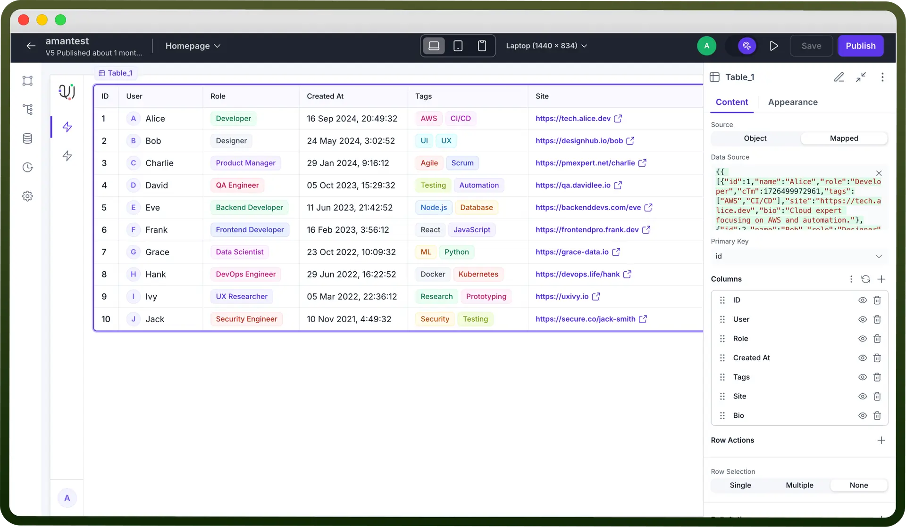

    - Source is set to “Mapped” and contains a static array of user data (in JSON format).
    - The data array includes fields like id, name, role, createdAt, tags, site, etc.
3. In the `Content` tab, set a **Primary Key** — a unique identifier for each row of data. **Note:** Primary Key is not mandatory, unless you want to make the table rows editable.
4. In the `Columns` section, click on the 3 dots action menu to toggle between the column configuration of Manual columns or Mapped columns. By default, it will pick Manual columns.

**Manual columns:**

- You’ll see a list of data fields derived from your data source
- You can click on the (`+`) icon to add a new column.
- Enable/disable columns by toggling the eye icon.
- Reorder them by using the drag and drop feature at the left of each column header.

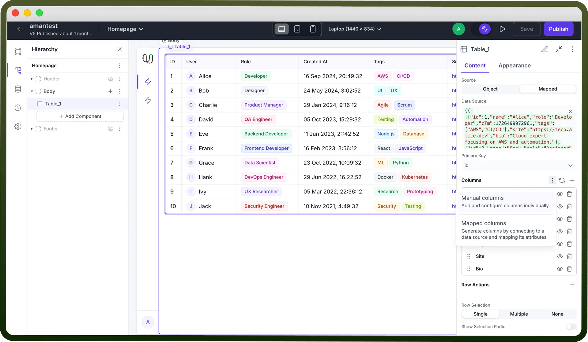

- Click on each column to configure its settings (label, data type, formatting, rendering logic, etc.
1. `Name`: The label displayed as the column header in the table.
2. `Field Key`: The key from your data source object that this column pulls data from (must match your data structure).
3. `Column Type`: Determines how the column data is rendered in the table, such as Text, Number, Date, Tag, etc.
  - **Text**: Displays plain text values in string format.
  - **Number:** Represents a numerical value (whole or decimal). Choose notation format – Standard, Compact or Scientific. Specify up to how many decimal places should the number be truncated.
  - **Percent:** Represents a percentage value. Specify up to how many decimal places should the percentage be truncated.
  - **Currency:** Represents a monetary value. Choose notation format – Standard (eg. 100,000) or Compact (eg. 100K) Define the currency symbol from the provided list or input your custom currency. You may also specify up to how many decimal places should the currency be truncated.
  - **Html**: Renders HTML content inside the cell (use cautiously for security).
  - **Date:** Represents a calendar date. Choose from various different variations of supported date formats (ISO or UNIX Timestamp).
  - **Time:** Represents a specific time of day. Define precision for the entered time value amongst the supported formats: Years, Months, Days, Hours, Minutes, Seconds, Milliseconds. Choose notation format – Compact (eg. 3h 51m) or Comfortable (eg. 3 hours 51 mins).
  - **Link:** Represents a web address or URL. This converts the added value into a clickable link. **Is External**: When enabled, replaces the displayed link text with a clickable external link icon that opens the URL in a new tab.
  - **Attachment**: Displays file attachments or download links. You will also have to assign fields correct from your data array to “Mapped URL” (this should be a publicly accessible link). Additionally, captions and preview urls can also be assigned in the similar fashion via the “Mapped Captions” and “Mapped Preview URL” sections.
  - **Tags:** Renders data as a styled tag or badge for quick visual categorization.
  - **Text with Description:** Shows a main text with an optional sub-description below it.
  - **Icon**: Displays a static or dynamic icon based on the data. You can additionally define the size of your icon for consistency.
  - **Icon Button**: Renders an interactive icon button for row-level actions.
  - **Progress**: Displays a progress bar based on numeric value. You can define the number of decimal places you want to show. **Label** text will override the numeric display value.
  - **Avatar:** Creates an avatar based on the first letter of the username. The **image** for your avatar can be generated based on a publicly accessible image link. Additionally, you may choose to add a **caption** to your avatar which appears below your actual data value.
  - **Boolean:** Renders a toggle/icon for true/false values. **Note:** Boolean values are case sensitive, make sure to use “true” or “false” only.
4. `Value`: Field to set a dynamic or computed value for the column using expressions.
5. `Fallback Value`: The default value shown if the actual data is empty or undefined (e.g. N/A or -).
6. `Column Actions` let you attach interactive actions to individual columns in your data table — typically rendered as a drop down button/menu inside a specific column.
  - Click on the (`+`) button to create a column action.
  - Add the **label** to your column action.
  - **Interactions**: These actions allow users to perform row-specific operations like **view, edit, delete, or trigger workflows** directly from the table interface.
  - **Appearance**:
    - **Variant**: Option to customize button style (Default and Danger) depending on your customization.
    - **Start Icon**: Optional icon displayed before the label or as the button icon.
    - **End Icon**: Optional icon displayed after the label.
  - **Disabled Condition**: A logic rule to disable this action based on row data or app state (e.g. disable delete for admin users).
  - **Visibility**: Controls whether the action is visible or hidden, based on conditions or app logic.
  - **Permissions**: Allows adding/restricting action visibility based on user roles or permissions. **Note:** Icons can also be be rendered based on certain if/else conditions.

    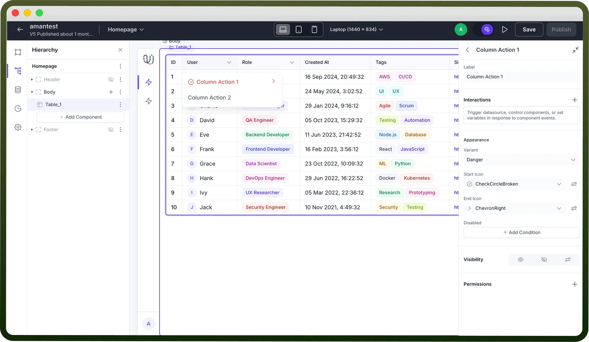

7. A `Decorator` is a slot-based layout container (typically a Stack component) added to a specific table column by clicking the (`+`) icon in the `Slot` section, allowing you to embed and arrange multiple components (like icons, buttons, text, or images etc.) inside a cell. This turns a basic data cell into a flexible, interactive space.

  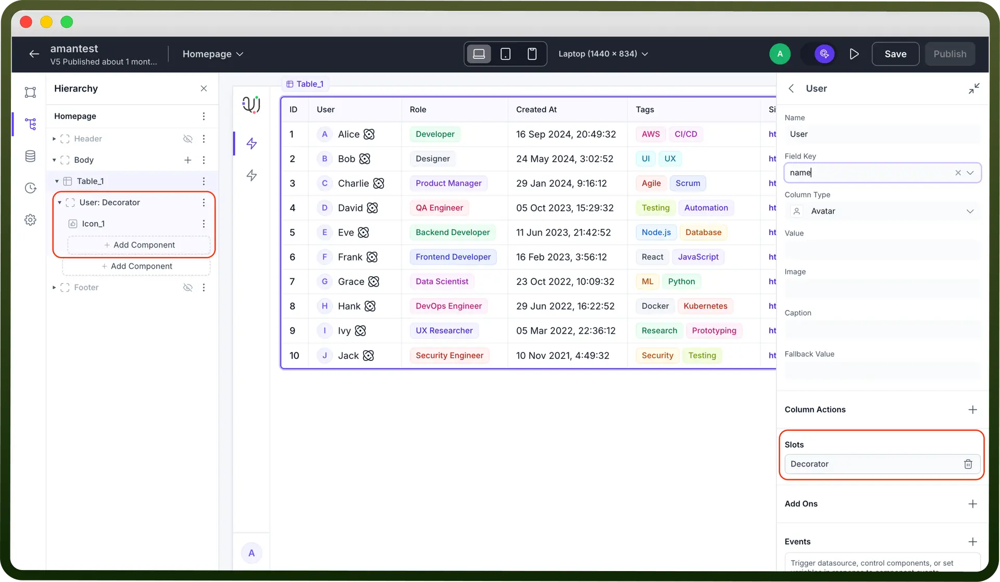

8. `Add-Ons`: Add summary rows for columns to show aggregates like sum, average, count, etc. based on the column type. Displays summary metrics beneath the table, configurable per-column — e.g. total number of users or average progress.
  - **Type**: Defines the data type of the summary value you want to display in the column footer.
    - **Text**: Plain text value.
    - **Number**: Numeric value (supports number formatting).
    - **Percent**: Percentage format.
    - **Currency**: Monetary value with currency formatting.
  - **Value**: Static or dynamic value (by mapping pills from your data source) to display in the summary row for that column.
  - **Appearance**:
    - **Text Alignment**: Controls horizontal alignment within the summary cell — Start, Center, End.
    - **Variant**: Sets the text style preset.
    - **Weight**: Font weight — Light, Regular, Medium, Bold.
    - **Cell Background**: Sets background color for the summary cell.
    - **Cell Text**: Sets text color. **Note:** You can also use dynamic bindings for these style values via the conditions icon next to each option.

      

9. **Events**: This is where you can define your cell interactions, so as to trigger data sources, automations, or workflows.
10. **Column width:** Define column width in pixels. **Grow**: Allows the column to flexibly expand and occupy remaining space in the table layout if enabled.

> **Note:** You will also have access to define visibility logic(s), varied list of appearance customizations depending on column type and/or permission settings for each column.

- **Row Actions**: Just like you configure column actions, Row Actions let you attach interactive actions to each row in your table. Good for decluttering your UI while still giving users row-specific controls like **"**`Edit`**", "**`Open Modal`**", "**`Delete`**"** etc. You can either:
  - Keep actions visible next to each row using the Visible Actions section.
  - Or tuck them into an overflow menu (those 3 dots) under Hidden in Overflow.
- Click on the added row action to configure it.
- `Label`: Name for your action button.
- `Interactions`: Define what happens when the action is clicked (like triggering a data source, navigating, setting variables, etc.)
- `Add-Ons`**:** A **Tooltip** lets you add an optional text that appears on hover.
- `Appearance`: Customize your row action
  - **Color**: Sets button color (e.g. Brand, Neutral, Danger).
  - **Variant**: Style of the button (Ghost, Solid, Outline, etc.)
  - **Start Icon**: Icon before the label text.
  - **End Icon**: Icon after the label text.
  - **Disabled**: Add conditions to disable the action for specific rows.
- `Visibility`: Control when to show or hide the action using conditions.
- `Permissions`: Define role-based or custom access for who can see/trigger this action.

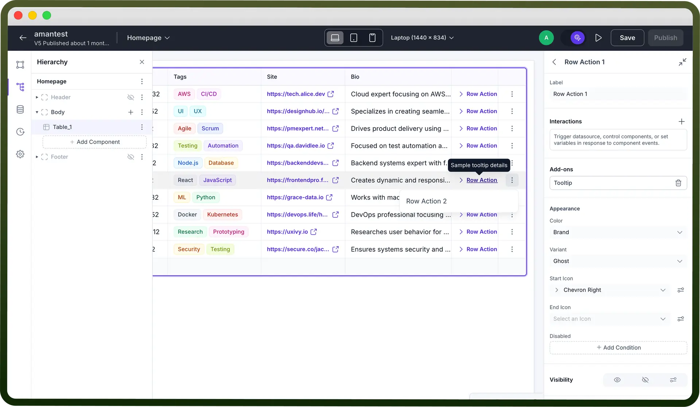

- **Row Selection**:
  - **Single**: Allows selecting one row at a time.
    - **Show selection radio:** Toggle this on to show a radio button for selecting rows visually in the table.
  - **Multiple**: Allows selecting multiple rows simultaneously. Enabling this will automatically add a checkbox to show the rows selected visually in the table.
    - **Add disable conditions:** You may disable multiple row selection by defining a logic.
  - **None**: Disables row selection.
- **Bulk actions** allow you to trigger actions on multiple selected rows at once.
  - Actions show up when one or more rows are selected.
  - You can configure individual bulk actions, set their labels, icons, conditions, and interactions just like row actions.

> **Note:** Adding a bulk action will automatically override the **Row Selection** toggle to **Multiple** — it cannot be set to Single or None while bulk actions exist.

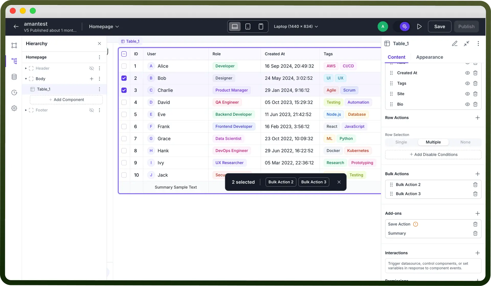

## Add-ons

1. **Toolbar:** The Toolbar provides multiple functionalities that enhance table usability and allow users to customize data views according to their needs: **Note:** Once the toolbar is added, your bulk actions automatically moves to the toolbar at the top of the table instead of a hovering menu. **Standard Actions:**

  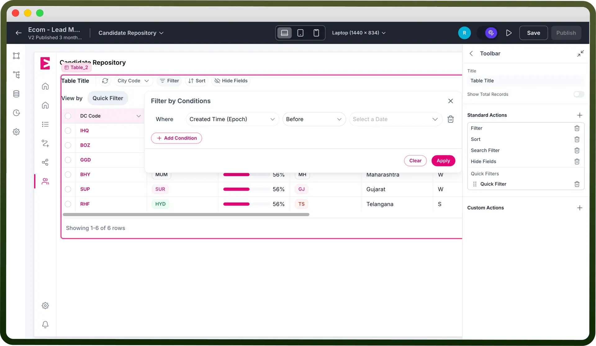

  - **Filter:** Filters let users narrow down data based on specific fields.
    - Only fields marked as filterable (at the object level for Object data sources) will appear in filter options.
    - For custom data sources (like callables or arrays), you’ll need to create and map filters manually.
    - You can also add visible quick filters in the filter section for easy, one-click filtering on key fields.

      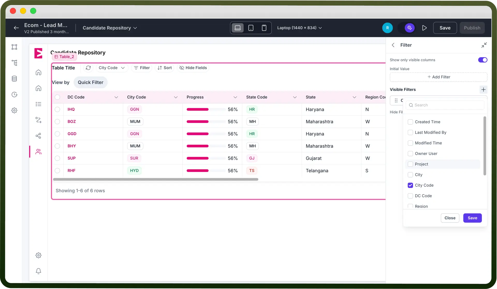

  - **Sort:** The Sort functionality enables users to organize their data when needed, helping them view information in their preferred order.
  - **Search Filter:** The Search Filter adds a search bar for users to quickly find records by matching text within specific fields — ideal for navigating large datasets.
  - **Custom Actions:** Custom Actions let you add interactive buttons to the table, each with configurable interactions. Tooltips can clarify their purpose, and keyboard shortcuts can be assigned for quicker, more efficient access.
  - **Hide Fields:** The Hide Fields feature lets users hide unnecessary columns, creating a cleaner, more focused table view for easier data navigation.
2. **Pagination:** In the case where you have mapped an object to your data table, you can directly set up the pagination by defining Page Size and Total Records. You may also set up the initial page (by default set to page 1 if left empty). If you have mapped a data source to fetch the data using an automation, you will have to first define your page size as usual and then map Page size and Offset pills (`Table` > `Content` > `Page` > `Page Size and Offset`) to your callable to dynamically define pagination in your automation.

  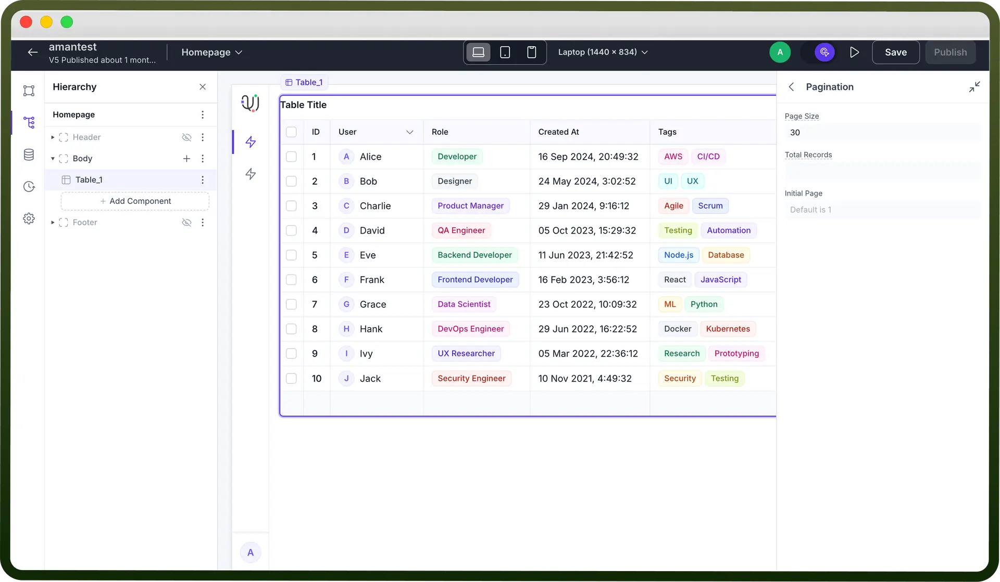

  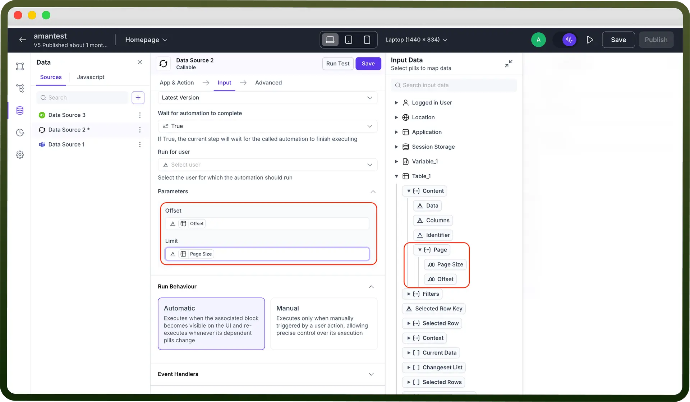

3. **Save Action:** The Save Action lets users confirm and save edits made in the table. A popup prompts for confirmation, and once saved, changes are updated in the mapped datasource object. This option is only available if at least one of the columns is set as editable in the table.

  

4. **Summary:** This option is only available if you add a summary to any of the columns of the data table. Lets you configure conditional visibility, set cell background and/or cell text color. You can also use dynamic bindings for these style values via the conditions icon next to each option.

## Managing Table Data

**Current Data**: An array of all records currently displayed in the table. You need to trigger save action to pick up the latest edits (Table > Current Data).

**Selected Rows**: An array of objects representing the rows currently selected by the user (`Table` > `Selected Rows`).

**Selected Rows Keys**: An array of keys (IDs or unique identifiers) for the selected rows (`Table` > `Selected Rows Keys`).

**Changeset List**: An array of objects capturing any changes made to editable fields before they’re saved (`Table` > `Changeset List`).

**Current Row:** The latest row object a user interacted with — updates with each new selection (`Table` > `Context` > `Current Row`).

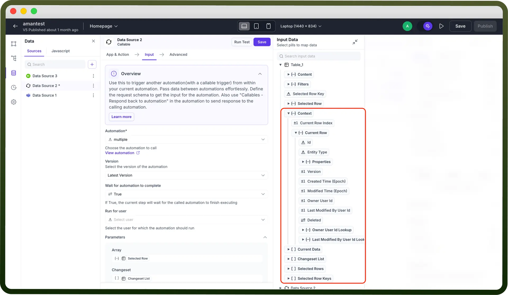

## Appearance Customization

- **Show Table Border** — Toggle to add or remove an outer border around the table.
- **Grid Line Axis** — Control where grid lines appear:
  - Both (rows and columns)
  - Horizontal (only between rows)
  - Vertical (only between columns)
  - None (no grid lines)
- **Row Height** — Adjusts row padding:
  - Compact – 36px
  - Comfortable – 52px
  - Spacious – 92px
- **Hide Header** — Hides the column headers when enabled.
- **Wrap Column Header** — Allows long header text to wrap onto multiple lines.
- **Column Reordering** — Enables drag-and-drop reordering of columns within the table.
- **Empty Message** — Custom text displayed when no data is present.
- **Table Styles:**
  - **Cell Background / Cell Text** — Set background and text color for data cells.
  - **Header Background / Header Text** — Set background and text color for the header row. **Note:** You can also use dynamic bindings for any of these style values via the conditions icon next to each option.
- **Action Column Width**
  - **Actions width** — Manually define the pixel width of the **Row Actions** column.

## Best Practices for Using Data Table Component

- **Prioritize Readability:** Use clear headers, consistent column widths, and alignment to help users scan data effortlessly.
- **Manage Large Datasets Smartly:** Incorporate pagination, sorting, and filtering to keep tables performant and focused.
- **Enhance Interactivity:** Enable row actions, bulk actions, or inline editing to turn tables into functional management tools.
- **Use Visual Hierarchy Thoughtfully:** Highlight important data with tags, badges, or color cues for quick identification.
- **Keep Empty States Informative:** Customize empty messages to improve UX during no-data or filtered views.
