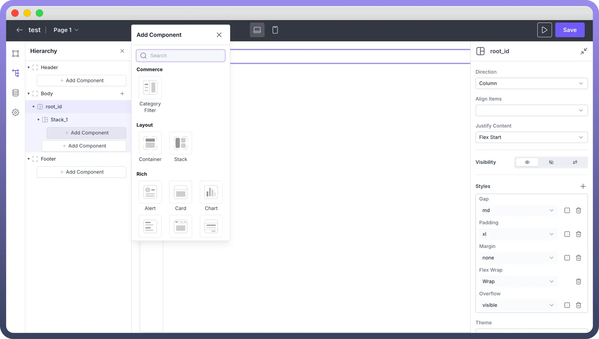

# Define Layout of Interface

Source: https://www.unifyapps.com/docs/unify-applications/defining-layout-of-your-interface
Section: applications

---

## Overview

Layout in app design refers to the **arrangement** and **organization** of visual elements within your application's user interface.

Layout components allow you to **organize** and **structure** application components and group different elements like `buttons`, `text`, `images` etc. on your app's screens.

## Components

The main layout components are:

1. `Stack`: It is a flexible UI component that groups and organizes components vertically or horizontally. Stacks automatically manage spacing and alignment between child elements and allow an indefinite number of components within them. **Note:** You can find more about Stack [here](/docs/unify-applications/stack).
2. `Container`: It is a layout component that groups and organizes UI components into a rigid layout. A container can hold a fixed number of components within it. **Note:** You can find more about Container [here](/docs/unify-applications/container).

These components work together to help you create organized and flexible app layouts. By using Stacks and Containers, you can easily control how your app looks and feels, ensuring a better user experience.

## Best Practices

1. **Keep it** **simple:** Avoid cluttering your layout with too many elements.
2. **Use consistent spacing:** Maintain uniform gaps between elements for a cleaner look.
3. **Align elements:** Proper alignment creates a sense of order and improves readability.
4. **Group related items:** Use containers to organize similar elements together.
5. **Use a grid system:** Helps maintain consistency and balance in your layout.
6. **Test your layout:** Preview your app on different devices to ensure it looks good everywhere.
