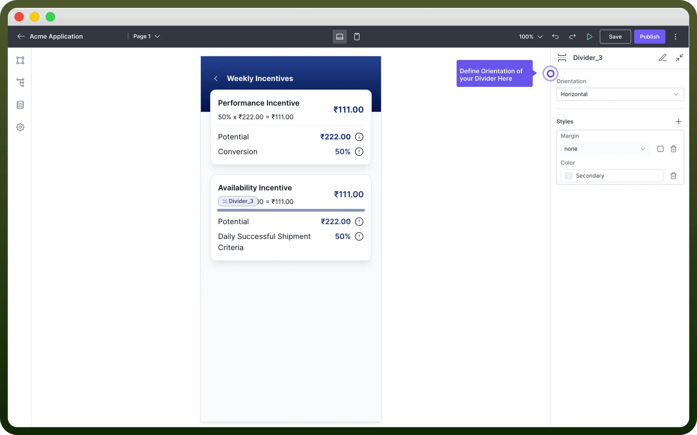

# Divider component

Source: https://www.unifyapps.com/docs/unify-applications/divider
Section: applications

---

## Overview

Divider component is used to visually **separate** or **group content** within your application. It adds a horizontal or a vertical line in the canvas.

This article will outline how to **add**, **configure**, and **style** the Divider component to suit your application's needs.

## Add Vertical Divider

You can change the orientation of the divider under the properties section.

Divider supports two orientations - Vertical & Horizontal.

To add `Vertical Divider`:

1. Add Divider from the component list to your canvas.
2. Choose the divider and change its orientation to vertical in the properties section.

## Appearance Customization

You can define various styles to the Divider Component.

| **Property** | **Description** |
|---|---|
| `Margin` | Add **custom** margins to separate the Divider from adjacent components. Options can be defined using standard CSS margin values (e.g., `10px`, `1em`, etc.) |
| `Color` | Choose a color from the **palette**. You can also add Conditional Coloring. |
| `Height` | Define height for the divider. |
| `Width` | Define width for the divider. |
| `Min-Height` | Defines the minimum height of the divider |
| `Min-Width` | Defines the minimum width of the divider |
| `Max-Height` | Defines the maximum height of the divider |
| `Max-Width` | Defines the maximum Width of the divider |
