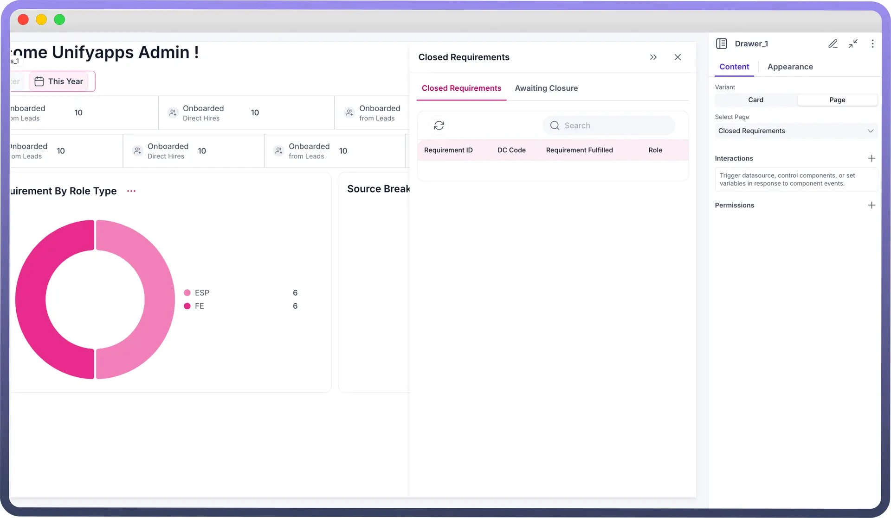
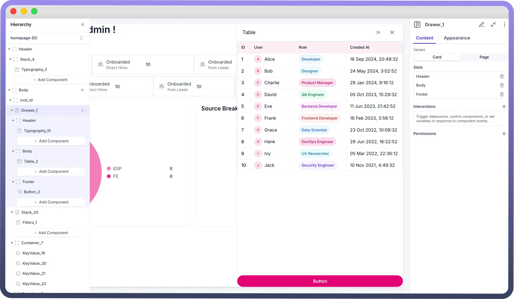
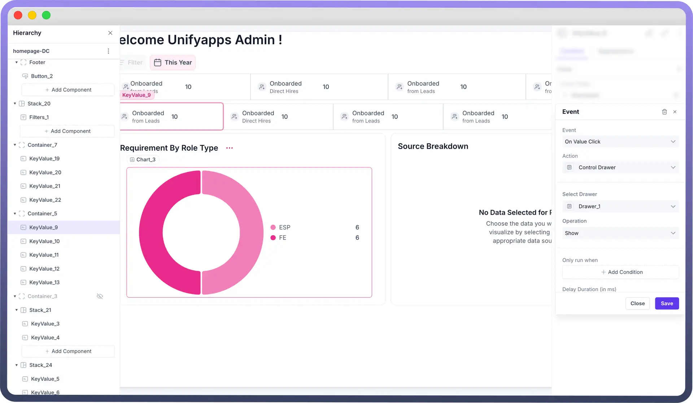

# Drawer

Source: https://www.unifyapps.com/docs/unify-applications/drawer-component
Section: applications

---

## Overview

The Drawer is a UI element that slides into view from different edges of the screen - either from the left, right, or bottom. Think of it as a panel that emerges when needed, serving three main purposes:

1. **Display Information:** It can show additional content without disrupting the main view
2. **Action Prompts:** It provides an intuitive way to ask users to take specific actions
3. **Data Collection:** It offers a dedicated space for users to input information or make selections

You can position these drawers based on your needs:

- **Left-aligned** for navigation menus
- **Right-aligned** for notifications or details
- **Bottom-aligned** for mobile-friendly interactions

Drawer can be of two variants :

1. `Page` Type Drawer
2. `Card` Type Drawer

## Configure a Page Drawer

The Page Drawer lets you display complete pages. Think of it as embedding one page inside another through a drawer interface. Here's how it works:

**Before configuring a Page Drawer, you need to:**

1. First, create and design the content on a separate page that you want to show in the drawer
2. Then navigate to where you want to implement the drawer

**You can configure a Page Drawer by following the below steps:**

1. Add Drawer from the component list to your canvas. **Note:** The drawer always gets added to the top of your component hierarchy.
2. By default, the added Drawer will be of Page Type. You can find it under: `Properties` → `Content` → `Variant`.
3. Select a page which you want to render inside the drawer.
4. By default:
  1. The Position of the Page type drawer will be **‘**`Right`**’**. Other positions are ‘`Left`’ and ‘`Bottom`’. You can change it under the Appearance tab in properties.
  2. The width of the drawer will be `38.2%`**.** User has the ability to select in terms of percentage as well as pixels (px)

    

## Configure a Card Drawer

In the Card Variant, the drawer appears on the screen like a card, integrated into the main page. Users can add components directly within this card-like drawer. You can configure a Card Drawer by following the below steps:

1. Add Drawer from the component list to your canvas.
2. Choose its variant as Card.
3. Add Components in Drawer like you add in a Card Component in 3 Different Slots of Header, Body & Footer. **Note:** Check Card Component’s Documentation to know in detail about adding components in a card.
4. By default:
- The Position of the Card type drawer will be **‘**`Right`**’**. Other positions are ‘`Left`’ and ‘`Bottom`’. You can change it under the Appearance tab in properties.
- The width of the drawer will be `38.2%`**.** User has the ability to select in terms of percentage as well as pixels (px)

  

### Defining Opening, Expanding, Collapsing and Closing of Drawers

Opening and Closing of Drawer is defined in the Interaction section. Drawer is triggered by the interaction defined in other components. To define opening of a Drawer, follow the below steps:

- **Add Interaction:** Select a component (e.g., button) that will trigger the Drawer to open.
- **Configure Interaction:** Set the interaction action to "`Control Drawer`."
- **Specify Operation:** Choose "`Show`" or “`Hide`” to control visibility of the Drawer when the triggering component is activated.

  

Drawers have attached functionality of Collapsing, Expanding and Closing when opened. But to open a drawer, you must trigger ‘`Show`’ event from the interactions of any other component.

> **Note:** You can also define events like On Close where you can mention the actions or workflows that should be performed when the drawer is closed, such as resetting forms or updating data.

### Styling and Customization

| **Property** | **Description** |
|---|---|
| `Width` | Adjust the horizontal size of the drawer. (ONLY when the drawer’s position is Right/Left) |
| `Height` | Adjust the vertical size of the drawer. (ONLY when the drawer’s position is Bottom) |
| `Position` | Sets the position of drawer on screen. |
| `Visibility` | Specifies visibility, invisibility and conditional visibility of the drawer |

## Defining Permissions

The Drawer component allows you to set visibility permissions based on the permissions granted to the logged-in user. This ensures that only authorized users can view or interact with the Drawer.

> **Note:** You can refer to Permissions documentation to know more about defining permissions for each component.
