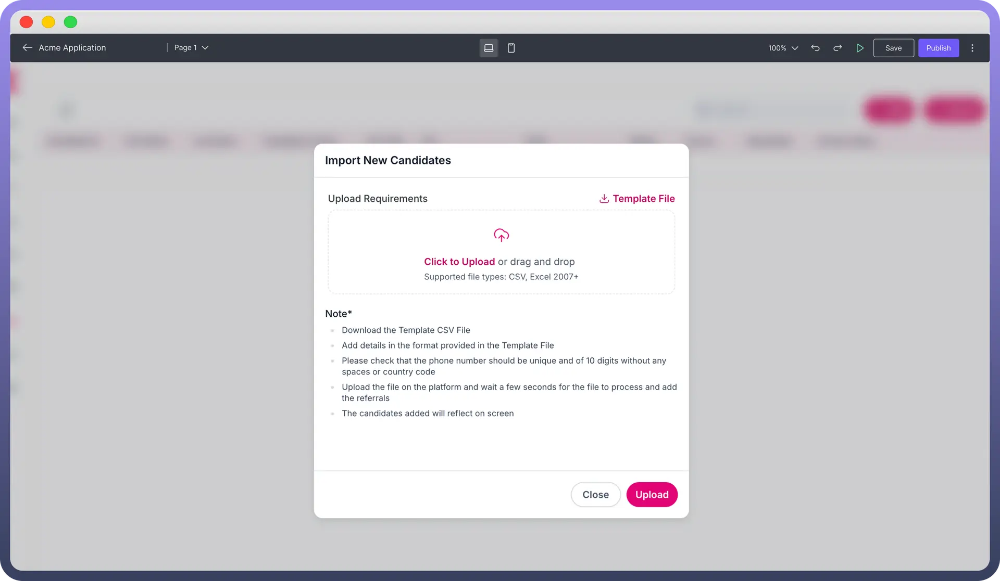
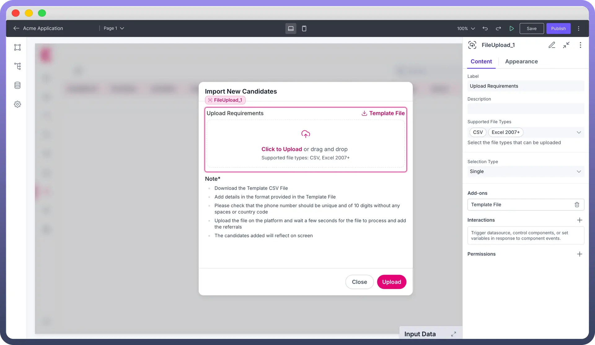
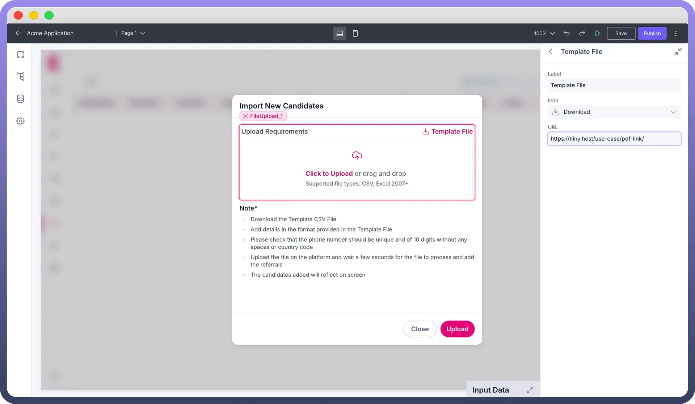
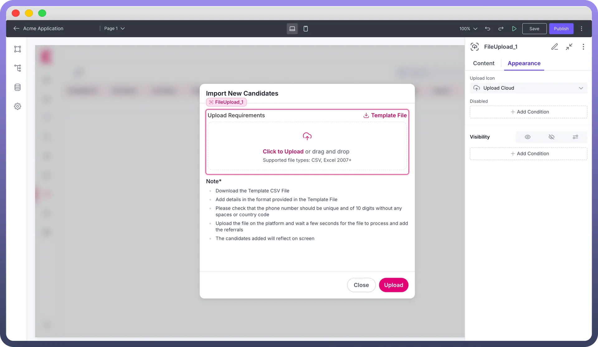

# File Upload

Source: https://www.unifyapps.com/docs/unify-applications/file-upload
Section: applications

---

## Overview

The File Upload component enables users to upload files in your application, supporting various configurations for labeling, file types, and user interactions. 
This guide offers an overview of how to set up and customize the File Upload component.

## Configuring the File Upload Component

### Setting Content and File Selection Options

- `Label`: Enter a descriptive label for the file upload field. This will guide users on the expected file content or purpose.
- `Description`**:** Provide a brief description to clarify any specific instructions or details related to the file upload.
- `Supported File Types`**:** Define which file types are supported by listing acceptable formats (e.g., .pdf, .jpg, .docx) in the "Supported File Types" field.
- `Selection Type`**:** Choose either Single or Multiple file upload options from the "Selection Type" dropdown. If Multiple is selected, set the maximum number of files that users can upload in a single instance.

### Adding a Template File

Under the "`Add-ons`" section, you can include a template file to guide users on the expected file format or content.

- `Label`**:** Enter a label for the template file, which will be displayed as an option users can download.
- `Icon`**:** Choose an icon to visually represent the template file for added clarity.
- `URL`**:** Provide the URL for the template file, so users can download it for reference before uploading their file.

### Defining Interactions on File Upload

The File Upload component supports `On Upload` events. This allows you to trigger an action or a workflow whenever a file is uploaded. Use this feature to perform various actions, such as notifications when a file is uploaded.

## Customizing the Appearance

Use the appearance settings to align the look and functionality of the file upload component with your application’s needs.

- `Upload Icon`**:** Select an icon to represent the upload functionality.
- `Disabled Condition`**:** Specify conditions to disable the file upload component, restricting user actions when necessary.
- `Visibility`**:** Control the component’s visibility based on specific conditions or user roles to enhance the dynamic user experience.

### Defining Permissions

Every component allows you to set visibility permissions based on the permissions granted to the logged-in user. This ensures that only authorized users can view and interact with the component.

> **Note:** You can refer to Permissions documentation to know more about defining the permissions for each component.

## Best Practices for Using File Upload Component

- **Clarify Instructions**: Use clear labels and descriptions to help users understand file requirements quickly.
- **Limit File Types**: Specify supported file types to prevent upload errors and ensure compatibility with your application.
- **Use Template Files**: Providing a template file can improve accuracy and reduce user errors during the upload process.
- **Set Appropriate Limits**: For multiple file uploads, set a sensible limit to avoid excessive uploads and maintain performance.
