# Filters

Source: https://www.unifyapps.com/docs/unify-applications/filters
Section: applications

---

## Overview

Filters help end users refine information on dashboard, stats and charts, to quickly show exactly what they need by selecting date ranges, or choosing particular categories of information across multiple data sources simultaneously.

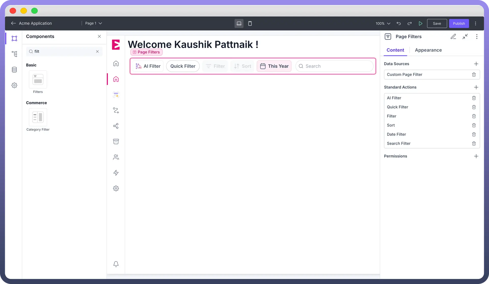

## Standard Actions

Following are the standard actions provided in Filter Components.

- **Date Filter:** A date filter allows users to limit data based on specific time periods. It’s particularly useful for Dashboards which display Statistics that change over time. **Features****Configuring Date filter**
  - `Range Selection` **:** Users can set a start and end date to filter data within a specific period.
  - `Presets` **:** Common time frames (e.g., "Last 7 days," "This Month," "Last Year") enable faster data exploration. You can also define a custom time range to be used as a default preset.

    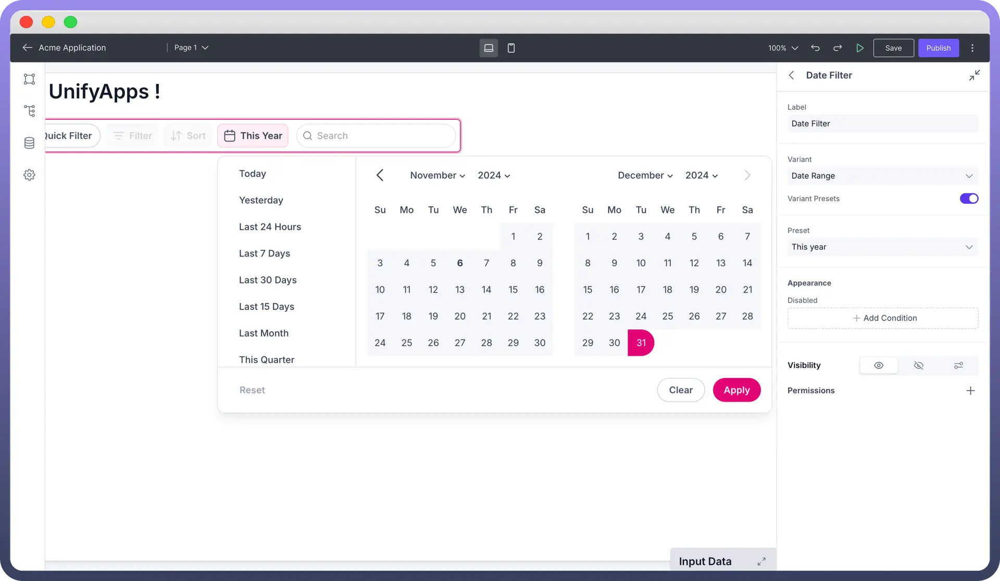

  - `For Analytics By UnifyApps`**:** Set the start time, end time, previous start time and previous end time for the date fields from the ‘Date time filter’ object.
  - `For Storage By UnifyApps`**:** Select the date fields (Created time/modified time/ any custom field) and add operators as required. For example, if you want to filter out records on the basis of created time, ‘created time’ greater than or equal to start time and ‘created time’ less than or equal to end time.

    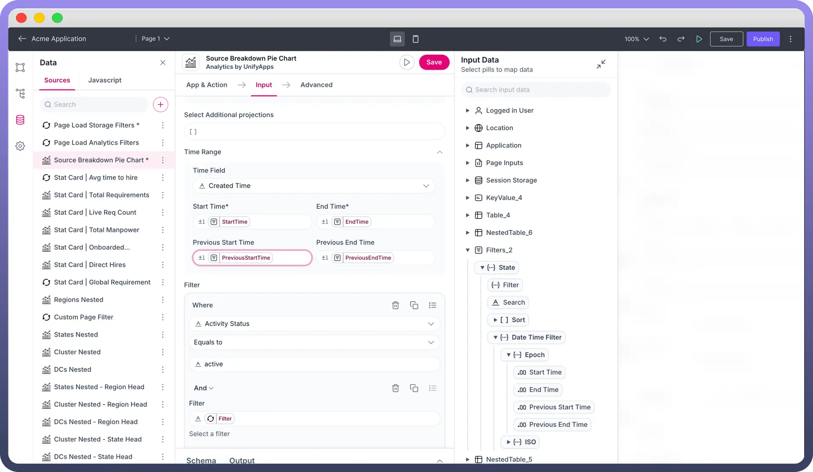

- **Sort:** Organizes data in a specific order, allowing users to view information according to their preference. **Features** **Configuring Sort Filter** Set the sort property of your analytics or storage data source by selecting the sort array from the state of Filters Component.

  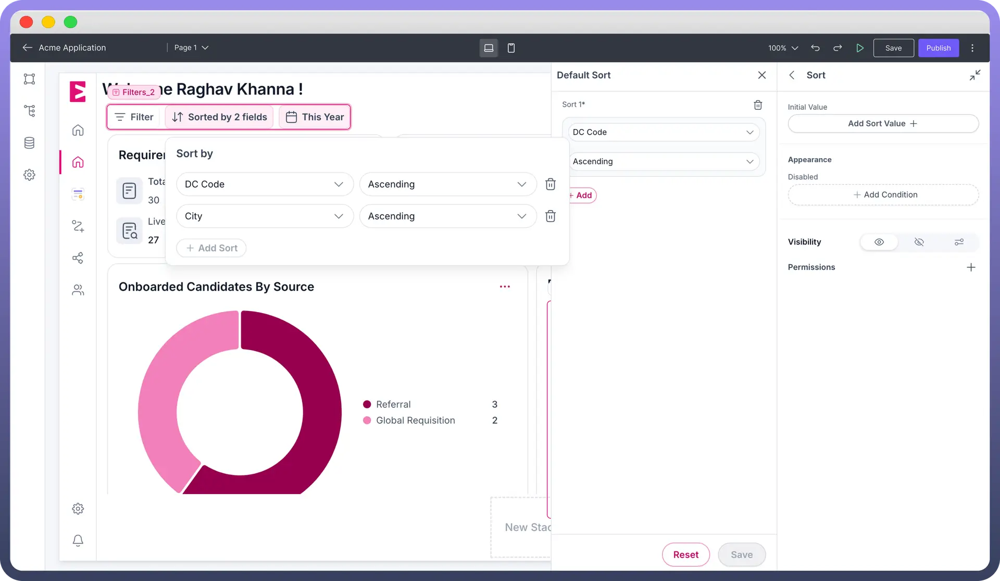

  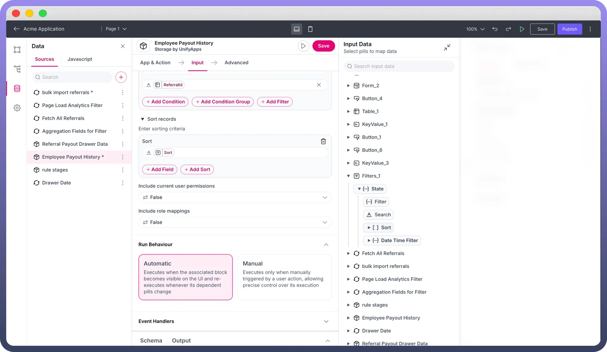

  - `Ordering of Data` **:** Data can be sorted either in ascending order or descending order of selected field. Users can also combine sorting of multiple fields in desired order to view the data.
  - `Initial Value` **:** Users can also add a default sort to the Dataset using the initial value property.
- **Search:** The search bar allows the end user to filter out data by performing search operations using keywords or phrases. **Configuring Search Filter**

  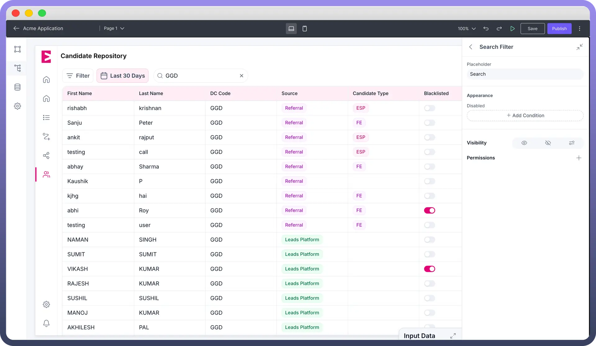

  - Select the fields you want the user to perform search operations on in your storage or analytics data source.
  - Map the search input pill from the filters.

    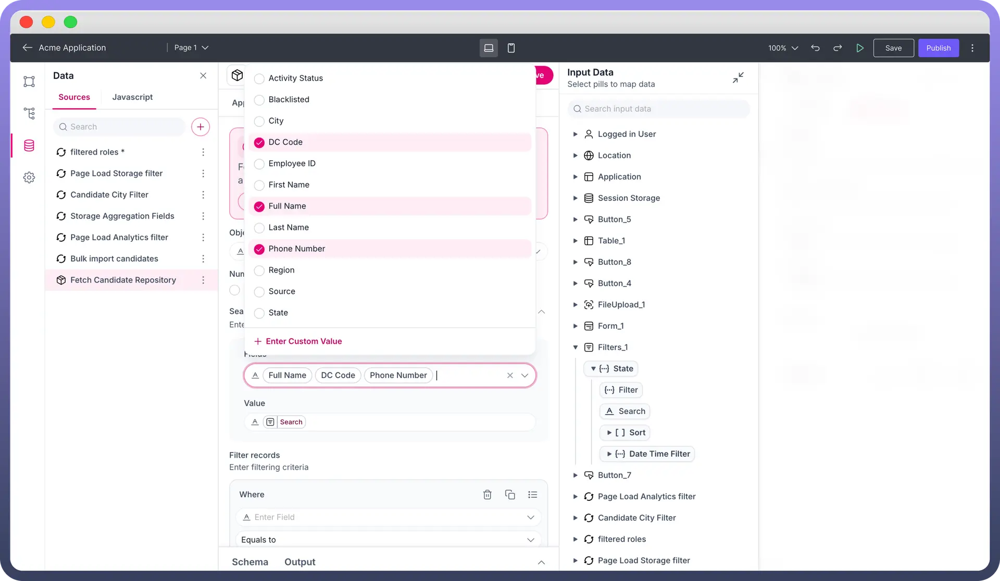

- **Filter:** This allows users to filter out data by performing operations on selected fields. Operators that can be applied to filterable fields:

| **Field Type** | **Operators** |
|---|---|
| `String Field` | Contains, Equals to, Does not equal, Starts with, Ends with |
| `Boolean Field` | Is, Is not |
| `Number Field` | Less than, Less than or equal to, Greater than, Greater than or equal to, Equals to,  Does not equal |
| `Lookup Field` | Is, Is not |

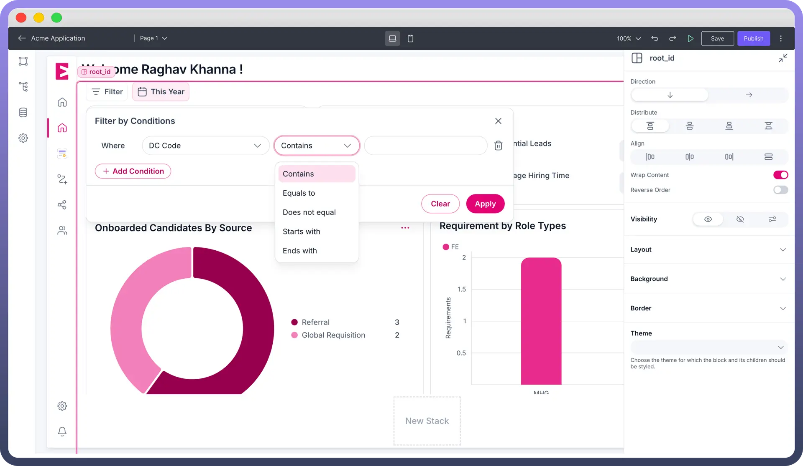

**Configuring Filter :** Map the filter object from the input pills in your storage or analytics data source.

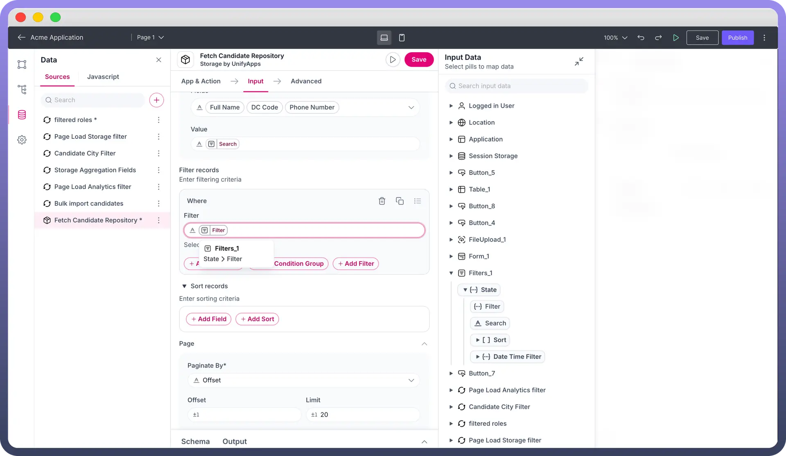

- **Quick Filter** Quick Filters allow users to apply pre-defined filters on their page components. You can customize quick filters using Data or Date filter types and select their value from the ‘`Add Filter Value`’ property. **Note:** Selecting the ‘`Add Filter Value`’ will display all the fields that can be filtered which are included in your data sour

  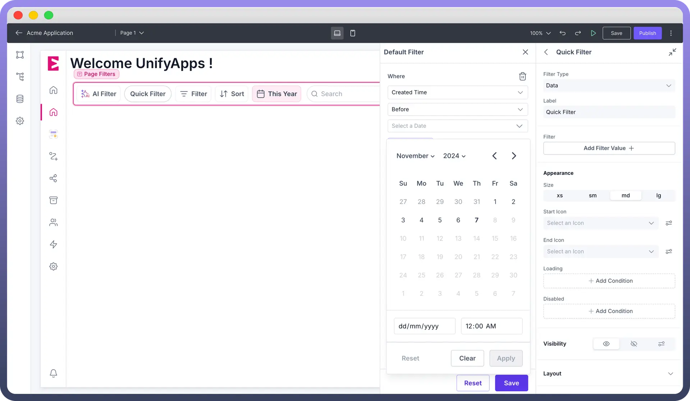

- **Field Filter** Field Filters help users to filter out a single field and with specific operators. You can specify the field and operators to be shown for filtering. For example, you can select a string field type and only allow ‘Equals to’ operator.

  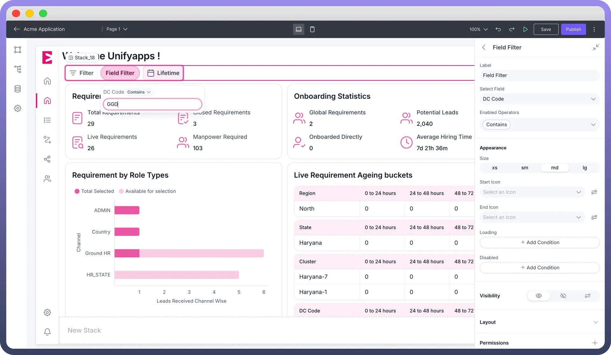

## Setting Up Filterable Fields Using Aggregation Metadata

The filter component works on the basis of aggregation metadata. This acts as a blueprint to decide the fields which are filterable, searchable or sortable.

Only the fields included in the aggregation metadata will be displayed by the filter component.

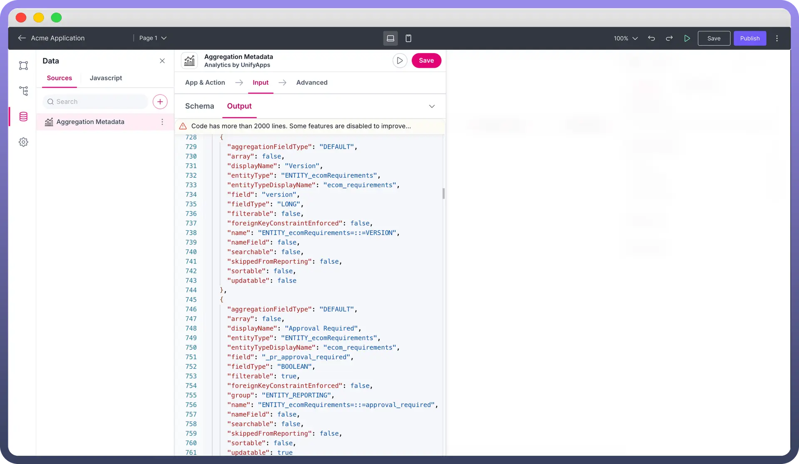

## Stitching Filter Component with Data Sources

You should include all relevant data sources on which the end user has to apply filtering, searching or sorting. When a data source is added to filters, it fetches the aggregation metadata directly when the data source is either storage or analytics.

**In Case The Data Source is Callable:**

Create a separate data source for defining the aggregation metadata for configuring your Filter Component.

> **Note:** When data source used is Storage or Analytics, make sure to enable filtering, sorting, searching on fields as required while defining the object schema.

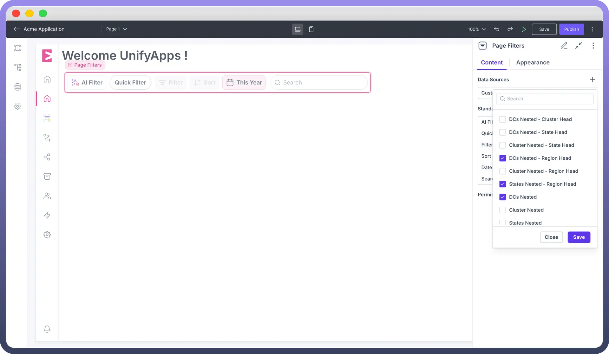

## Best Practices

- **Data Source** - Your data source should ideally be storage or analytics as they can easily be filtered out.
- **Date Filters -** It is better to use Epoch timestamps.
- **Filterable fields** - Make sure you enable only those fields that are required by the users as there can be multiple fields with filters enabled by default such as ‘`Created time`’ and ‘`Modified Time`’.
- **Labels** - Always label your filter so that it appears more intuitive to users.
