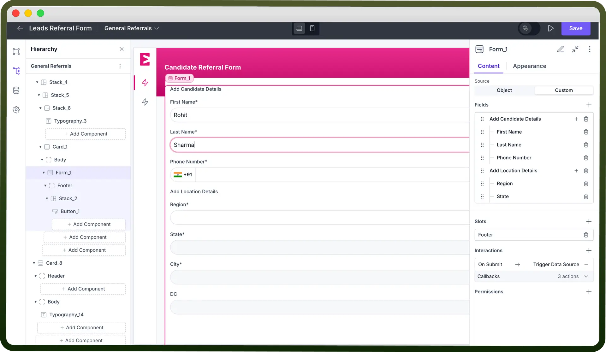
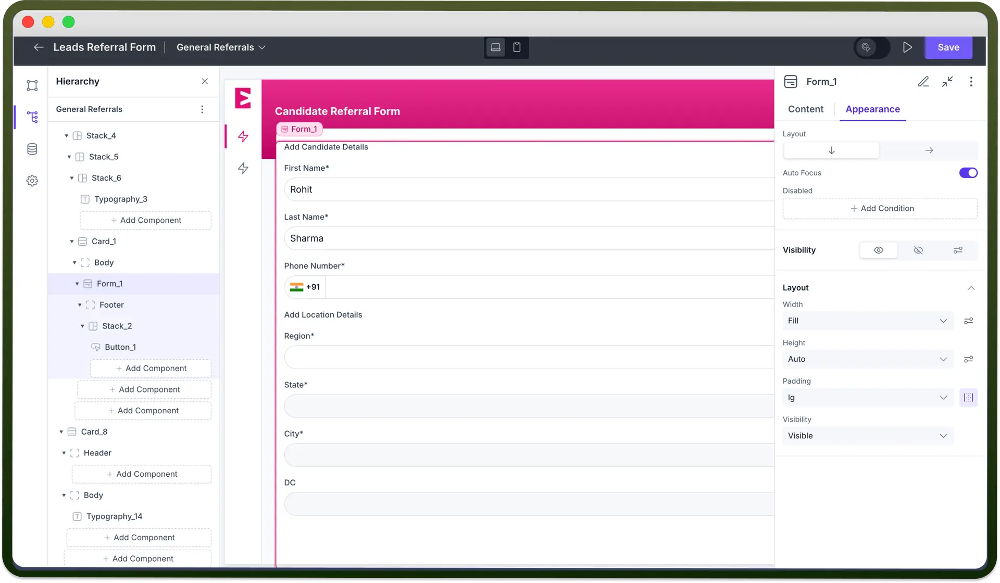

# Form component

Source: https://www.unifyapps.com/docs/unify-applications/form-component
Section: applications

---

## Overview

The Form is an interactive component used to collect inputs from users. It supports different input types, such as text, password, date-time, phone number, OTP, and email. You can create multiple fields for various input types, and once these fields are filled, interactions can be triggered based on form submission.

## Key Properties

Once the Form component is added to the canvas, you can configure it with these key actions:

1. `Source`**:** Define the fields shown in the form using one of two source options:
  - `Object`**:** Select an object as the source. Fields defined in this object will automatically appear in the form, allowing you to create or update records in the object.
  - `Custom`**:** Manually define each field in the form.
2. `Fields`**:** After setting up the source, you will see the form’s fields in this section. Detailed field customization options are discussed later in this article.
3. `Slots`: Forms come with two main slots — **Header** and **Footer**. The Header typically contains the title, while the Footer holds the Reset and Submit buttons, which clear or submit the Form. Slot direction, alignment, and other layout options are adjustable, similar to stack components. **Note:** You can refer to [stack article](https://www.unifyapps.com/docs/unify-applications/stack) for the same.
4. `Interactions`**:** Define actions triggered by form field changes or form submission. Click “`+`” under "`Interactions`" to add actions like triggering a data source, resetting the form, redirecting to a URL, and more. **Note:** You can refer to [Interactions article](https://www.unifyapps.com/docs/unify-applications/handle-interactions-in-interface) for the same.

## Configuring a Form

Once the form is added to the canvas, you can include fields, sections, and components within it. Adding a field places a single input field in the form, while adding a section allows you to group multiple fields together. You can also add other components, like charts, stacks, or cards, to enhance the form’s functionality.

After the form fields are added, they can be configured with the following properties:

| **Property** | **Description** |
|---|---|
| `Label` | Enter the label text of the form in the “Label” field. |
| `Type` | Define the type of input for the form field. |
| `Is Optional` | Check this box to make the field optional. |
| `Description` | Add helper text in the “Description” field. |
| `Placeholder` | Define placeholder text here. |
| `Default Value` | Set a default value for the field. |
| `Add Ons` | Add suffix or prefix icons to the field. |

## Customizing the Appearance

Use the appearance settings to align the look and functionality of the form component to fit your application’s needs.

- `Layout`**:** Select a layout for your form from the 2 available layouts — Row and Column.
- `Auto-focus`**:** Form fields become ready for typing as soon as the page loads, or the page automatically scrolls to show the form if needed.

## Defining Permissions

Each component allows you to set visibility permissions based on the logged-in user’s role, ensuring only authorized users can see and interact with the form.
