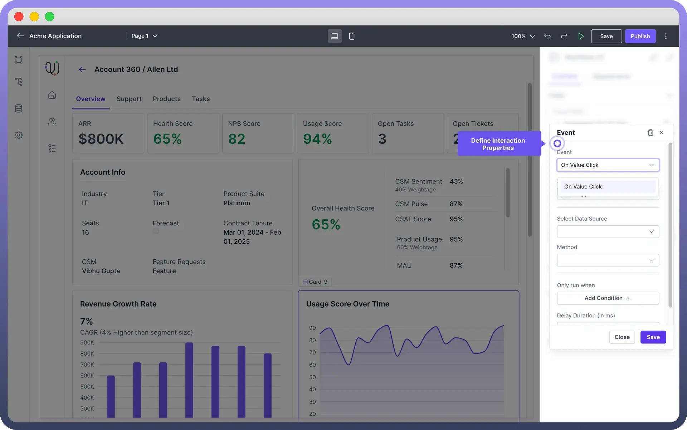
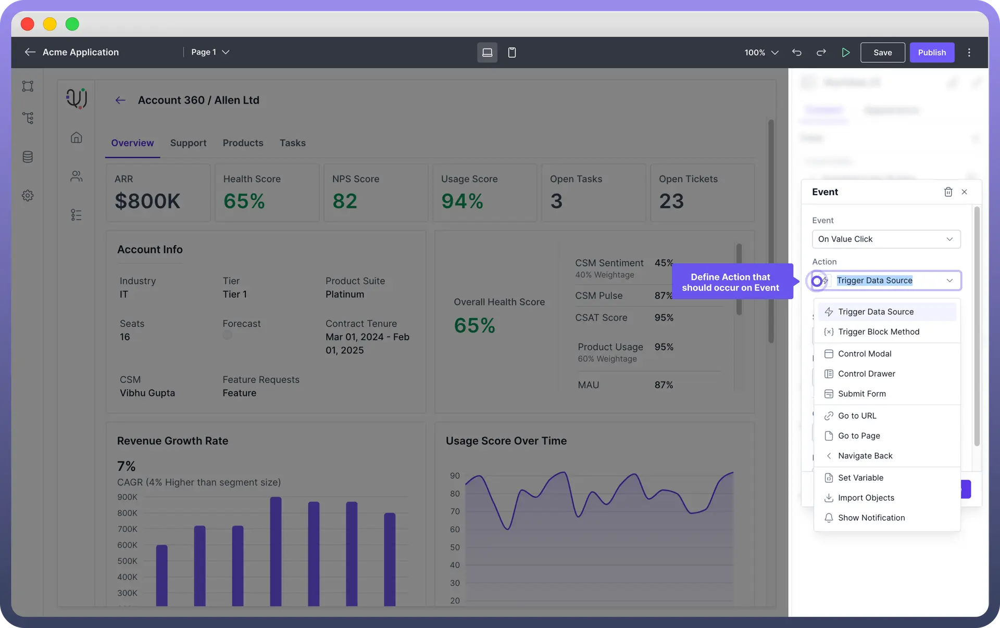
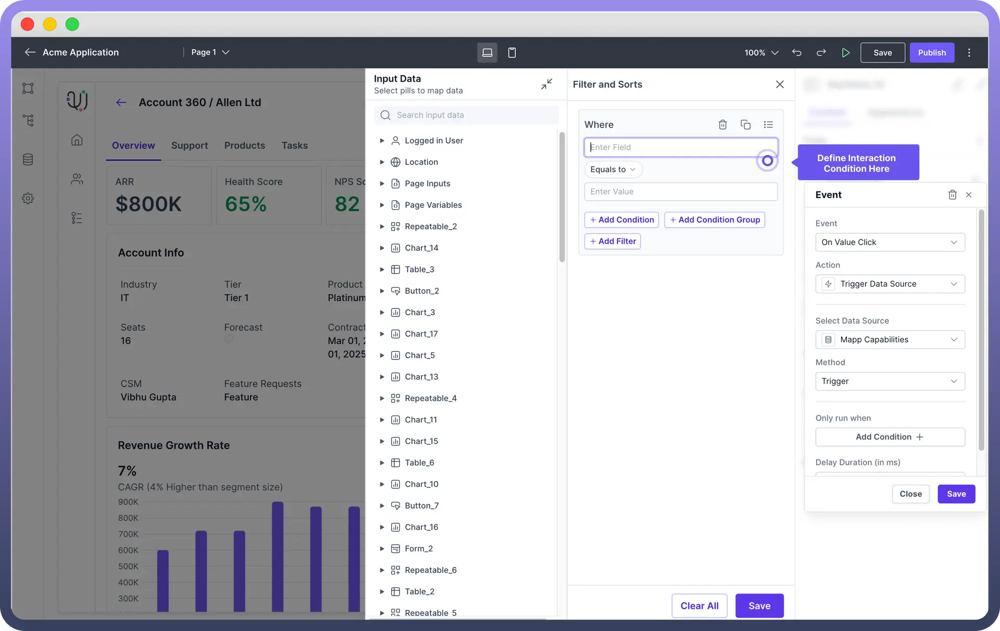

# Handle Interactions in Interface

Source: https://www.unifyapps.com/docs/unify-applications/handle-interactions-in-interface
Section: applications

---

## Overview

The Interaction property enables components in your low-code application to respond to user actions, like a button's "`OnClick`" event. Configurators can define actions such as opening pages or triggering data sources.

This article explains how to initiate and manage UI actions, which can be executed serially, in parallel, or conditionally to create complex, dynamic behaviors.

## How to Configure Interaction?

When a user interacts with a component, like clicking a button or selecting a row in a table, an event is triggered. Configurators can then define actions on these events to make the application responsive and dynamic.

The Step-by-step explanation of how interactions work is given below:

1. **Select Event for the Interaction**: Click on “`Interactions`” in the property panel of the component and select the event for which you want to define an action. **Note:** Each component has its own set of events. For more details, refer to the component-specific [articles](/docs/unify-applications/add-components-to-your-interface).

  

2. **Select the Action:** Define what action should happen when the event is triggered and configure the necessary parameters for the chosen action.`Control ModalGo to Page.` Different type of actions supported are as follows:

  

| **Action** | **Task Performed** |
|---|---|
| `Trigger Data Source` | Initiate the data source to **fetch** the data. |
| `Trigger Block Method` | Invoke a specific method or function within a **block** of code to perform an action. |
| `Control ModalGo to Page` | Open or close a modal dialog for additional **input** or **actions**. |
| `Control Drawer` | Toggle a side drawer for navigation or additional options |
| `Submit Form` | Send form data for **processing** and **handle** the response accordingly. |
| `Go to URL` | Redirect the user to a specified URL in a **new** or **existing** browser tab. |
| `Go to Page` | Navigate the user to a **different** page within the application. |
| `Navigate Back` | Return the user to the **previous** page in their browsing history. |
| `Set Variable` | Assign a value to a variable to **store** data or **state** within the application. |
| `Import Objects` | Load **external** objects or data into the current context for use or manipulation. |
| `Show Notification` | Display a notification to inform the user of a specific event or action. |

3. **Select the Method for the event** Under the "`Method`" dropdown, specify the method you want to choose. Currently UnifyApps supports the “`Trigger`” method.

## Configure Conditional Interactions

You can add conditions to control when the interaction should occur. You need to define the condition in the condition panel by using required fields or operators.

> **Note:** You can use the data pills from input data tab and also apply excel formulas directly while defining the conditions

## Example Walkthrough: Handling Button Clicks

Setting up an interaction for a button to navigate to the next page involves adding a button, defining an event and specifying the action to be performed in response to that event. Here’s a **step-by-step** guide to setting up this interaction:

1. **Add a Button Component:**
  - Drag and drop the Button component from the Components panel into your application's interface.
2. **Select the Button:**
  - Click on the button to open its properties panel on the right side of the screen.
3. **Define the Event:**
  - In the properties panel, locate the Interactions section.
  - Click on the `Add interaction` button and the event dialogue box will appear.
  - Choose the “`Onclick`” event from the dropdown menu. This event triggers when the button is clicked by the user.
4. **Specify the Action:**
  - After selecting the “`OnClick`” event, you need to define the action to be performed.
  - Choose the Go to Page action from the list of available actions.
5. **Configure the Action:**
  - Select the target page you want to navigate to from the dropdown menu. Ensure that the target page is already created in your application.
6. **Save the Interaction:**
  - Click the Save button to apply the interaction settings to the button.

Now, when a user clicks the button, they will be navigated to the specified page.

## Best Practices

1. **Use Clear and Descriptive Event Names:** When defining events, use clear and descriptive names that indicate the action being performed. This makes it easier to manage and troubleshoot interactions.
2. **Set Appropriate Conditions:** Use conditions to control when actions are executed. This ensures that actions are only performed when necessary.
