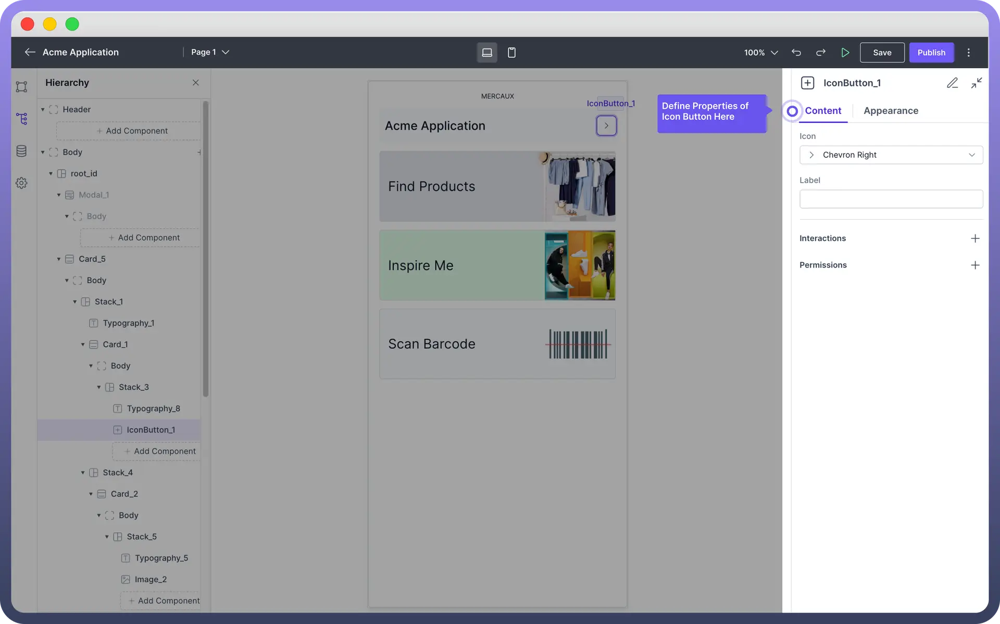

# Icon Button

Source: https://www.unifyapps.com/docs/unify-applications/icon-button
Section: applications

---

## Overview

The Icon Button is used when you want an icon that also acts like a `button`, making it clickable and interactive

It helps users quickly understand the action they can take by just looking at the icon.

## Key Properties

Once the Icon Button is added, you can customize it through the properties panel on the right side of the screen.

1. `Icon`: Choose an icon from the dropdown menu.
2. `Label`: Add a label to your Icon Button. When the user will hover over the icon, they can read the label and know about it.
3. `Interactions`: Define the interactions that should occur when the button is clicked. Click the "`+`" button under "Interactions" to add a new interaction, such as triggering a data source or navigating to another page & many more. Refer to [Interactions](/docs/unify-applications/handle-interactions-in-interface) article for more details.

> **Note:** Select an icon that clearly represents the **action** the icon button will perform. Ensure that the icons chosen are universally understood to avoid ambiguity. Also, always include a label for easy user navigation. You can even use data pills for dynamic Label.

## Appearance Customization

The Icon Button component can be styled to match your application's design:

| **Property** | **Description** |
|---|---|
| `Color` | Choose a color for your Icon Button. Options include brand colors, **neutral** (black) or **danger** color (red). |
| `Size` | Adjust the size of the Icon Button. Options include **Small** (sm), **Medium** (md), and **Large** (lg) |
| `Variant` | Select the button variant from options like **Solid** (with background fill), **Outline** (with outline border), or **Ghost** (with just text). |
| `Padding` | Add or adjust padding to change the spacing around the icon. You can find padding under Styles section |

> **Note:** Icon Buttons are effective for actions that are easily understood by icons alone, like a trash icon for delete actions or a magnifying glass for search. In contrast, Normal Buttons are more suitable when the action benefits from accompanying text, such as "**Submit**" or "**Create Account**".
