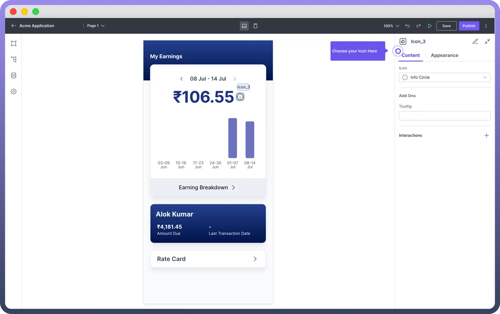

# Icon

Source: https://www.unifyapps.com/docs/unify-applications/icon
Section: applications

---

## Overview

An icon is a small image or symbol used to **represent a function** in an application. This article will walk you through how you can configure icon components.

## Key Properties

Once the Icon component is added, you can customize it through the properties panel on the right side of the screen.

- **Choose an Icon**: Select an icon from the dropdown menu which includes symbols for actions like `saving`, `deleting`, `editing`, etc.
- **Add a Tooltip**: Enter text to display as a `tooltip`. This text appears when the user hovers over the icon, providing additional context or information about the icon's purpose.

### Appearance Customization

The Icon Button component can be styled to match your application's design:

| **Property** | **Description** |
|---|---|
| `Color` | Choose a color for your Icon Button. Options include **brand** colors, **neutral** (black) or **danger** color (red). |
| `Size` | Adjust the size of the Icon Button. Options include **Small** (sm), **Medium** (md), and **Large** (lg) |
| `Variant` | Select the button variant from options like **Solid** (with background fill), **Outline** (with outline border), or **Ghost** (with just text). |
| `Padding` | Add or adjust padding to change the **spacing** around the icon. You can find padding under Styles section |

## Define Interactions

Define the interactions that should occur when the icon is clicked or interacted with. This can be configured by adding a new interaction under the "`Interactions`" section.

> **Note:** Check out the [Interactions](/docs/unify-applications/handle-interactions-in-interface) article for more details on setting up various types of interactions.

## Best Practices

- **Consistency**: Use icons consistently throughout your application to avoid confusion. For example, always use the same trash icon for delete actions.
- **Simplicity**: Choose simple and recognizable icons. Overly complex icons can be difficult to understand at smaller sizes.
