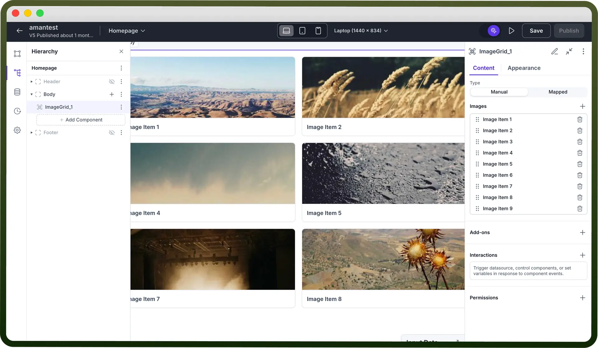
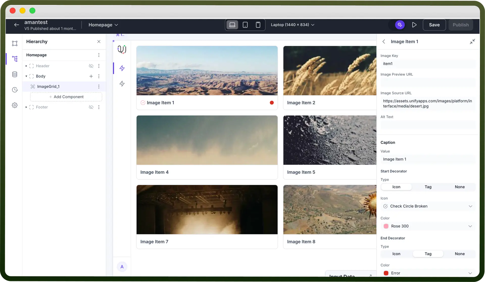
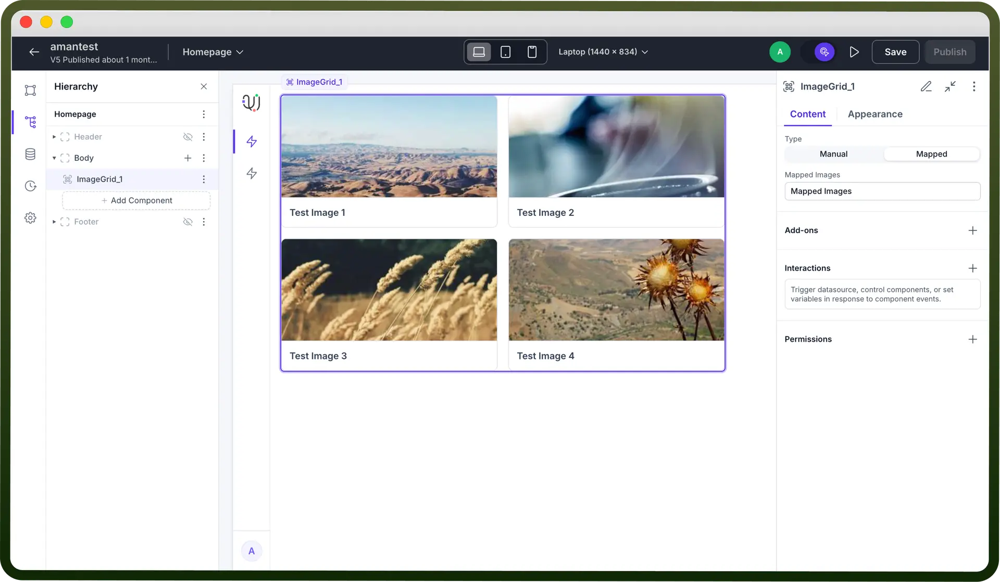
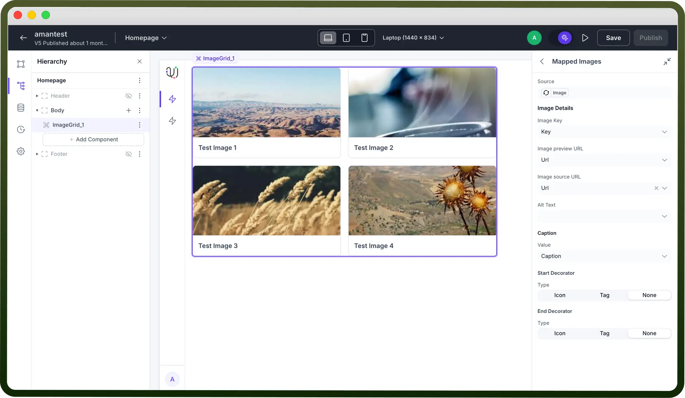
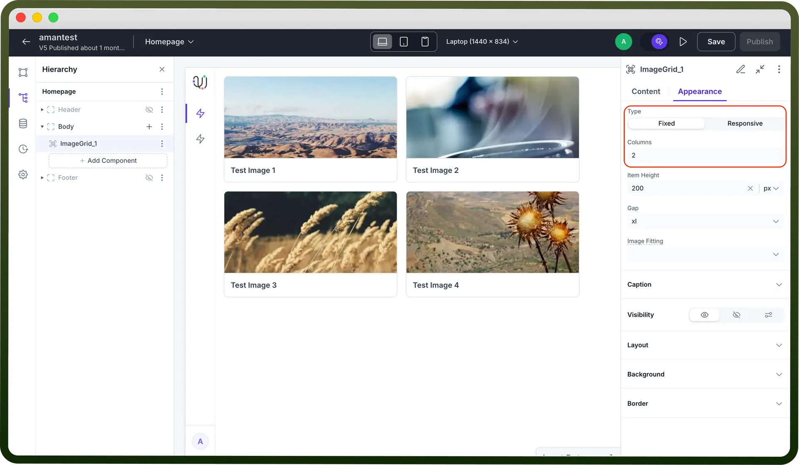
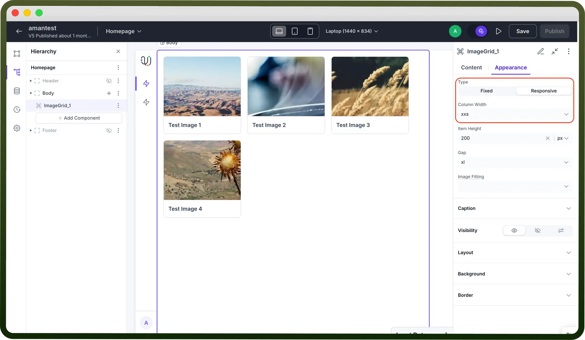

# Image Grid component

Source: https://www.unifyapps.com/docs/unify-applications/image-grid
Section: applications

---

## Overview

The **Image Grid** component is a flexible and responsive UI element in our low-code platform that allows users to display a collection of images in a structured, grid-based layout. Ideal for showcasing product photos, portfolios, galleries, or visual data, the Image Grid makes it easy to organize and present multiple images in a visually appealing format. With support for customization options like column count, spacing, image scaling, and click actions, this component empowers users to create rich visual experiences.

## Configuring an Image Grid

You may configure the Image Grid component by following the below steps:

1. Add Image Grid from your component list to your canvas’ body.
2. You can define content for Image Grid by choosing the type of Layout between Manual or Mapped.

**Manual**

Choose type `Manual` (default option), then use the `Images` list to add items one by one by clicking the (`+`) icon. Each item represents an image card in the grid, and you can reorder them by drag and drop feature on the left of every Image item.

Once added, each image item can be individually configured for its source, label, and click behavior.

**Mapped**

The **Mapped** mode allows you to dynamically populate the Image Grid using data from a connected datasource. Instead of manually adding each image, you map fields like image URL, caption, and identifiers directly from your data structure.

This is ideal for use cases where the image content changes frequently or is driven by backend data — such as product listings, user galleries, or media libraries. Mapped mode streamlines content management and ensures your image grid stays in sync with live data.

Once Mapped is selected in the Type field, you will have to click on the “`Mapped Images`” section to configure the array of image(s) by linking it to your data source.

**Image Properties:**

Clicking on any image item (for Manual) or mapped images (for Mapped) in the list opens its configuration panel, where you can define key properties:

- `Image Key`: A unique identifier for the image item.
- `Image Source URL`: The actual image path used for rendering.
- `Image Preview URL` *(optional)*: Used for showing a lightweight or alternative preview image.
- `Alt Text` *(optional)*: Text shown if the image fails to load, enhancing accessibility.
- `Caption` *(optional)*: A label displayed below the image.
- `Start/End Decorators` *(optional)*: Add icons or tags on either side of the caption for enhanced context or visual styling.

> **Note:** In case of Mapped, your data source needs to have a schema which contains image url, image key as mandatory fields. Apart from that you may optionally also have preview url, caption text, alt text etc.

## Add-ons

**1. Selection**

- Present in both `Manual` and `Mapped` mode.
- Enables selecting images from the grid (checkboxes on top-left of each image).
- Useful for triggering actions based on selected items.

**2. Pagination (Mapped only)**

- Appears only in `Mapped` mode because it’s meant for **dynamic datasets**.
- Automatically handles large lists by showing a limited number of images per page (e.g., 4 per page).
- You may further click on Pagination to define the type (Scroll based or Page based), Page size, Total Records, Initial Page (defaults to page 1 if empty).

## Appearance Customization

**Type:**

The first option allows you to choose how the grid behaves in different screen sizes.

**Fixed**

- This option enables a **manual layout**, where you define the “Number of columns”.
- Best used when you want consistent presentation across all devices.

  

**Responsive**

- The layout automatically adjusts based on the screen size, or may keep the width of each image constant by choosing column width.
- Great for mobile-first or dynamic interfaces where flexibility is key.

  

**Item height:**

- Specifies the height of each image card.
- Units supported: px, %
- Example: Setting it to 200px will make each image card 200 pixels tall.
- Ensures uniformity across all cards.

**Gap**: Controls the spacing between rows and columns in the grid.

**Image Fitting:**

Determines how images scale or fill their card containers. This affects how the images appear within the dimensions set above.

- **Original Size:** Displays the image at its native resolution. May result in empty space or overflow.
- **Scale but Preserve Image:** Scales down the image to fit inside the card while preserving aspect ratio. No cropping.
- **Fill & Crop:** Fills the entire card space and crops parts of the image that overflow. Ideal for a uniform look.
- **Stretch to Fill:** Stretches the image to completely fill the card, which may distort the image.
- **Smart Fit:** Automatically chooses the best fit strategy depending on the image and card dimensions.

## Best Practices for Using Image Grid Component

- **Optimize for Visual Clarity:** Use consistent image dimensions and clean captions to help users quickly scan and interpret visuals.
- **Enable Interactive Browsing:** Add selection or click interactions to make grids more than just static galleries — ideal for choosing or exploring options.
- **Combine with Pagination for Scalability:** Use pagination when displaying many images to keep performance and focus intact.
- **Maintain Layout Consistency:** Choose between fixed and responsive layouts based on your design needs, ensuring images always look intentional.
- **Use Gap for Breathing Space:** Leverage the gap property to maintain visual spacing between items, avoiding a cluttered look.
