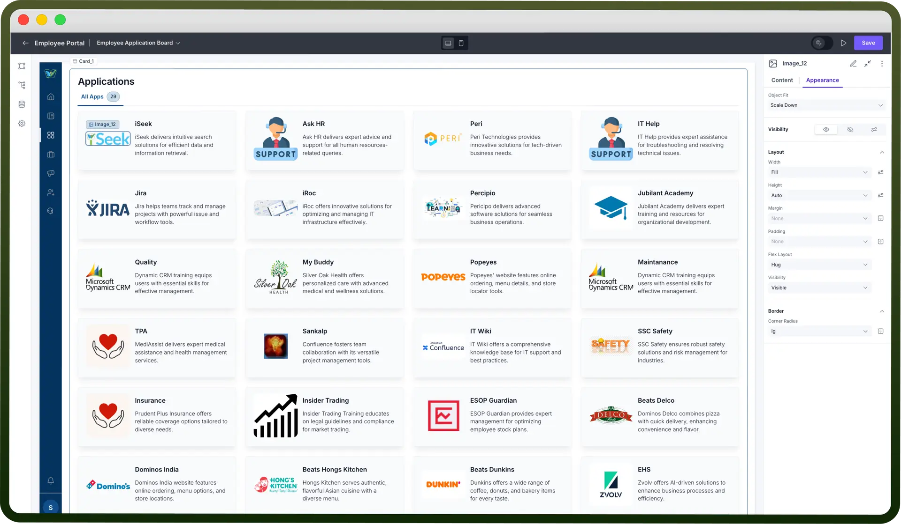
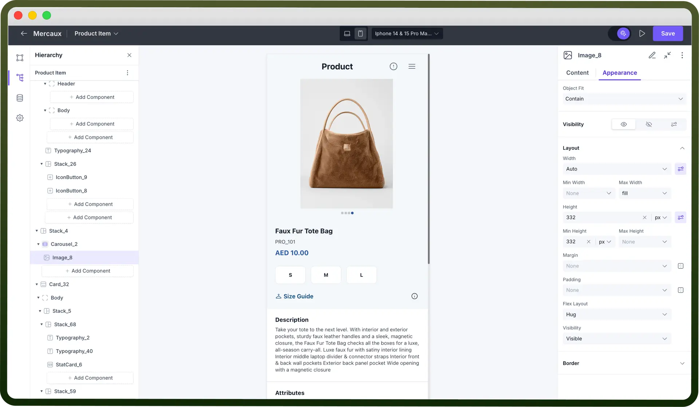

# Image component

Source: https://www.unifyapps.com/docs/unify-applications/image
Section: applications

---

## Overview

The Image component allows you to display images into your low code application. This documentation will guide you on how to configure an Image Component.

## Adding Image to Your Application

- **Configure Image URL**: In the Content tab, enter the URL of the image you want to display in the "`Image URL`" field.
- **Add Alt Text**: Provide a descriptive text in the "`Alt Text`" field. This text will be displayed if the image fails to load and helps with accessibility.

> **Note:** Use publicly accessible URLs to ensure your images are visible to users.

## Styling Your Image

Styling your image helps improve the visual appeal and alignment of your application, ensuring a polished and professional look. Proper styling also ensures that images fit well within various screen sizes and layouts, providing a consistent look across different devices.

**Choosing the Image Fit**

Select how the image should fit within its container using the "`Object Fit`" property in the Appearance tab.

| **Fit Option** | **Description** |
|---|---|
| `None` | The image is displayed at its original size without any scaling. Use this when you want the image to maintain its original size regardless of the container size. |
| `Contain` | The image scales to fit within the container while maintaining its aspect ratio. Use this when you want the entire image to be visible without cropping, but you don't mind if there are empty spaces around it. |
| `Cover` | The image scales to fill the container, possibly cropping parts of the image to maintain its aspect ratio. Use this when you want the image to completely fill the container, even if parts of it are cropped. |
| `Fill` | The image stretches to fill the container, ignoring its aspect ratio. Use this when you want the image to fill the entire container, but be aware that it may become distorted. |
| `Scale Down` | The image scales down to fit within the container |

## Best Practices

- **Use High-Resolution Images**: Ensure your images are of high quality to maintain visual appeal.
- **Optimize Image Size**: Use appropriately sized images to reduce loading times.
- **Descriptive Alt Text**: Always provide meaningful alt text for better accessibility and SEO.
