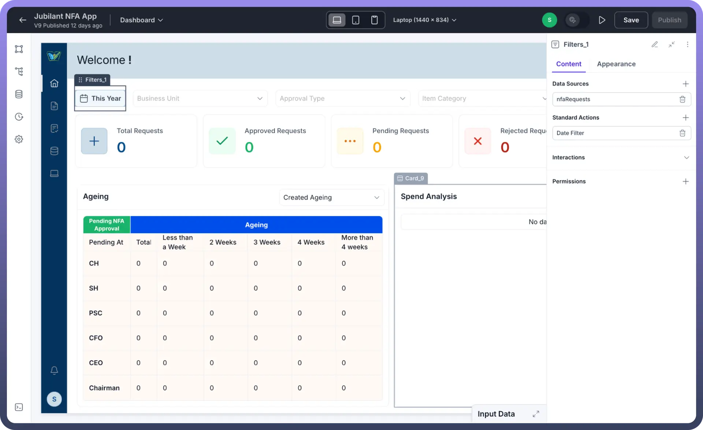
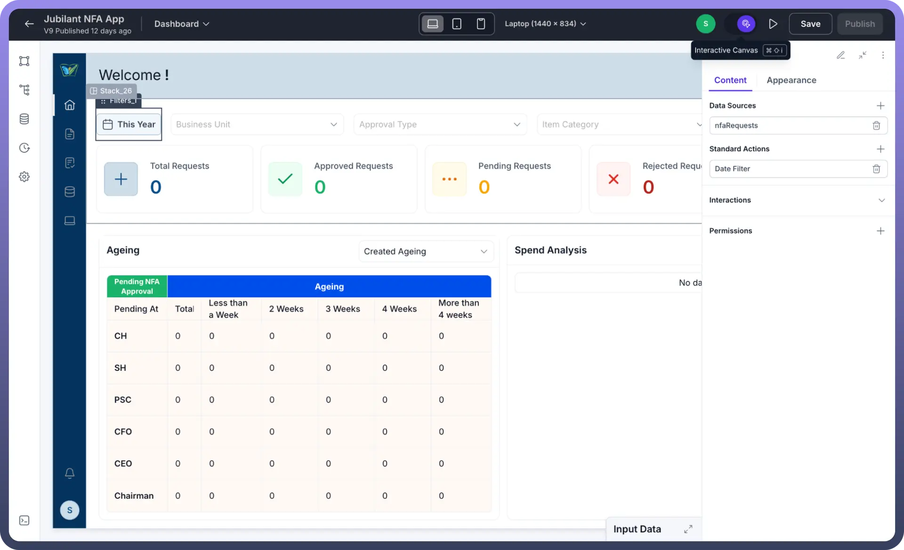
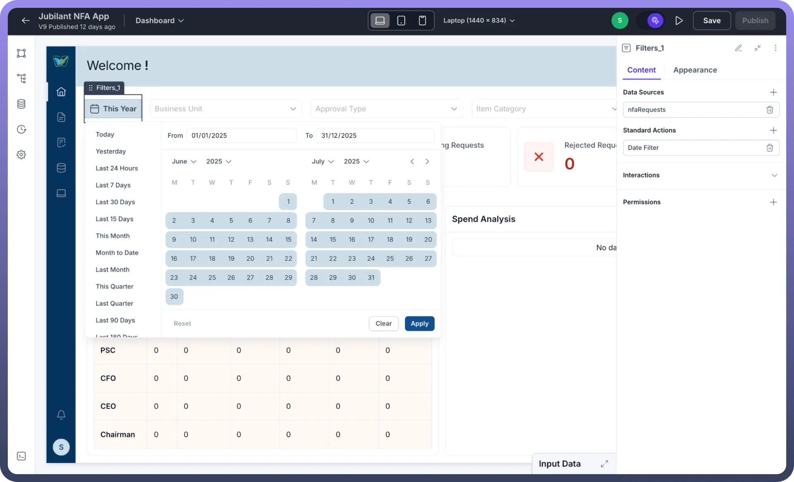

# Interactive Mode Switcher

Source: https://www.unifyapps.com/docs/unify-applications/interactive-mode-switcher
Section: applications

---

## Overview

The Interactive Mode Switcher in UnifyApps enables users to select interactive elements such as buttons, filters, etc., and edit their properties without triggering the associated actions. This feature simplifies and accelerates the process of refining user interface elements during application development.

## How to Use Interactive Mode Switcher

1. Enter Application Builder Mode:
  - Open your application in UnifyApps.
  - Access the Application Builder mode.

    

2. Locate and Enable Interactive Mode:
  - Find the Interactive Mode toggle at the top-right corner.
  - Activate the toggle to enter Interactive Mode.

    

3. Select and Edit Interactive Elements:
  - Click any interactive element (buttons, filters, etc.) on your canvas.
  - Adjust properties safely in the properties panel without triggering any actions.

    
