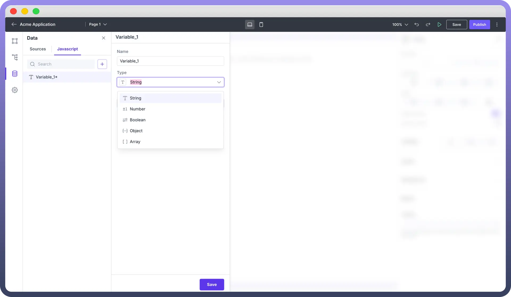
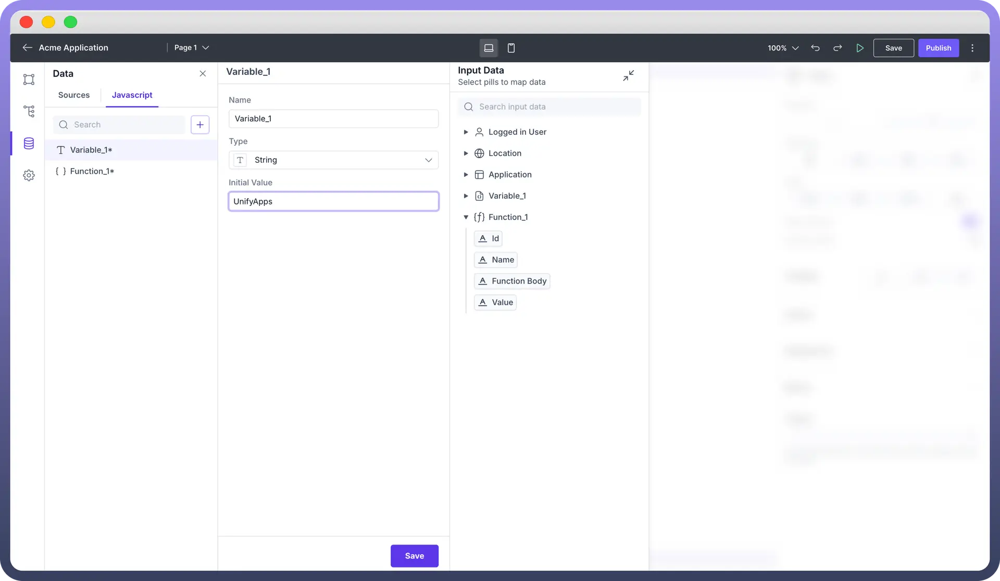
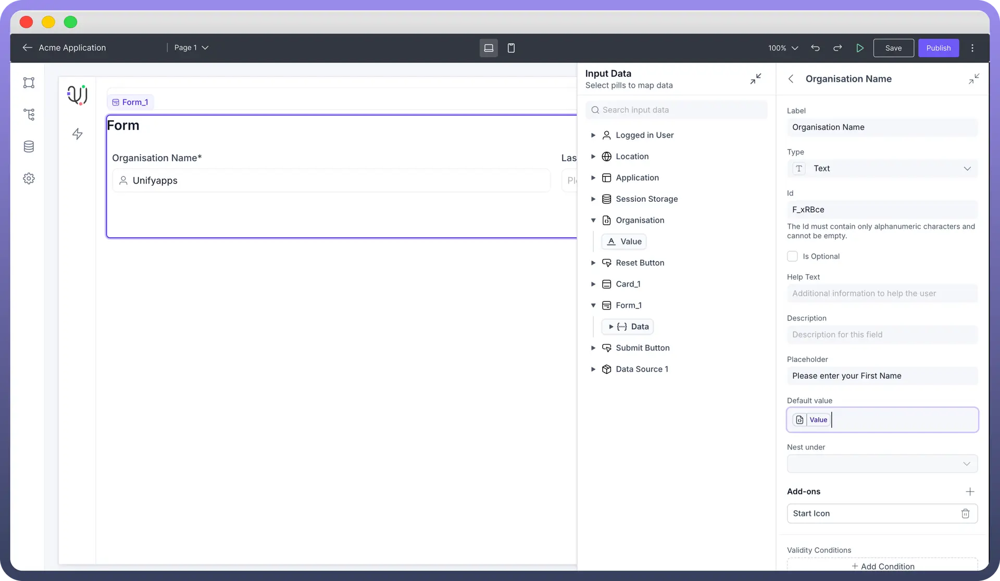
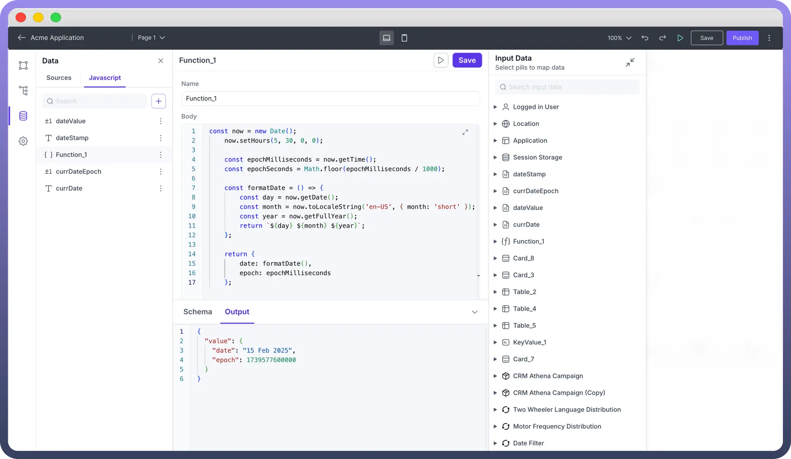

# JS Variables and Functions

Source: https://www.unifyapps.com/docs/unify-applications/js-variables-and-functions
Section: applications

---

## Overview

JavaScript variables and functions can be used for handling data in your application. Variables act as containers to store information (like numbers, text, or lists), while functions can be used as custom code blocks that can execute any javascript process.

## Variables

Variables can be used across a page in your low code application to form logics. They can also act as conditions for the behavior of UI components and interactions.

These can be named using the name field and the data type can be selected from the given options. For example, creating a variable named ‘var’ with initial value as 1.

## Data Types

- `Number`
  - Represents numeric values (both integers and floating-point).
  - JavaScript does not differentiate between integers and floats.
- `String`
  - Represents sequences of characters (text).
  - Can be created using single quotes, double quotes, or backticks (for template literals).
- `Boolean`
  - Represents a logical entity and has only two values: true or false.
- `Object`
  - Objects are collections of key-value pairs. Values can be of any type, including other objects and functions.
  - Objects are versatile and form the basis for more complex data structures like arrays and functions.
- `Array`
  - Arrays are lists that can store multiple values in an ordered way.

**Initialization**

This field allows you to set static initial value or map a data pill as the initial value. This is an optional field and can be filled if any default value is necessary.

> **Note:** You can refer to Component Specific Documentation to know more about data pills for each component.

## Interactions for variables

Each variable type (Array, String, Boolean, Object, Number) has specific operations available as mentioned in the interactions list below. These operations help you manipulate the stored data according to your needs.

| Operation | Applicable Variable type | Function |
|---|---|---|
| `Set value` | Array, string, boolean, object, number | This operation is used to set value for a variable |
| `Add to beginning` | Array, string | This operation inserts an element at the beginning of a variable. |
| `Add to end` | Array, string | This operation inserts an element at the end of a variable. |
| `Remove from first` | Array | This operation is used to remove the first element of an array. |
| `Remove from last` | Array | This operation is used to remove the last element of an array. |
| `Toggle value` | Boolean | This operation toggles the current value of a variable. |
| `Increment by` | Number | This operation increases the value of a number variable. |
| `Decrement by` | Number | This operation decreases the value of a number variable. |
| `Merge properties` | Object | This operation is used to combine the mentioned properties with the object variable. |

### Use case for a Variable

Here is a sample use case of variables where you can create a variable named ‘organisation’ and use it to assign default value to a form.

## Functions

Functions in Javascript are designed to perform custom tasks. Functions can take inputs (parameters), operate on those inputs, and return a result. JavaScript offers several ways to define functions . You can also use data pills as input to create data sources by directly selecting the pill as required. You can then return the value of the function.

### Use case for a function

You can write a Javascript function to fetch the current date formatted in Month - Day - Year and map the values in the UI components. In case there are multiple values in the functions, return them by creating a javascript object.

## **Best Practices**

- **Naming Conventions** - Keep names concise and clear enough to understand their purpose
- **Initialization** - Initialize variables with appropriate default values.
- **Returning a function value** - Return consistent data types to avoid any type mismatch.
