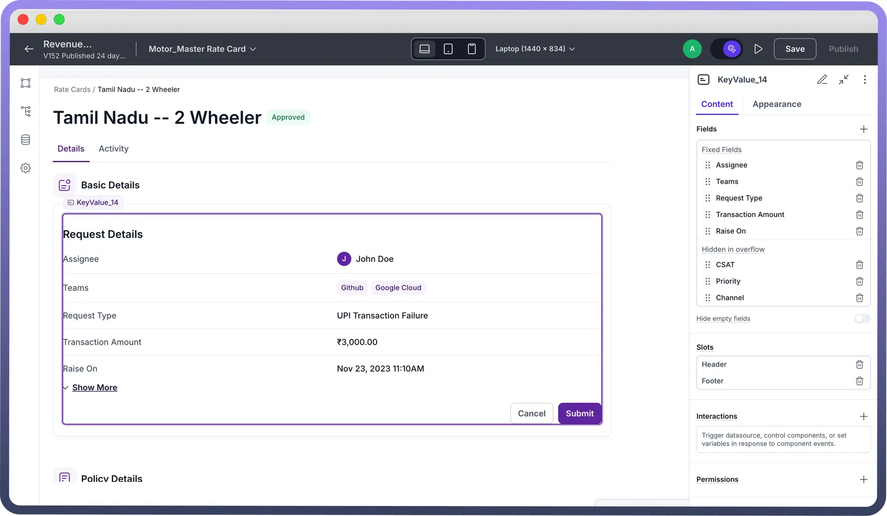
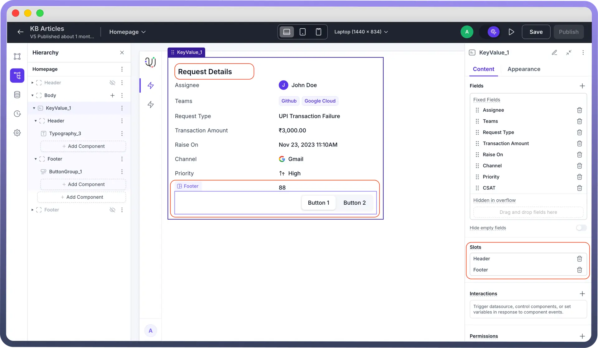
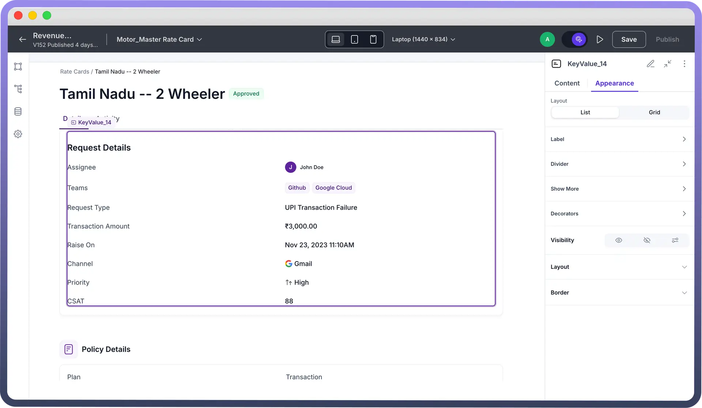
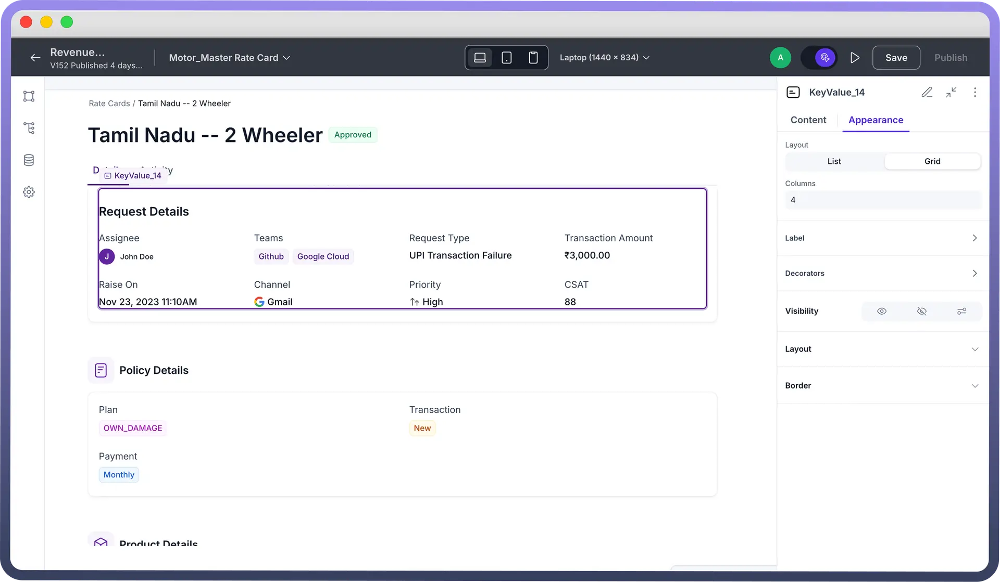
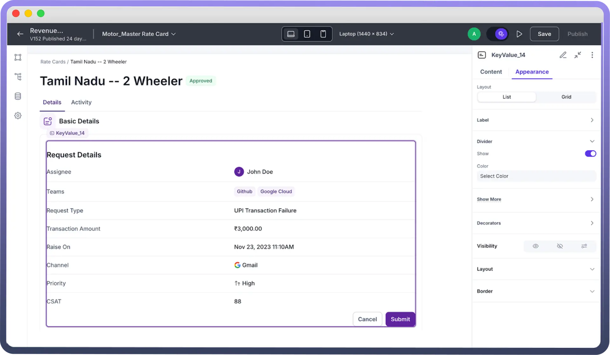
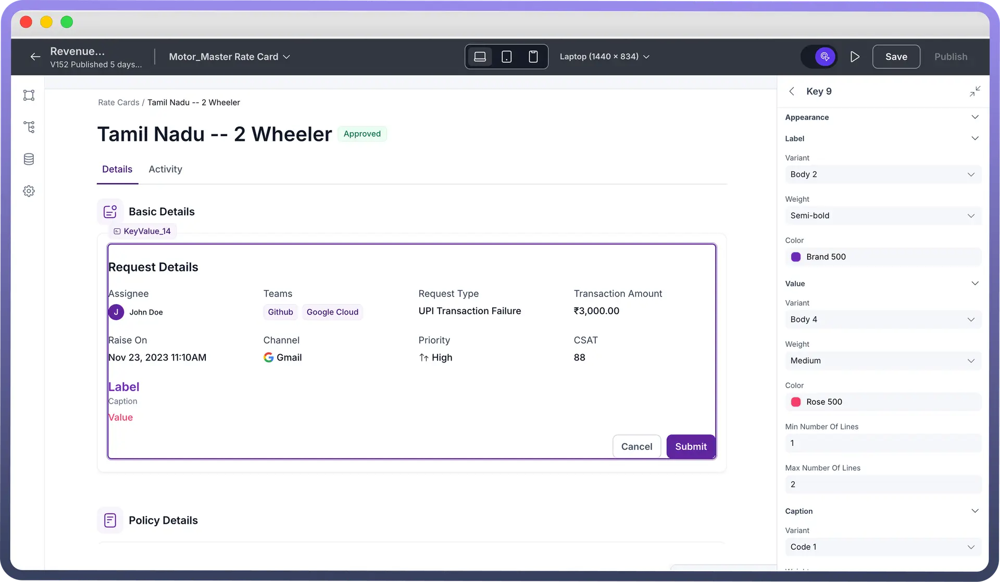
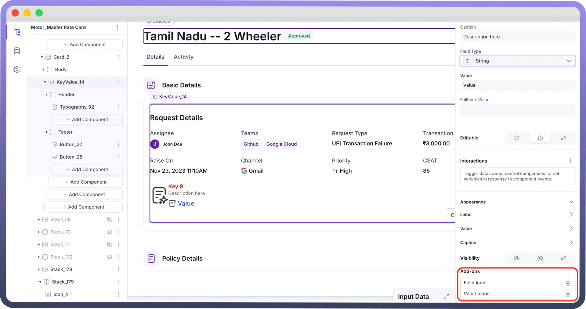
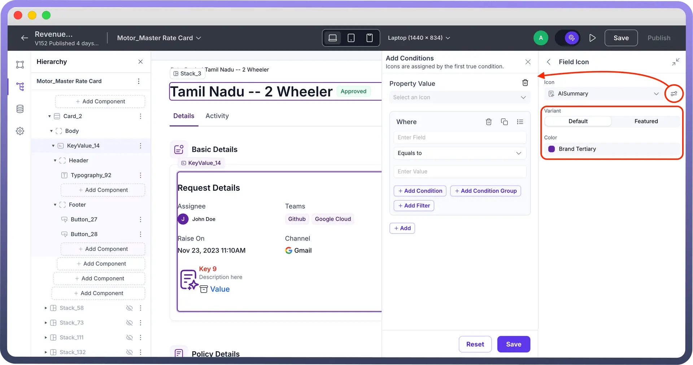

# Key Value

Source: https://www.unifyapps.com/docs/unify-applications/key-value
Section: applications

---

## Overview

The **Key Value** component is used to display structured data as labeled information, making it easy to highlight key metrics, statistics, or contextual details at a glance. Each data point consists of a **key** (label) that describes the information and a **value** that represents the actual data. This component is commonly used for presenting summaries, statuses, or essential details in a clear and organized manner.

## Configuring a Key Value

You may configure a key value component by following the below steps:

1. Add key value from your component list to your canvas’ body.
2. You can define content for Key Value using the following properties:

| **Property** | **Description** |
|---|---|
| `Fields` | Add the metrics you want to summarise in key value |
| `Hide empty fields` | Toggle button to choose if you want to hide the fields with no value |
| `Slots` | Specify Header and/or Footer components |

**Fields:** In the context of the Key Value component, fields are the individual data points displayed, each consisting of a label (or key) that describes the data and a value that represents the actual information.

**Reorder fields:** You can reorder fields simply by dragging and dropping in the field list.

- To add a new field click on the plus (+) icon
- Click the newly added field, input the “`label`” (title),“`caption`” (description) and select one of the many supported field types from the drop down:
  - `Date`**:** Represents a calendar date. Choose from various different variations of supported date formats: “DD MMM YYYY” or “Month DD, YYYY” or “DD/MM/YYYY”.
  - `Date & Time`**:** Represents a specific date and time. Choose from various different combinations of supported date and time formats.
  - `Time`**:** Represents a specific time of day. Define precision for the entered time value amongst the supported formats: Years, Months, Days, Hours, Minutes, Seconds, Milliseconds. **Note:** Values in Date, Date & Time, Time field types must be in **epoch milliseconds**. An epoch is a reference point in time (1st January, 1970) from which other times are measured.
  - `Currency`**:** Represents a monetary value. Choose notation format – Standard (eg. 100,000) or Compact (eg. 100K) Define the currency symbol from the provided list or input your custom currency. You may also specify up to how many decimal places should the currency be truncated.
  - `String`**:** Represents a sequence of characters/text.
  - `Link`**:** Represents a web address or URL. This converts the added value into a clickable link.
  - `Number`**:** Represents a numerical value (whole or decimal). Choose notation format – Standard, Compact or Scientific. Specify up to how many decimal places should the number be truncated.
  - `Percent`**:** Represents a percentage value. Specify up to how many decimal places should the percentage be truncated.
  - `Phone Number`**:** Add the phone number field or dynamically map the input value.
  - `Tags`**:** Map the data pill for the value and then select the mapped label and value. **Note:** To configure drop down values for Tags field type in Key Value component the required schema should be an array of objects, with properties defined for label and value.
  - `Avatar`**:** Creates an avatar based on the first letter of the username.
- `Show More`**:** Drag and drop fields from the “`Fixed fields`” section to “`Hidden in overflow`” section to hide them under the “`Show more`” option.

  

- **Fallback value:** Configure a fallback value if no data found or entered for the field. **Note:** Toggle on “`Hide empty fields`” to not show fields with no/null values.
- To view or edit a field, click on it to open the details and follow the same steps as above: **Using Slots in Key Value Pair:** Slots can be added as needed. "Header" and "Footer" are added by default under which a component is added/removed in the left hierarchy panel. You may choose to remove the slots by clicking the delete icon.

  

**Interactions:** Any component added to Header/Footer can be assigned specific interactions such as on-click.

## Appearance Customization

**Layout:**

There are two types of layout which can be used to configure arrangement of fields in a Key Value:

- **List view:**

  

  - Presents Key Value pairs in a vertical, stacked format, arranged one below the other for a natural reading flow.
  - Ideal for displaying a concise summary of related attributes in a clear, top-down approach.
  - Good for mobile or limited spaces.
- **Grid view:**

  

  - Arranges Key Value pairs in a grid layout, allowing for a more compact display of information.
  - Suitable when you have several data points to show and horizontal space is available.
  - You can define the number of columns from the left hand pane.

**Label:** This section tailors your customization for label heading.

- `Truncate`**:** If your label heading is too large, this toggle button lets you truncate the header. The entire heading is still visible if you hover over the label in the application.
- `Position`**:** Define where you want to place your label header, above (“Top”) the field value or below (“Bottom”) the field value.
  - If you are using List view, you can also position your labels on the “Left”. Furthermore, you may choose width ratio and value alignment from the pre-defined options.
- `Gap`**:** Choose from a list of pre-defined values in the drop down to specify the gap between the field header and field value.

**Divider:** You may toggle on (Show) to add a divider between each row of fields.

Furthermore, you may customize the color of divider line or add color based on if/else condition(s) using “`Set Color Conditions`”.

> **Note:** Divider is only available in List layout of key value.

**Show More:**

1. `Label`: By default the label is set to “Show More”. You may customize it to your preferred choice.
2. `Color`: Choose from Brand, Neutral, Danger options to allot the color to your label.
3. `Size`: Allows you to customize the size of the button.
4. `Variant`**:** Similarly, the look of the button can be configured from the available options of Solid, Outline, Soft, Ghost. By default it is set to Ghost.

**Decorators:** This section allows you to add margins to each of your icons (if present) from a list of pre-defined positive and negative values of margin. For easy reference, you can also view the pixel values of the same on the right.

You may click on the icon adjacent to the drop down to either add a margin only to a certain side or add a mixture of margin values to a combination of sides.

> **Note:** Margins can be added to Field Start Icon, Value Start Icon and/or Value End Icon.

**Field appearance customizations:**

- **Label Appearance Customizations:**

| **Property** | **Description** |
|---|---|
| `Variant` | Choose from a list of pre-defined values of font size. For reference, you can also see the size in pixels on the right. |
| `Weight` | Specify font weight from a list of pre-defined values in the drop down. You can also see the preview of the weight on the right. |
| `Color` | Choose font color from our wide range of options available in the color palette.
You may also add color conditions, by defining your if/else condition(s) or condition groups with AND or OR operators. On top of it, you may choose to apply a default color nevertheless. |

- **Value Appearance Customizations:**

| **Property** | **Description** |
|---|---|
| `Variant` | Choose from a list of pre-defined values of font size. For reference, you can also see the size in pixels on the right. |
| `Weight` | Specify font weight from a list of pre-defined values in the drop down. You can also see the preview of the weight on the right. |
| `Color` | Choose font color from our wide range of options available in the color palette.
You may also add color conditions, by defining your if/else condition(s) or condition groups with AND or OR operators. On top of it, you may choose to apply a default color nevertheless. |
| `Number of lines` | Define minimum and maximum lines for the value. |

- **Caption Appearance Customizations:**

| **Property** | **Description** |
|---|---|
| `Variant` | Choose from a list of pre-defined values of font size. For reference, you can also see the size in pixels on the right. |
| `Weight` | Specify font weight from a list of pre-defined values in the drop down. You can also see the preview of the weight on the right. |
| `Color` | Choose font color from our wide range of options available in the color palette.
You may also add color conditions, by defining your if/else condition(s) or condition groups with AND or OR operators. On top of it, you may choose to apply a default color nevertheless. |

- **Visibility Customizations:** You can define the visibility of the field based on the options provided, either make it visible in the application, invisible in the application and only make it available in hierarchy or add visibility conditions.
  - Add-ons: In the Add-ons sub-section you may choose to add field icons and/or value icons: **Note:** You may choose to customize the added icons, by selecting the variant of the icon and the color.

    

- You may also add a conditional visibility on the icon as shown below:

  

## Defining Permissions

Every component allows you to set visibility permissions based on the permissions granted to the logged-in user. This ensures that only authorized users can view and interact with the component.

## Best Practices for Using Key Value Component

- **Prioritize:** Ensure crucial data points only to be included in Key Value fields
- **Caption:** Add crisp field description to summarise better
- **Visual Cues:** Leverage font customizations and spacing to create an appealing hierarchy.
- **Layout:** List view works best for top-down reading, Grid view works best for compact display of information.
