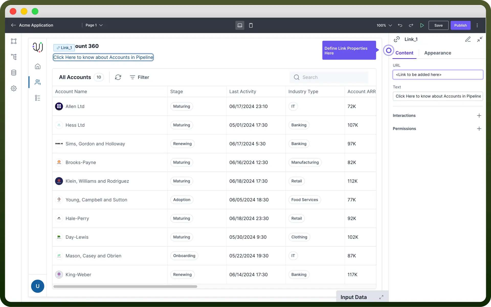

# Link component

Source: https://www.unifyapps.com/docs/unify-applications/link
Section: applications

---

## Overview

The Link component allows users to add **clickable links** to direct users to a different URL. This article will guide you on configuring the Link Component.

## Configure Link Component

Once the Link component is added, you can configure its properties through the right-side configuration panel.

1. **URL**: Enter the URL where the link should navigate when clicked.
2. **Text**: Enter the display text for the link. This is what users will see and click on.

## Appearance Customization

You can customize the visual aspects of the link such as font **style**, **color**, and **size**.

| **Property** | **Description** |
|---|---|
| `Variant` | Specifies the **text style** variant for the link. Example: Body 4. |
| `Weight` | Defines the **font weight** of the link text. Options include Regular, Bold, etc. |
| `Underline` | Determines when the link is underlined. Options include Always, **Hover** (underline on hover), or None. |
| `Start Decorator` | Adds an icon at the **beginning** of the link text. You can select from a list of available icons. |
| `End Decorator` | Adds an icon at the **end** of the link text. You can select from a list of available icons. |
| `Disabled` | Sets whether the link is disabled or not. If true, the link will be **non-interactive**. Defaults to false. |

## Define Interaction

Link support `On Click` event. It is used to Trigger an action or an automation when the Link is clicked. 
This can be used for various purposes, such as updating a variable to track clicks on the link or performing other specific actions.

## Define Permissions

Every component allows you to set visibility permissions based on the permissions granted to the logged-in user. This ensures that only authorized users can view or interact with the button.

> **Note:** You can refer to the [Permissions](/docs/unify-applications/link) article for the same.
