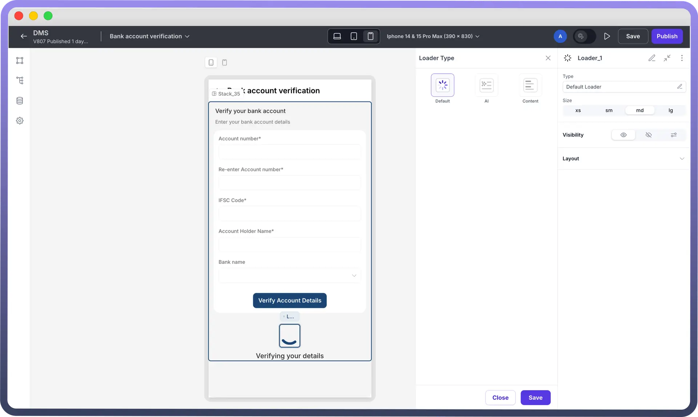
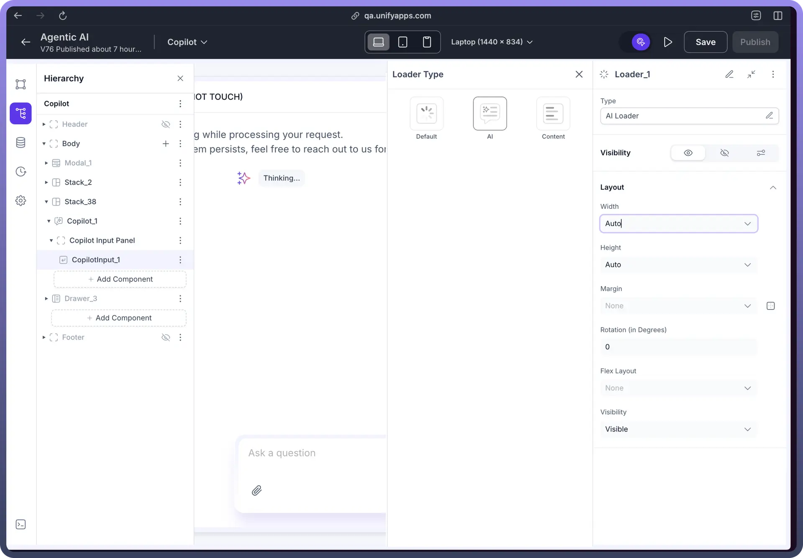
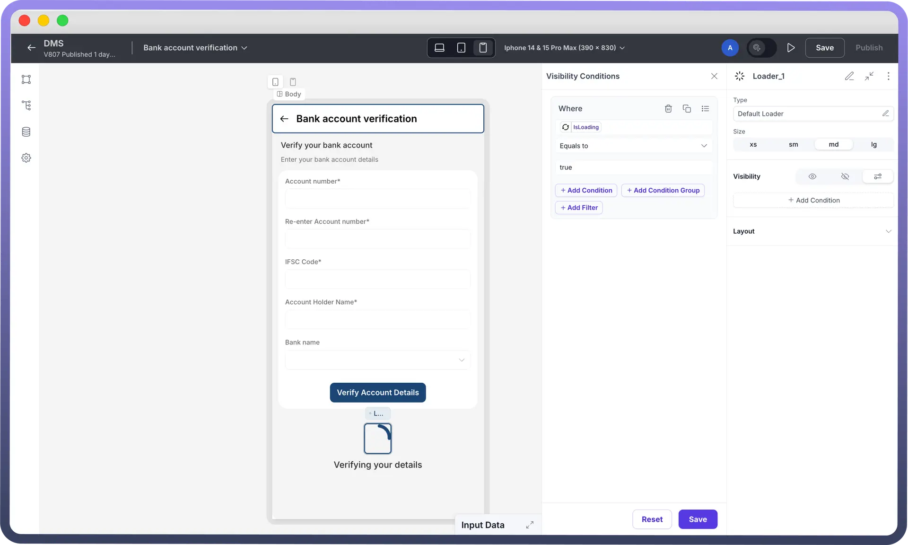
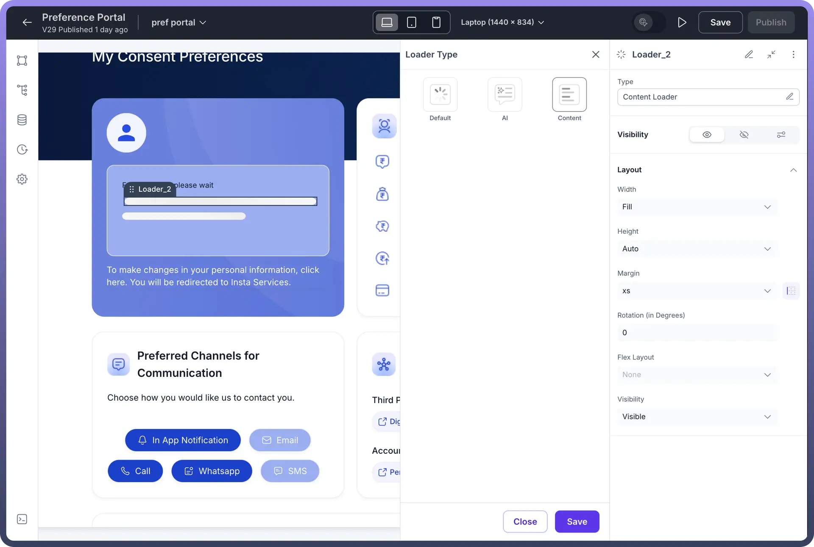

# Loader

Source: https://www.unifyapps.com/docs/unify-applications/loader
Section: applications

---

## Overview

The **Loader** component provides visual feedback to users, indicating that an action is in progress or data is being fetched in the background. Displaying a loader improves the user experience by managing expectations during wait times, such as when a page is loading data or a process is running.

## Key Properties / Configuration

After adding the Loader component to your canvas, you can configure its behavior and appearance using the properties panel.

### Loader Type

This is the primary setting that determines the visual style of the loading indicator.

- `Type`**:** Select the desired loader style from the dropdown menu.
- `Default Loader`**:** Displays a standard animated spinner or progress indicator.
- `Size`**:** Choose the size of the default animation (xs, sm, md, lg). This allows you to scale the loader appropriately for different contexts.
- `AI Loader`**:** Displays a specific animation themed around AI processing (often represented by a chat bubble or similar icon). This type does not have a separate size option.
- `Content Loader`**:** Displays a placeholder animation typically used to indicate that content sections are loading (often resembling lines or blocks where content will appear). This type does not have a separate size option.

### Visibility

- Control when the Loader component is displayed or hidden. This is crucial for showing the loader only when necessary (e.g., while a data source is fetching).
- Use the conditional visibility settings (eye icon, link icon, formula icon) to define rules based on application state or data source properties

  

### Layout

- Adjust the positioning and spacing of the Loader component within its parent container.
- Standard layout properties include:
- **Width / Height:** Control the dimensions of the loader component's container.
- **Margin / Padding:** Adjust spacing around the loader.
- **Rotation:** Rotate the component if needed.
- **Flex Layout:** Control alignment and distribution if the loader is within a Flex container.
- **Visibility (Layout):** Basic visibility toggle within layout settings.

  

## Best Practices

- **Conditional Visibility:** Always configure the Loader's visibility to be conditional. Typically, you should bind its visibility to the isLoading property of the data source(s) being loaded for the relevant part of the interface. Show the loader when isLoading is true and hide it when false.
- **Placement:** Place the loader logically where the user expects content to appear or where an action is being processed. For page loads, a central position might be suitable. For specific component loading (like a table), place the loader within or overlaying that component.
- **Choose Appropriate Type:** Select the loader type that best matches the context. Use "`Default`" for general loading, "AI" for AI-related tasks, and "`Content`" as placeholders for loading UI sections.
