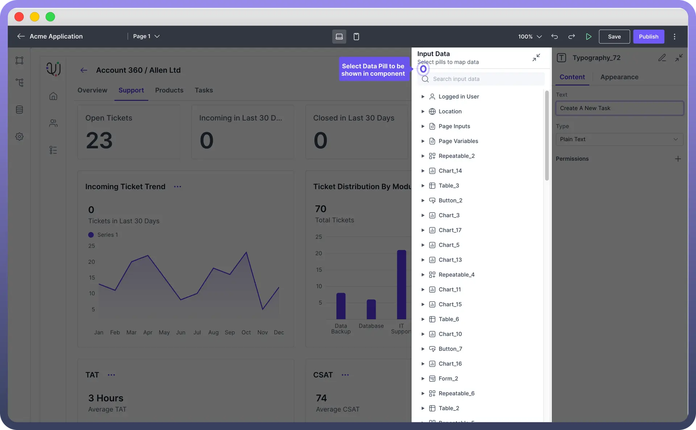
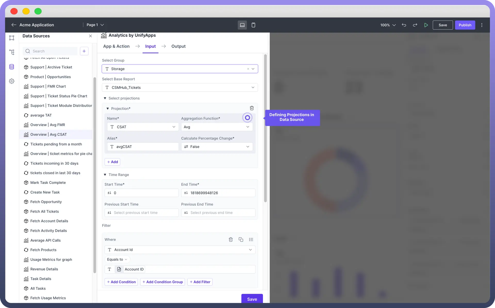
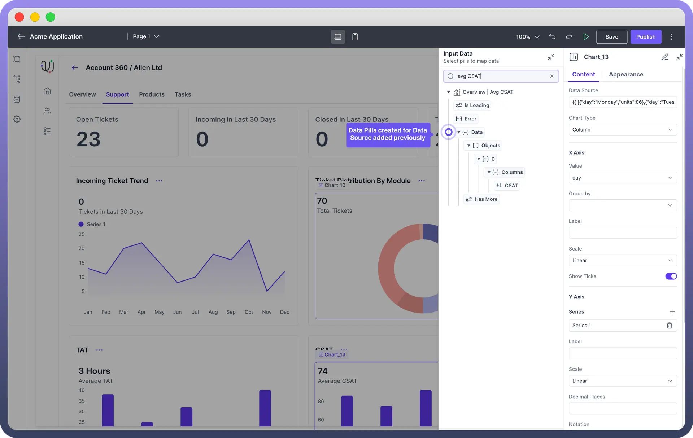
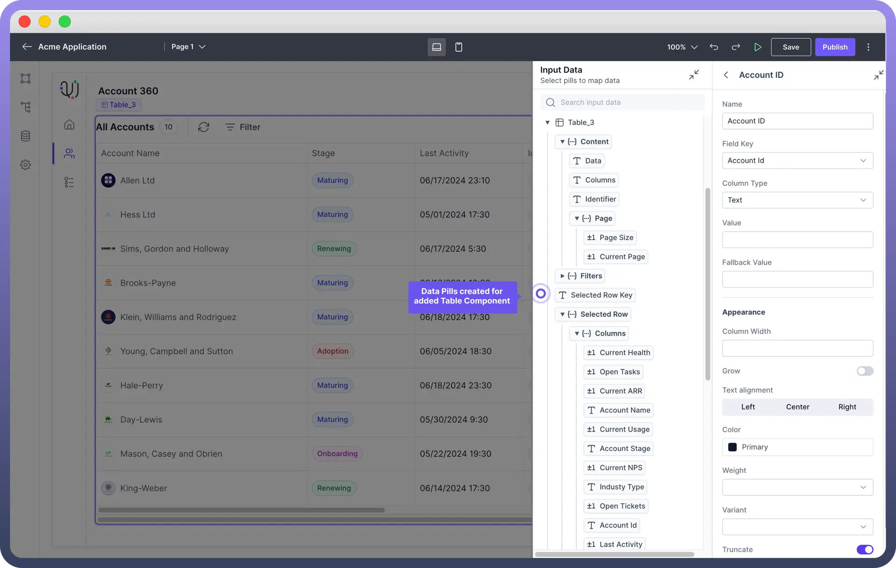
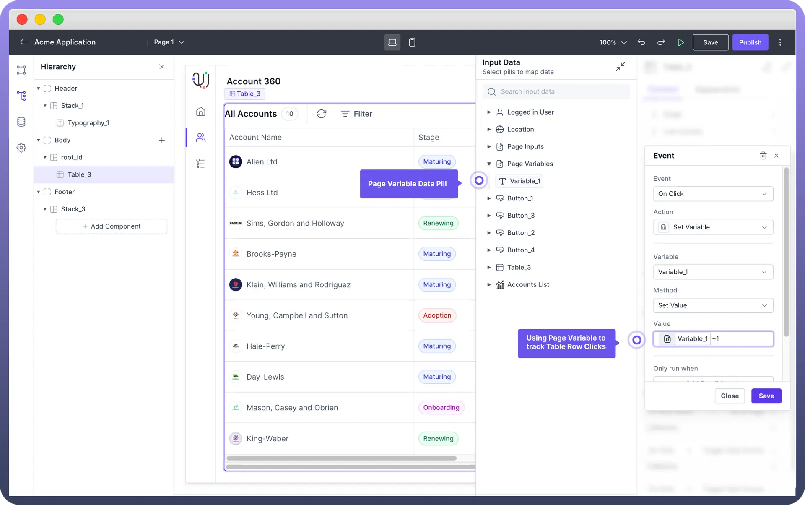

# Map Data to Interface Components

Source: https://www.unifyapps.com/docs/unify-applications/map-data-to-interface-components
Section: applications

---

## Overview

Building data-rich applications requires mapping data to interface components. You can add data by directly typing into text fields, labels, input boxes of various components, or you can display text from a data source.

This article explains how output of various data sources is converted into data pills which can be then mapped to various interface components like `tables`, `cards`, and `charts`.

## Introduction to Data Pills

Data Pills represent data points from various sources, allowing easy mapping and display within interface components like tables, cards, and charts in UnifyApps.

They **dynamically fetch** and **present data**, providing real-time updates for your application's UI components.

> **Note:** Clicking on an **input field**, **text area**, **label field**, or **value field** in various components opens the Input Data Pills popup.

## Fetch Added Data Source Output

In our article on [Adding Data Sources](/docs/unify-applications/adding-data-sources) to Interface, we have covered:

1. **Storage by UnifyApps:** For adding Data from Unify Objects.
2. **Analytics by UnifyApps:** For querying data stored in Objects.
3. **Application Connectors:** For connecting with various applications.
4. **Callable by UnifyApps:** For adding data sources from automations.

Each data source once integrated translates its specific outputs into data pills that can be used in your application. 

For **example**, in the above added data source, you would see the following data pills in your application.

You can use these data pills to define Average CSAT in your chart.

## Fetch Component State

Component data pills are automatically generated based on the components used in your interface page. These data pills represent the state of various components.

For **example** a table component will have pills representing its state, such as Selected Row.

> **Note:** You can refer to [Component](/docs/unify-applications/add-components-to-your-interface) Specific articles to know more about data pills for each component.

## Fetch Page Inputs

Page Input Data Pills represents the input query parameters defined for the page (You can learn more about input query parameters [here](/docs/unify-applications/map-data-to-interface-components)). You can use this contextual information to display relevant information in your page.

For **example**, imagine you have a table with multiple bank accounts. 
A user wants to see details about one specific account. You create a detailed account page that needs an Account Number as input. When this page is called, the Account Number must be provided.

This ensures that the page can load and display the relevant details for that specific account.

> **Note:** You can define this in the input parameters of your page in your App Settings. Refer to [Pages](/docs/unify-applications/pages) Article to know the step by step process to define input variables for a page.

## Fetch Data Variables defined in the page

For creating and updating variables within a page—like changing a variable value upon button click—Page Variables Data Pills are useful. 
Refer to below example to see how Page Variable is being used to track `clicks` on the button.

> **Note:** You can combine **multiple data pills** as well using excel-file formulas to generate a new value. For **example**, to display a full address, you might combine data pills for street, city, and zip code into a single field, enabling a streamlined and customized data presentation.

## Fetch Logged In User Details

In case you want to use logged-in user’s details, you can use logged-in user detail pills. This is a **default** data pill that is accessible throughout the application, regardless of the data sources connected. A common **use-case** is around using Logged In User’s name to greet your users in the application.

| **Data Pill Category** | **Pill Name** | **Description** |
|---|---|---|
| Logged In User | `Name` | The full name of the logged-in user as mentioned in “**User**” Standard Object in Unify Objects  which is added once you create a User. |
| Logged In User | `Username` | The username of the logged-in user as mentioned in “**User**” Standard Object in Unify Objects which is added once you create a User. |
| Logged In User | `Email` | The email address of the logged-in user as mentioned in “**User**” Standard Object in Unify Objects which is added once you create a User. |
| Logged In User | `Custom Attributes` | Additional attributes defined for the user in the “**User**” Standard Object in Unify Objects. |

## Fetch Page URL Details

In case you want to refer to the page URL in your application you can use **Location Data Pill**. This is also a **default** data pill which provides various URL details of the page.

| **Data Pill Category** | **Pill Name** | **Description** |
|---|---|---|
| Location | `Href` | The full URL of the current page |
| Location | `Hostname` | The hostname of the current page |
| Location | `Pathname` | The path section of the URL. |
| Location | `Search` | The query string portion of the URL. |
| Location | `Hash` | The anchor portion of the URL. |
