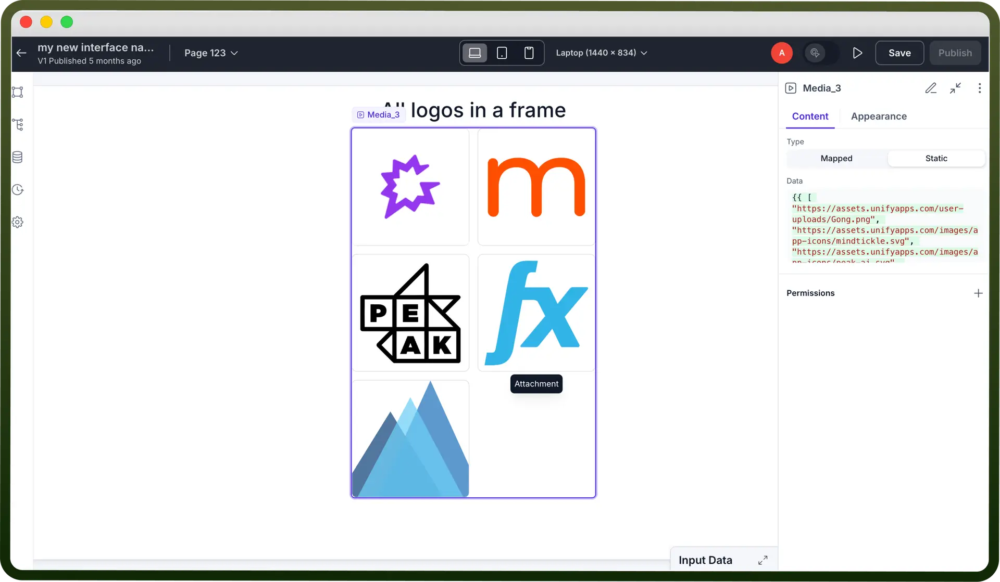
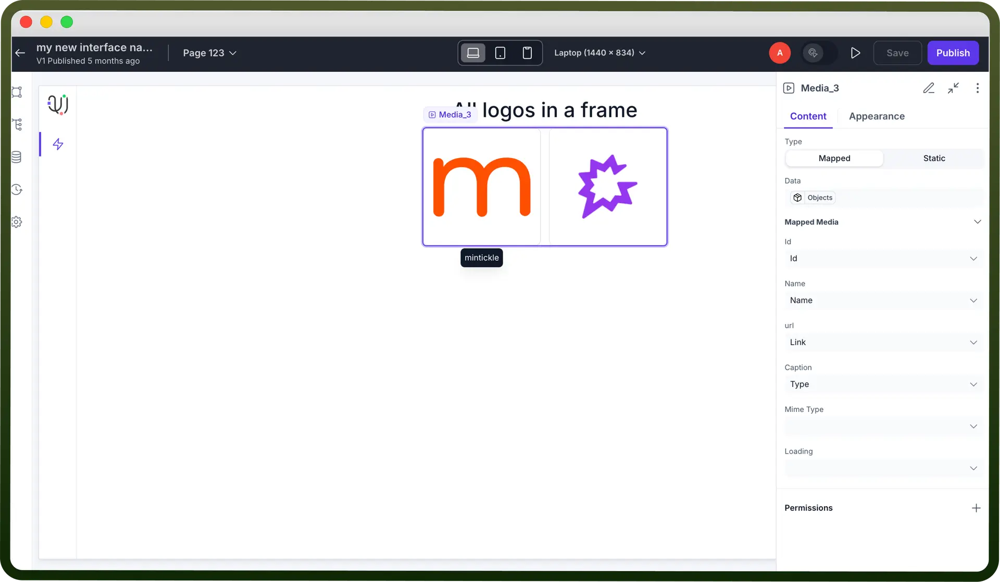
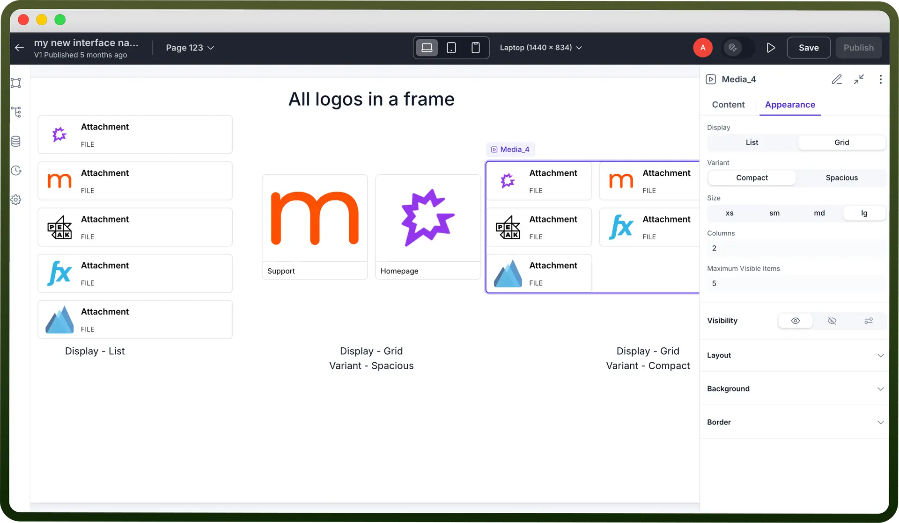

# Media component

Source: https://www.unifyapps.com/docs/unify-applications/media
Section: applications

---

## Overview

The Media component helps you visually present files like images, videos, or audio within your application. It supports both static and dynamic data sources, making it flexible for showcasing galleries, media lists, or any visual content from external links or data collections.

By configuring its properties, you can control the layout, appearance, and behavior of media elements to create a rich user experience.

## Standard Actions

### **Content**

The Media component provides several options to customize the media presentation.

**Type**

Define how you want to add media to your component:

| **Property** | **Description** |
|---|---|
| `Mapped` | Add media dynamically from a data source as shown in the image below. |
| `Static` | Add media manually using an array of URLs. For example ({{ [ "Link1", "Link2", "Link3"]}} |

**Data**

Provide URLs or a data source to populate the component with media items.

| **Property** | **Description** |
|---|---|
| `Mapped` | Add media dynamically from a data source as shown in the image below. |
| `Static` | Add media manually using an array of URLs. For example ({{ [ "Link1", "Link2", "Link3"]}} |

**Mapped Media**

Dynamically link and display media based on your data source.

Fields to configure:

| **Property** | **Description** |
|---|---|
| `ID` | Unique identifier assigned to each media item for tracking and referencing. |
| `Name` | Descriptive label or title to easily recognize the media file. |
| `URL` | Direct path to access and render the media file (image, video, or audio). |
| `Caption` | Brief text providing context or description of the media. |
| `MIME Type` | Specifies the format of the media file (e.g., image/jpeg, video/mp4) to ensure correct handling. |
| `Loading` | Indicates the loading state of the media while it is being fetched, improving the visual experience. |

### Appearance

1. **Display:** Choose how the media items are presented:
  - **List**: Display media in a vertical list format for a more detailed view.
  - **Grid**: Arrange media in a grid layout for a clean, organized look.
2. **Variant**: Select the spacing style for your media layout
  - **Spacious**: Enlarges the images, creating a more open and airy layout.
  - **Compact**: Arranges media items closely for a condensed view.
3. **Size :** Adjust the dimensions of the media items for optimal display. *(For example: xs, sm, md, lg)*
4. **Maximum Visible Items :** Set the maximum number of media items to be displayed at once.
5. **Show Caption :** Enable to display captions alongside the media for additional context.

Above showing different types of appearance media component can be used for.

## Typical Use Cases

- Display product images in an e-commerce application.
- Show user profile pictures in a contact or employee directory.
- Embed promotional or tutorial videos in your app.
- Render document previews (PDFs, images, etc.)
- Showcase banners, ads, or dynamic posters.
