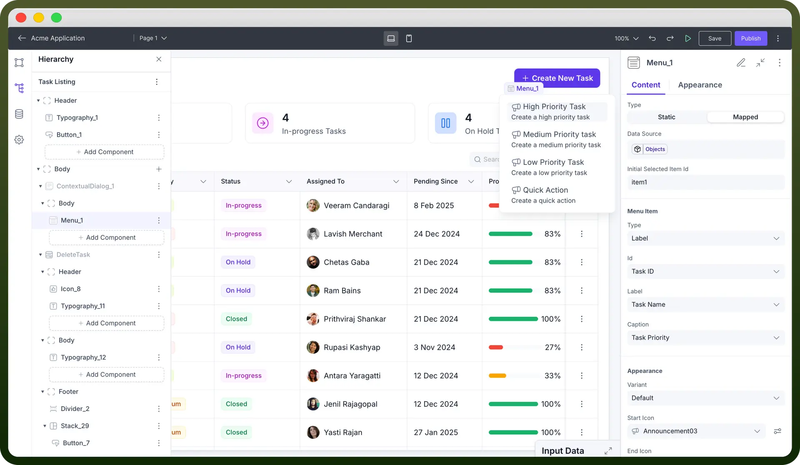
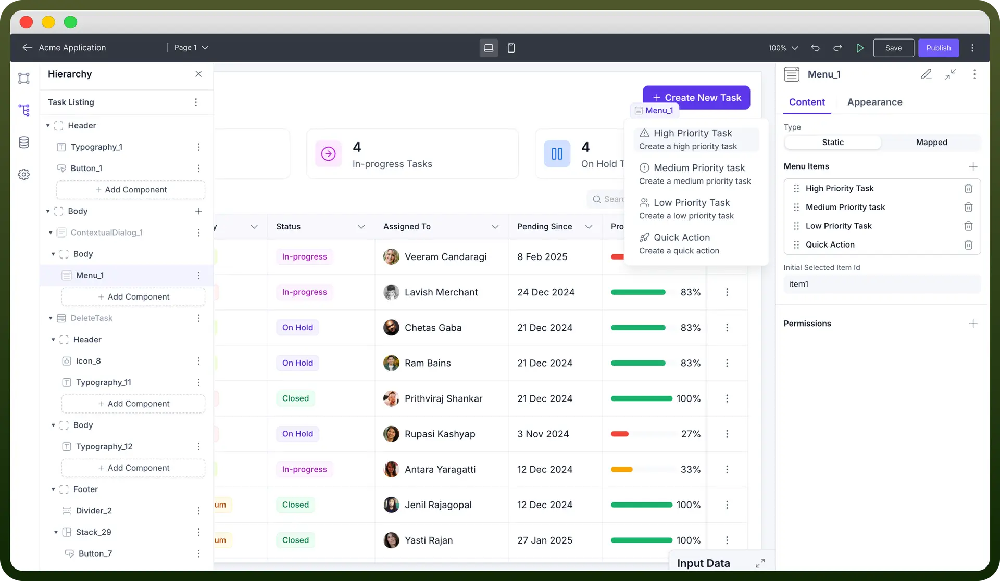

# Menu component

Source: https://www.unifyapps.com/docs/unify-applications/menu
Section: applications

---

## Overview

The Menu Component enables users to access actions, options, or navigation within the application. One of the use cases is embedding the menu inside a contextual dialog, for quick actions, as well as for navigation, list management, and option selection.

## Adding Menu to your Application

You can add Menu from the list of components to your canvas.

**Configuring Properties of a Menu**

Menus can be `Static` or `Mapped`, each containing its unique configuration properties:

**Static:**

1. **Menu Items:** Static menu items can be manually added by clicking on the plus (`+`) icon in menu items. Each Menu Item contains its own properties, which can be accessed by clicking on it. Here, you can set the menu item type, label, and caption, enhance the appearance of the menu item by setting variant, start and end decorators, and set interactions.
2. **Initial Selected Item ID:** The default-selected menu item can be specified here by entering the ID.

**Dynamic:**

1. **Data Source:** Dynamic Menu Items can be controlled by plugging a data source, which would dynamically determine the menu's contents.
2. **Initial Selected Item ID:** Similar to static menu items, the default-selected menu item can be specified by entering the ID.
3. **Menu Items:** Even though the configuration settings of Dynamic Menu Items are the same as those of Static Menu Items, the key difference lies in the fact that the settings configured here would be applied to all menu items.

## Customizing the Appearance

Use the appearance settings to align the look and functionality of the menu component with your application’s needs.

> **Note:** You can refer to Appearance Settings documentation to know more about defining Layout for each component.

## Best Practices

**Keep Item Content Consistent**: Maintain consistency in the content type for each menu item, whether it's text-based labels, icons, or a combination of both.

**Spacing**: Ensure proper margins and padding for a clean, visually balanced display. Too much spacing can lead to a cluttered UI, while too little may make the items harder to differentiate.

**Responsiveness**: Always test your design on different screen sizes. Adjust width and height dynamically, mainly if the menu component is part of a responsive layout.

**Visibility:** Manage the visibility of the menu based on specific triggers or conditions. This can help show menus only when needed, primarily within contextual dialogues.

> **Note:** You can refer to Contextual Dialog documentation to know more about configuring the Contextual Dialog Component.
