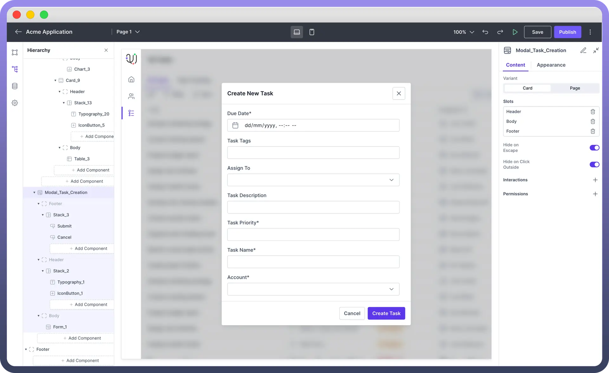
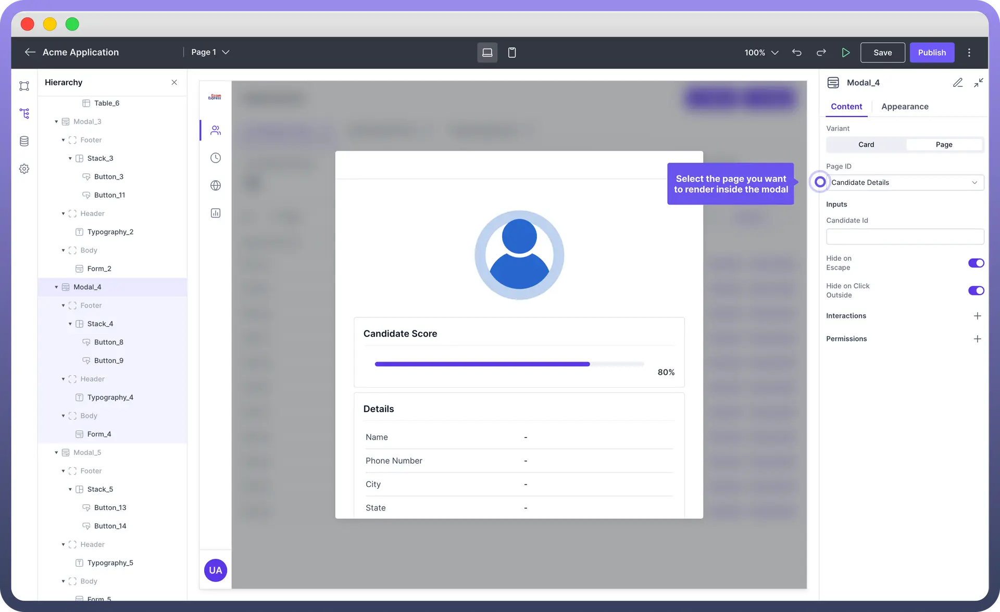
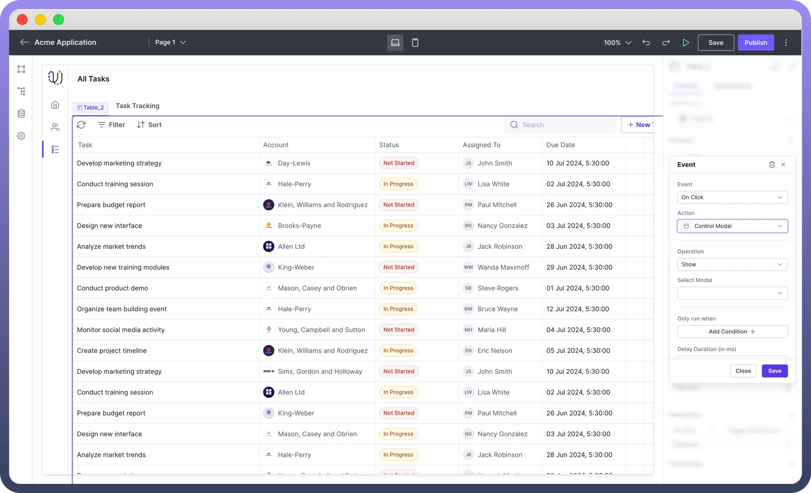

# Modal

Source: https://www.unifyapps.com/docs/unify-applications/modal
Section: applications

---

## Overview

The **Modal** component allows users to create pop-up dialogs that can **display** information, **prompt** user actions, or **gather** input. 

Modals are an essential UI element for creating interactive and dynamic applications.

## Configure Card Modal

In the `Card Variant`, the modal appears on the screen like a card, integrated into the main page.

Users can add components directly within this card-like modal. This variant is particularly useful for displaying smaller, self-contained content and interactions.

You can configure a Card Modal by following the below steps:

1. **Add Moda**l from the component list to your canvas.
2. By default, the added Modal will be of **Card Type**. You can find it under Variant in the properties section.
3. Add Components in Modal like you add in a Card Component in 3 Different Slots of `Header`, `Body` & `Footer`. **Note:** Check [Card](/docs/unify-applications/modal) Component’s article to know in detail about adding components in a card.

  

## Configure Page Modal

This variant allows users to **select** and **render** an entire page inside the modal. 

Users need to navigate to the selected page to create and configure the content that will be displayed within the modal.

## Open & Close Modals

Opening & Closing of Modal is defined in the Interaction section. Modal is triggered by the interaction defined in other components. To define opening of a modal, follow the below steps:

- **Add Interaction:** Select a component (e.g., button) that will trigger the modal to open.
- **Configure Interaction:** Set the interaction action to "`Control Modal`".
- **Specify Operation:** Choose "`Show`" or “`Hide`” to control visibility of the modal when the triggering component is activated.

> **Note:** You can also define events like **On Close** where you can mention the actions or workflows that should be performed when the modal is closed, such as resetting forms or updating data.

## Appearance Customization

| **Property** | **Description** |
|---|---|
| `Height` | Set the **vertical** size of the modal to control how much space it occupies on the screen. |
| `Width` | Adjust the **horizontal** size of the modal to fit the desired content width. |
| `Padding` | Define the internal **space** between the content and the modal's border |
| `Height` | Sets the **overall height** of the modal component. |
| `Min-Height` | Sets the minimum height of the modal component. |
| `Max-Height` | Defines the maximum height the modal component can expand to. |
| `Width` | Sets the **overall width** of the modal component. |
| `Min Width` | Specifies the minimum width the tab component can shrink to. |
| `Max Width` | Defines the maximum width the tab component can expand to. |

## Permissions

The Modal component allows you to set **visibility permissions** based on the permissions granted to the logged-in user. This ensures that only authorized users can view or interact with the modal.

> **Note:** You can refer to [Permissions](/docs/unify-applications/modal) article to know more about defining permissions for each component.
