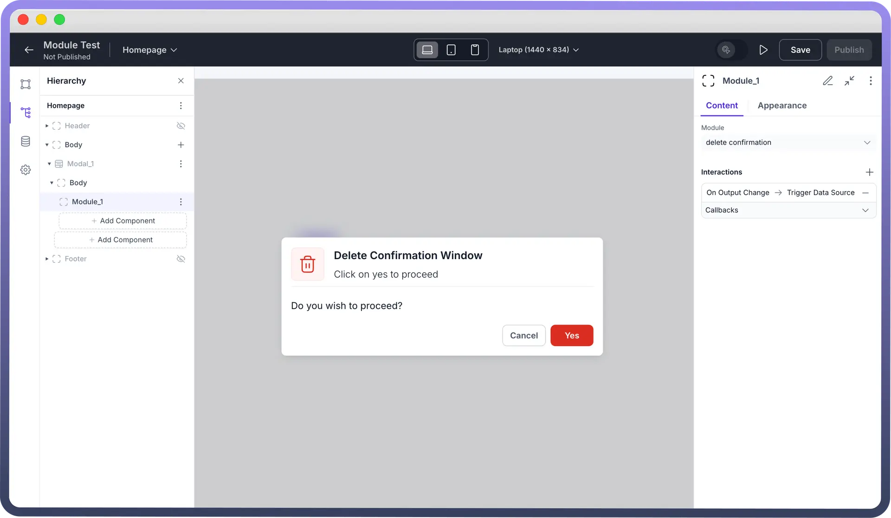

# Module

Source: https://www.unifyapps.com/docs/unify-applications/module
Section: applications

---

## Overview

Modules are reusable groups of components that can be embedded in multiple pages within the same application—or even across different applications. They help reduce duplication, streamline maintenance, and ensure consistent UI/UX across your apps.

Think of modules like mini-pages that can be reused wherever needed. Common use cases include login screens, settings pages, confirmation modals, and file upload dialogs.

Whenever you update a module, the changes automatically reflect everywhere it's used—saving you time and effort.

## How to Use?

### 1. Application-Based Modules

These are standalone modules that can be used across multiple applications.

- Go to the `New Application` tab.
- Click `Create Module`.
- This opens a single-page module editor.
- To add this module to any app, open the `Components Panel`, search for `Module`, and select it.
- Select your module from the dropdown and configure its appearance and interactions.

### 2. Page-Based Modules

These modules are tied to a specific application and can't be reused across others.

- Inside your app, click the `Page Dropdown` > `New` > `Module`.
- You’ll be redirected to configure your new module.
- Use the `Content Tab` in the module component to link this module from the dropdown.

Both types support full configuration, appearance customization, and interaction logic.

## Best Practices

- **Reusability First:** Avoid app-specific logic. Design modules to work in various apps without modification.
- **Consistency:** Match styles, spacing, and interaction patterns of the parent app to create a seamless user experience.
- **Responsive Design:** Ensure your modules adapt well across desktop, tablet, and mobile views.
