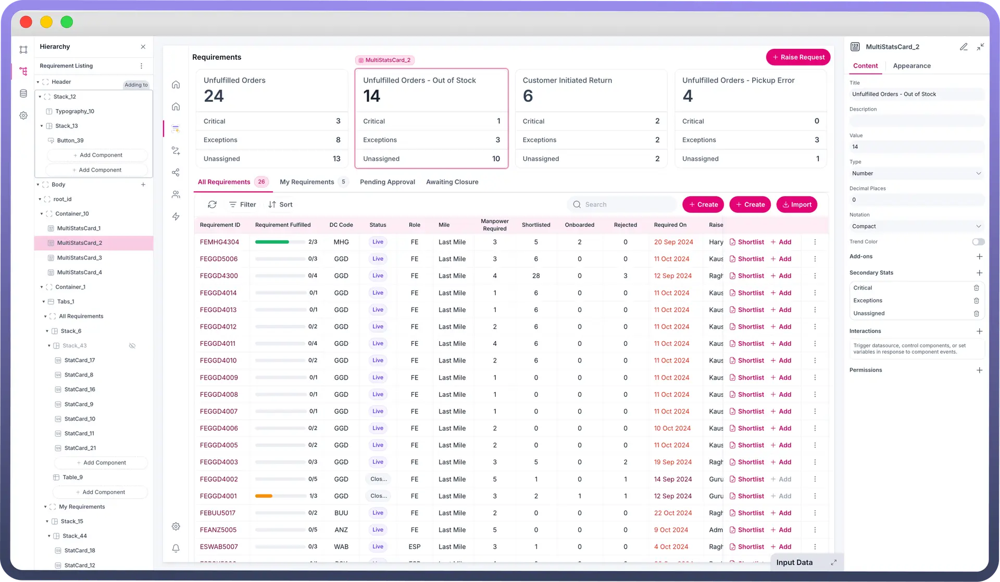
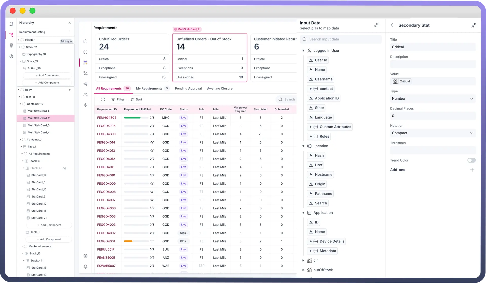
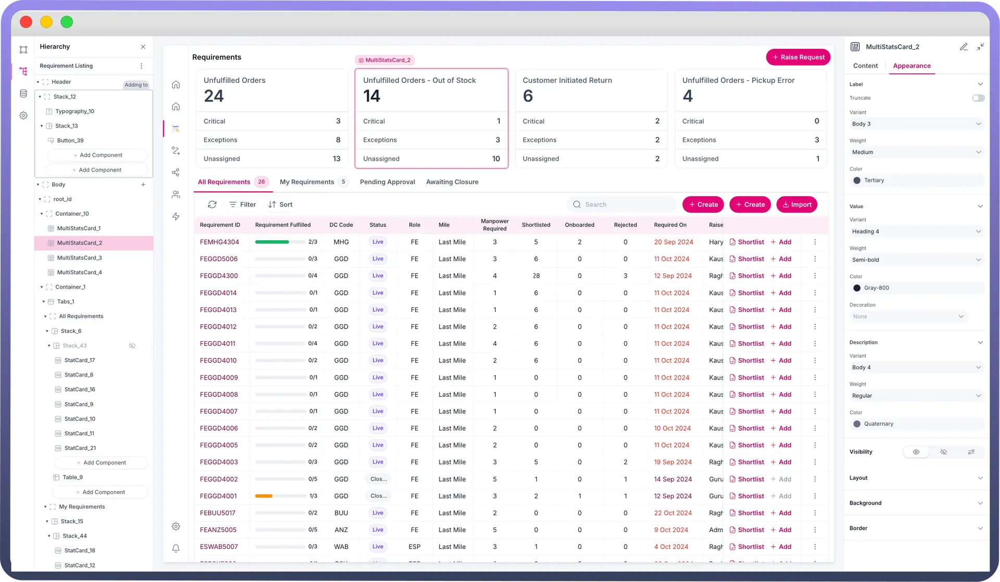

# Multi stat Card

Source: https://www.unifyapps.com/docs/unify-applications/multi-stat-card
Section: applications

---

## Overview

The Multi Stat Card component is designed to display key statistics or metrics in a visually appealing way. It allows users to showcase important numerical data, trends, and related information, making it easy to convey insights at a glance. This document will help you understand Multi Stat Cards in detail.

## Defining Content for a Multi Stat Card

You can define content for your multi stat card using the following properties:

| **Property** | **Description** |
|---|---|
| `Title` | Enter the title for the Multi Stat Card. |
| `Description` | Add a brief description of the statistic or metric. This will show up in the Multi Stat Card. |
| `Value` | Set the main value to be displayed on the Multi Stat Card. You can bind this to a data source using the data pills. |
| `Type` | Choose the type of value (e.g., Number, Percentage, String, Currency, Time) |
| `Notation` | Select the notation format between Standard Notation (1234.56), Scientific Notation (1.23 e+3), Engineering Notation (1.23e+3) & compact notation (1.2k for 1200) |

### Adding Trend Colour

The Trend Color setting visually indicates performance by changing the text color based on specified conditions:

- `Threshold`: Define a value above or below which the text color changes. By default, values above the threshold are green, and below are red.
- `Invert Trend`: Inverts the default color conditions. When enabled, values above the threshold turn red, and below turn green.

### Adding Secondary Stats in a Multi Stat Card

Multi Stat Cards can show multiple additional values (e.g., *Critical values*, *Exceptions*, etc.) that provide more context to the primary value displayed on the card. It is typically used to represent trends, comparisons, or supplementary data points that enhance the understanding of the main statistic

You can add a Secondary stat with following properties:

| **Property** | **Description** |
|---|---|
| `Title` | Enter the title for the Multi Stat Card. |
| `Description` | Add a brief description of the statistic or metric. This will show up in the Multi Stat Card. |
| `Value` | Set the main value to be displayed on the Multi Stat Card. You can bind this to a data source using the data pills. |
| `Type` | Choose the type of value (e.g., Number, Percentage, String, Currency, Time) |
| `Notation` | Select the notation format between Standard Notation (1234.56), Scientific Notation (1.23 e+3), Engineering Notation (1.23e+3) & compact notation (1.2k for 1200) |

### Adding Trend to your Stats

Adding trend in a Multi Stat Card provides more context to the stat displayed on the card. It is typically used to enhance the understanding of the main statistic by using percentage change. You can add a trend on the primary stat and all secondary stats in the multi stat card.

You can add a Trend with following properties:

| **Property** | **Description** |
|---|---|
| `Type` | Choose the type of trend indicator, such as Percent, Number, or Currency. |
| `Value` | Enter the value to be displayed in the trend indicator. |
| `Decimal Places` | Specify the number of decimal places for precision. |
| `Trend Color` | Option to set a trend color based on a threshold. |
| `Threshold` | Define the value threshold for the trend color. |
| `Invert Trend` | Invert the default color condition, where values above the threshold turn red and below turn green. |
| `Appearance` | This allows you to set the icon alongside the trend value as positive or negative symbols, arrows, or remove it altogether. |

## Customizing the Appearance of Multi StatCard

You can customize the appearance of multi stat card by using the following properties.

| **Property** | **Description** |
|---|---|
| `Size` | Choose from predefined sizes (e.g., sm, md, lg). |
| `Truncate Label` | Enable to truncate long text labels. |
| `Padding` | Adjust the padding around the Multi Stat Card content. |
| `Gap` | Set the gap between elements within the Multi Stat Card. |
| `Border Width` | Adjust the width of the border around the Multi Stat Card. |
| `Border Radius` | Set the border radius for rounded corners. |
| `Border Color` | Choose the color for the border. |
| `Width` | Sets the overall width of the tab component. |
| `Min Width` | Specifies the minimum width the tab component can shrink to. |
| `Max Width` | Defines the maximum width the tab component can expand to. |

## Defining Interactions on Multi Stat Cards

Multi Stat Card support `On Click` event. On Click  Trigger an action or a workflow when the Multi Stat Card is clicked. You can use this functionality to navigate to detailed views, update data, or execute specific actions on click of the multi stat card.

### Defining Permissions

The Multi Stat Card component allows you to set visibility permissions based on the permissions granted to the logged-in user. This ensures that only authorized users can view or interact with the Multi Stat Card.

> **Note:** You can refer to Permissions documentation to know more about defining permissions for each component.
