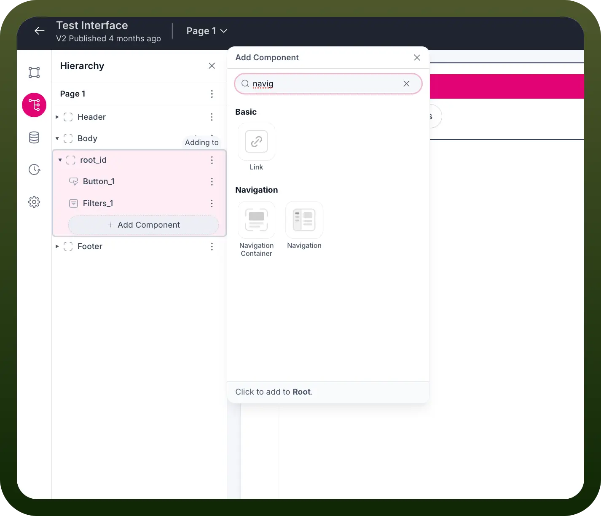
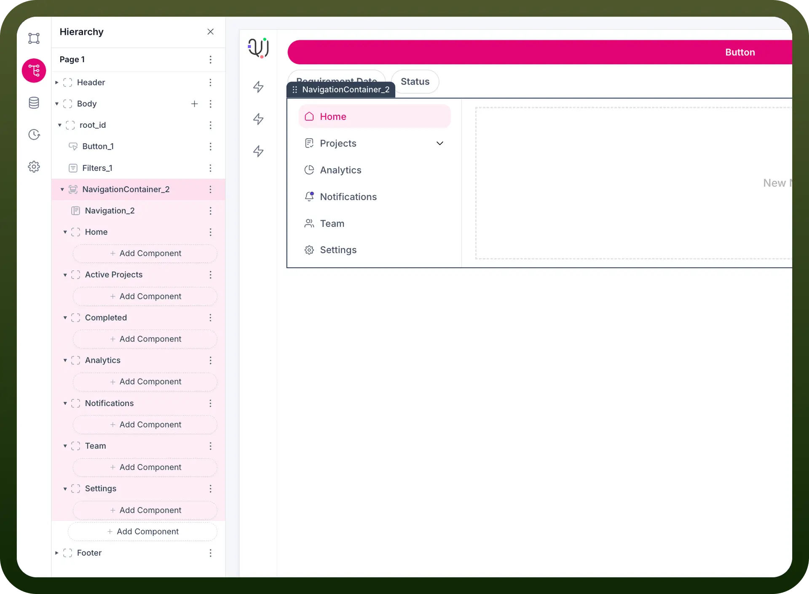
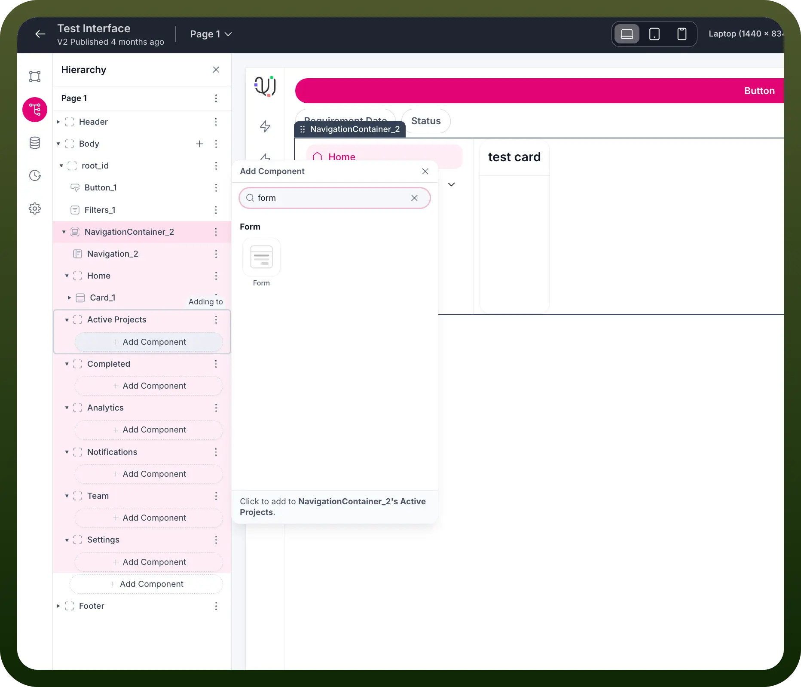
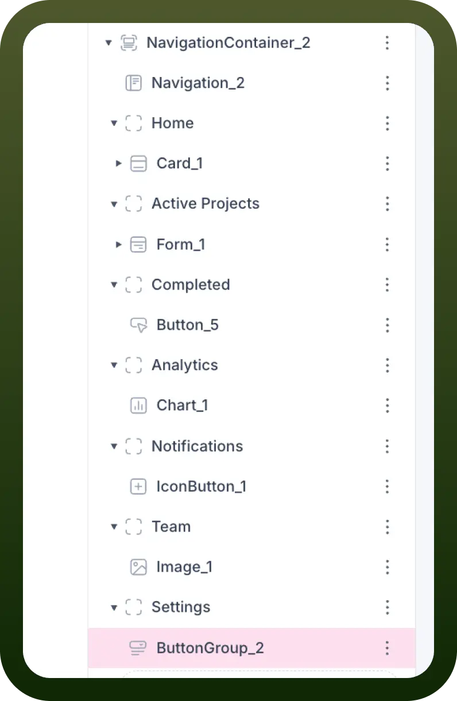
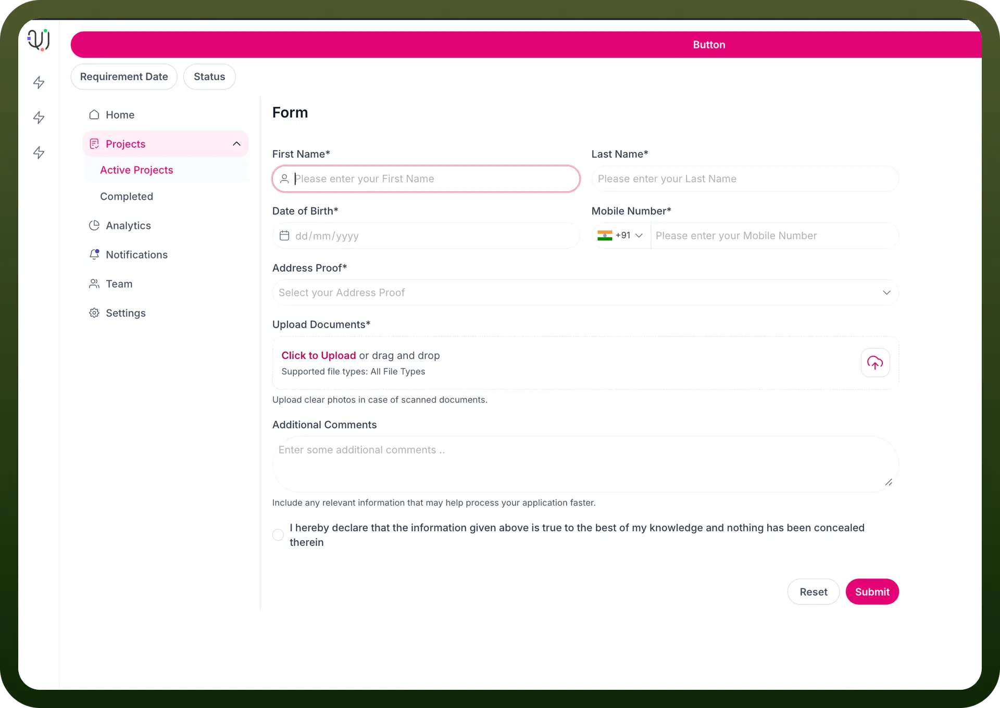
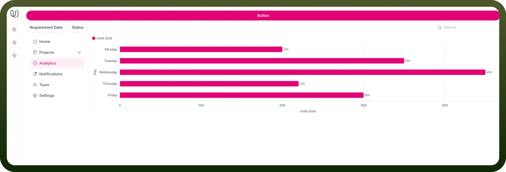

# Navigation Container

Source: https://www.unifyapps.com/docs/unify-applications/navigation-container
Section: applications

---

## Introduction

The Navigation Container component is a powerful element in your application interface that allows you to create structured navigation hierarchies with different sections and pages. This guide will walk you through how to work with Navigation Container components, add them to your interface, and customize them with various elements.

## Adding a Navigation Container

1. Select "`Navigation Container`" from the search results.

  

2. You'll see a message that says "`Click to add to Root`" or similar, depending on your current selection in the hierarchy.
3. Click to add the Navigation Container to your desired location in the component hierarchy.

The component will appear in your hierarchy as "NavigationContainer_X" (where X is a number).

## Working with Navigation Container

Once you've added a Navigation Container, you can customize it with various navigation elements:

**Adding Navigation Items**

1. Select the Navigation Container in your hierarchy.
2. Click the "`+`" or "`Add Component`" button within the container.
3. You can add components like:
  - Home
  - Projects
  - Analytics
  - Notifications
  - Team
  - Settings

**Customizing Navigation Sections**

Your Navigation Container can include:

- **Simple Navigation Items**: Basic navigation links
- **Expandable Sections**: Like the "Projects" section that can expand to show "Active Projects" and "Completed"
- **Child Components**: Each navigation section can contain its own components

## Navigation Container Structure Example

```
NavigationContainer_2
├── Navigation_2
├── Home
│   └── Card_1
├── Active Projects
│   └── Form_1
├── Completed
│   └── Button_5
├── Analytics
│   └── Chart_1
├── Notifications
│   └── IconButton_1
├── Team
│   └── Image_1
└── Settings
    └── ButtonGroup_2
```





## Adding Components to Navigation Sections

Each section in your navigation can contain specific components relevant to that section:

1. **Home**: Can contain cards, welcome messages, dashboards
2. **Projects**: Can contain project lists, forms, task trackers
3. **Analytics**: Can contain charts, graphs, data visualizations
4. **Notifications**: Can contain notification lists, alert components
5. **Team**: Can contain team member lists, profiles, images
6. **Settings**: Can contain forms, button groups, toggles, input fields



## Example: Adding a Form to Active Projects

1. Select "`Active Projects`" in your hierarchy.
2. Click "`Add Component`" within Active Projects.
3. Search for "`form`" in the component search.
4. Select the Form component.
5. The form will be added to the Active Projects section.

  

## Example: Adding a Chart to Analytics

1. Select "`Analytics`" in your hierarchy.
2. Click "`Add Component`" within Analytics.
3. Search for chart-related components.
4. Select the Chart component of your choice.
5. The chart will be added to the Analytics section.

  

## Styling and Customization

- The Navigation Container typically appears as a sidebar with styled navigation items.
- Selected/active items are often highlighted with a different background color.
- Icons can be added next to navigation items for better visual identification.
- Expandable sections can have dropdown arrows or indicators.

## Best Practices

1. **Organize Logically**: Group related functionality together in your navigation.
2. **Use Consistent Icons**: Maintain consistent icon styles across navigation items.
3. **Limit Nesting**: Avoid deeply nested navigation structures for better usability.
4. **Highlight Current Section**: Ensure the active navigation item is clearly highlighted.
5. **Consider Responsive Design**: Ensure your navigation works well on different screen sizes.

## Troubleshooting

- If a component doesn't appear after adding it, check if it's properly nested in the hierarchy.
- If navigation items don't respond to clicks, verify that the proper event handlers are configured.
- If the navigation layout appears broken, check for any CSS conflicts or overrides.

## Summary

The Navigation Container component provides a structured way to organize your application's navigation. By properly setting up your navigation hierarchy and customizing it with appropriate components, you can create an intuitive and user-friendly navigation experience for your application.
