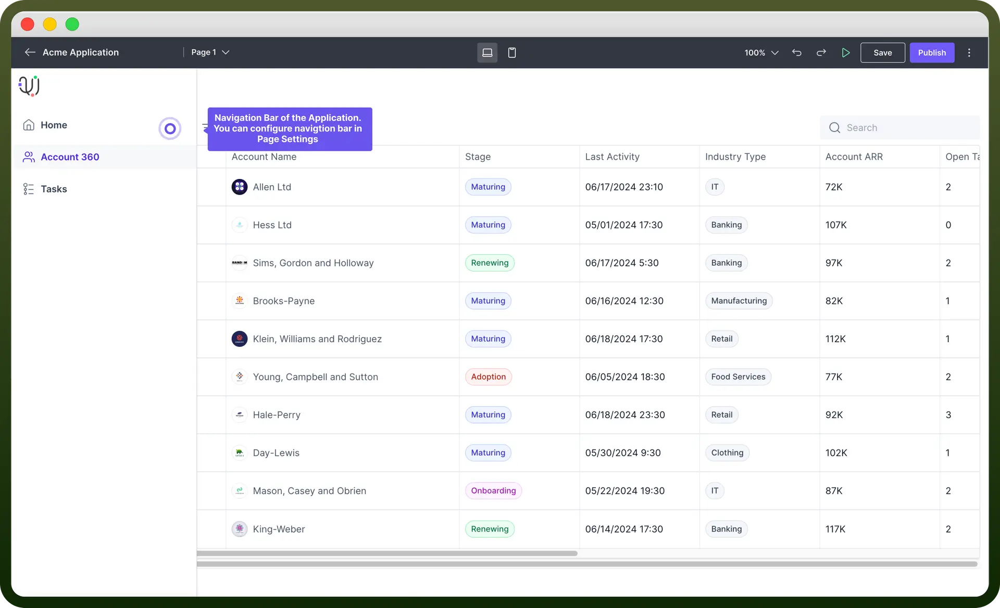
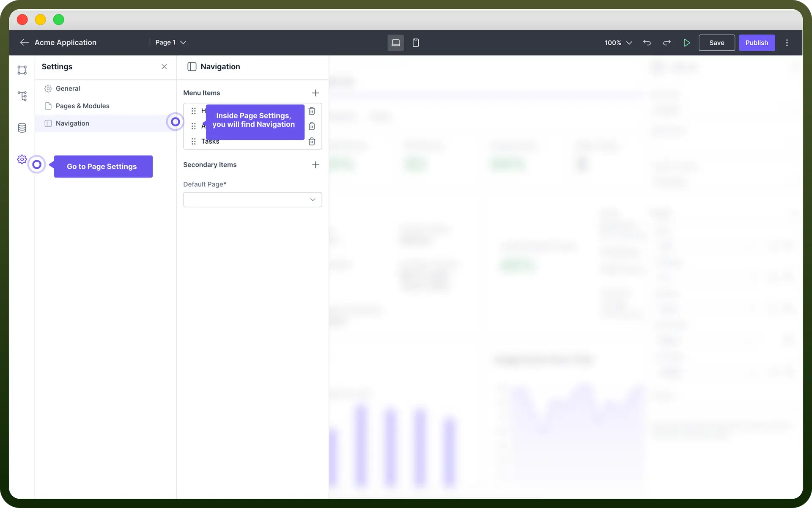
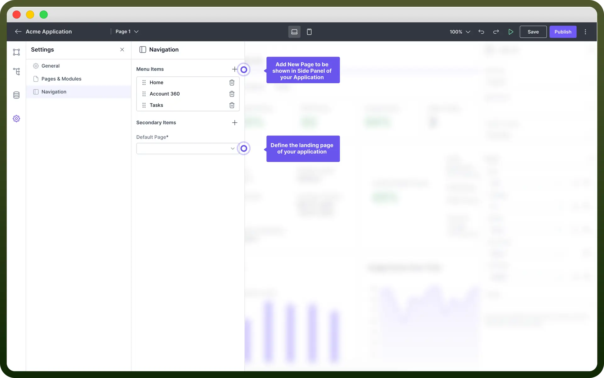
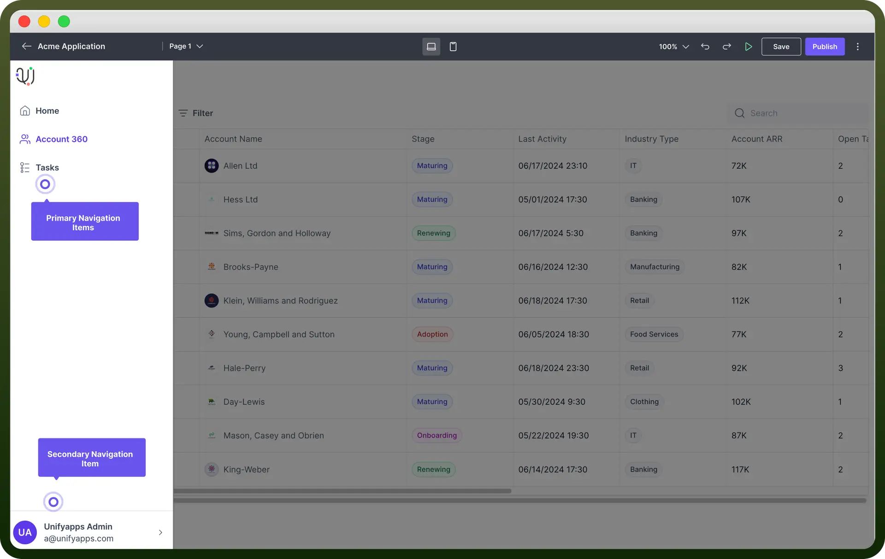

# Navigation component

Source: https://www.unifyapps.com/docs/unify-applications/navigation
Section: applications

---

## Overview

Page navigation allows users to specify which pages are displayed in the side panel, ensuring that the most critical sections are easily accessible.

Additionally, you can determine the order of these pages, along with their icons and names, for a streamlined and intuitive user experience.

This guide will explain how to **configure** page navigation, including **adding**, **editing**, and **organizing** navigation items.

## Access the Page Navigation

You can access the navigation settings by navigating to the "`Settings`" section in your Unify Applications interface and selecting "`Navigation`" from the sidebar.

## Add Menu Items

Menu items are the **primary navigation elements** that are prominently displayed in the side panel. These items represent the main sections or functionalities of the application that users frequently access.

These items are positioned at the top of the side panel for easy access.

To add a new navigation item, click the "`+`" button next to "`Menu Items`" and a new item will appear in the list.

> **Note:** Use the `Default` Page Option to define the first landing page of your application.

## Define Properties of each menu item

You can edit an existing navigation item by clicking on the navigation item you want to edit and updating the details in the properties panel..

| **Property** | **Description** |
|---|---|
| `Type` | You can choose the type of navigation item. It can be a URL to another website, a page already made in your application or a Group. |
| `Page/URL` | This is where you choose Page Name from the list of pages in your application or add the URL in case the navigation item is a URL. |
| `Label` | This is where you write the name of the page. Ensure that you name each page appropriately to provide clarity and context for users. |
| `Icon` | This is where you can choose icons that will come in the Navigation Panel. alongside the label Ensure you Assign distinctive icons to each page for quick identification and enhanced usability. |

> **Note:** To define the order of navigation items, you can simply drag and drop them to rearrange their order.

## Add Profile Page

Profile Page is added as a secondary item in the Navigation Panel.

**Secondary items** are additional navigation elements that appear at the bottom of the side panel. These items are usually less frequently accessed but are still important for overall application functionality.

To add a new secondary navigation item, click the "`+`" button next to "`Secondary Items`" and a new item will appear in the list.

## Define Panel Permissions

- You can set navigation panel permissions for each item by selecting the navigation item for which you want to set permissions.
- In the properties panel on the right, click the "`+`" button next to "`Permissions`" to add any required permissions for accessing this page.
- Configure the permissions based on user roles to control who can access the page.

> **Note:** You can read more about Page Navigation in the Permissions Article.

## Best Practices

1. **Consistent Naming**: Using clear and consistent names for your navigation items makes it easy for users to understand.
2. **Logical Structure**: Arranging navigation items in a logical order that aligns with the user flow of your application is beneficial.
3. **Use Icons**: Adding icons to navigation items can help users quickly identify different sections.
4. **Set Permissions**: Configuring permissions for sensitive pages helps control access based on user roles.
5. **Default Page**: Choosing a default page that serves as the main entry point or landing page for users accessing your application is important.
