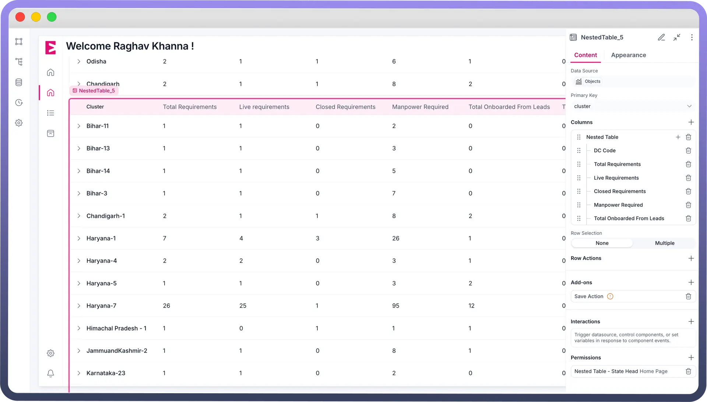
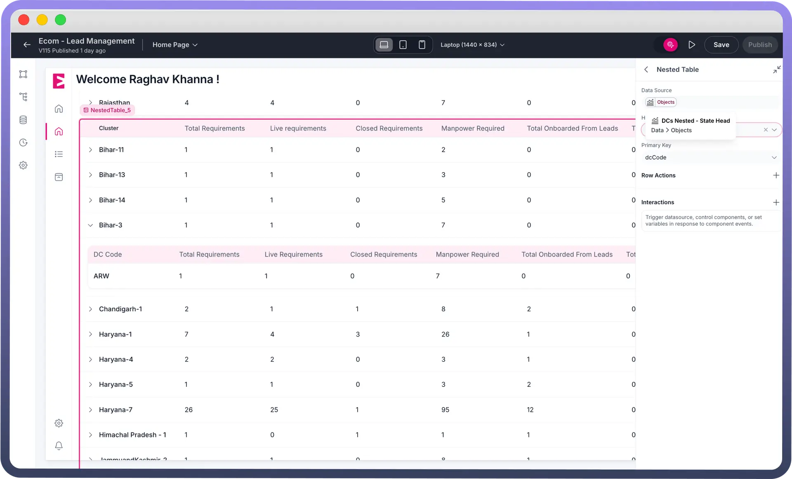

# Nested Table

Source: https://www.unifyapps.com/docs/unify-applications/nested-table
Section: applications

---

## Overview

The **Nested Table** component allows you to display data in a hierarchical structure. Each row in the table can contain a nested table that displays additional data. This component is ideal for displaying detailed records, such as state-level manpower requirements with drill-downs into city and pincode-wise onboarding status.

## Configuring a Nested Table

You may configure the Data Table component by following the below steps:

1. Add a Nested Table component to your canvas
2. **Content Configuration**
  - **Data Source**: Defines the data displayed in the table. The data must be an array of objects, with each object representing a row.
  - **Primary Key**: Specifies a unique identifier for each row. This key is used for row selection and other actions.
  - **Columns**: Defines the columns for each row. You can add standard columns or insert a nested table as a column.
3. **Nested Table Configuration**

  

  - **Data Source:** Defines the data displayed in the nested table. It must also be an array of objects, with each object representing a row in the nested table.
  - **Has Children**: Specifies the key in the parent row that determines if child rows exist. This enables the expand/collapse functionality.
  - **Primary Key:** Sets a unique identifier for each child row, required for features like row selection and actions.

> **Note:** The primary key in the parent table should be used as the input for the nested table's data source to ensure proper mapping of child rows to their respective parent row.

## Best Practices for Using the Nested Table Component

- Set a reliable primary key for each row at both primary table and nested levels to ensure consistent row-level operations like selection or actions. Avoid using non-unique or dynamic values.
- Test nested table behavior during pagination, filtering, or sorting on the parent table to ensure child rows render correctly under different data views
- Use the Has Children field only when child data is pre-fetched or conditionally loaded.

> **Note:** In addition to the nested structure, Nested Tables use the same properties as Data Tables. For more information, please refer to the [Data Table article](https://www.unifyapps.com/docs/unify-applications/data-table).
