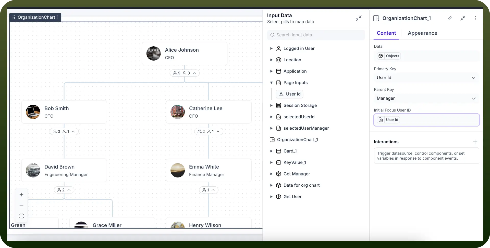
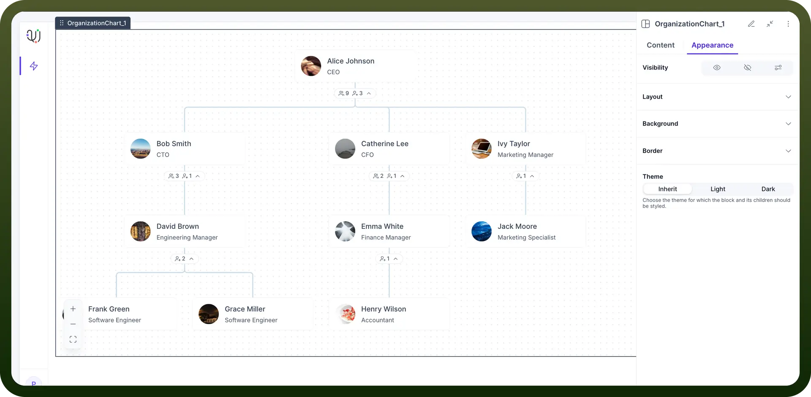

# Organization Chart

Source: https://www.unifyapps.com/docs/unify-applications/organization-chart
Section: applications

---

## Overview

The Organization Chart component allows users to create a hierarchical view providing a clear, visual representation of their department or organization chart.

## Configuring Organizational Chart

You may configure an Organizational chart component by following the below steps:

1. Add the “`Org Chart`” component from your component list to your application body.
2. You can define content using the following properties:

| **Property** | **Description** |
|---|---|
| `Data` | This is the main parameter which will be fetched to generate the org chart For e.g. in the screenshot below, we are fetching the DATA for Org chart  from an Object called “ DATA FOR ORG CHART” To populate data in this object, users need to create an automation which creates a list of users along with their reporting managers in it. |
| `Primary Key` | This field is used to identify & display the Primary key in the org chart.  For e.g. in the screenshot below, we are using “UserId” as the primary key. This will ensure that User Id is the primary key which is displayed in the org chart. |
| `Parent Key` | This field is used to identify & display the Parent key in the org chart.  For e.g. in the screenshot below, we are using “”Manager” as the parent key. This will ensure that in the org chart hierarchy, Manager entity is being used to create organizational branches |
| `Initial focus user id` | This field is used to set the initial focus on any particular user. You can select a particular user or use data elements to focus on users dynamically. For e.g. in the screenshot below, we are focussing on the “userId” being passed from “PageInput” variables to focus on the user whose details have been clicked/passed from the previous page. |

## Appearance Customization

**Layout:** Details about the layout can be found in the table below:

| Attributes | Properties |
|---|---|
| `Padding` | Add space inside an element's border to create separation between the content and the border. |
| `Height` | Set the height of an element to control its vertical size. |
| `Min-Height` | Define the minimum height an element can be, ensuring it doesn't shrink below this value. |
| `Max-Height` | Specify the maximum height an element can reach, preventing it from growing too tall. |
| `Gap` | Set the space between rows and columns in a grid or flex container to create consistent spacing. |
| `Margin` | Set the outer space around an element to create distance between it and surrounding elements. |

> **Note:** For more detailed information on styling a component, refer to the [Appearance](https://www.unifyapps.com/docs/unify-applications/container) article.

**Visibility Customizations:**

- You can define the visibility of the field based on the options provided, either make it visible in the application, invisible in the application and only make it available in hierarchy or add visibility conditions.
- You may also add a conditional visibility on the icon.

## Defining Permissions

Every component allows you to set visibility permissions based on the permissions granted to the logged-in user. This ensures that only authorized users can view and interact with the component.

> **Note:** You can refer to Permissions documentation to know more about defining permissions for each component.
