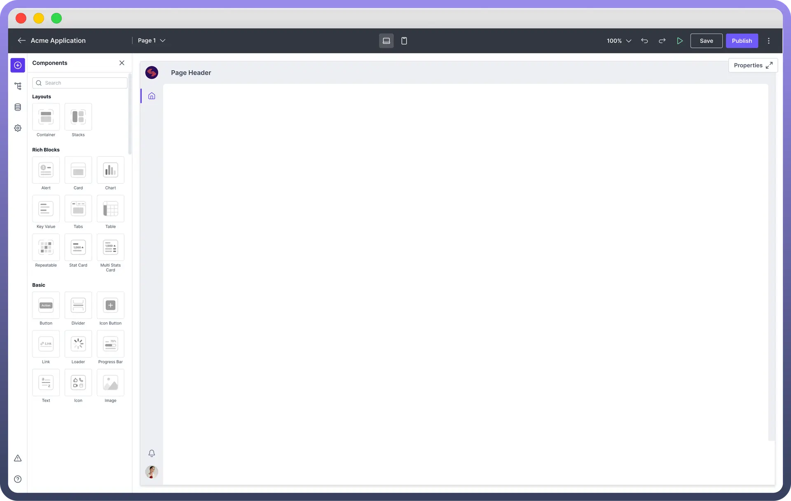
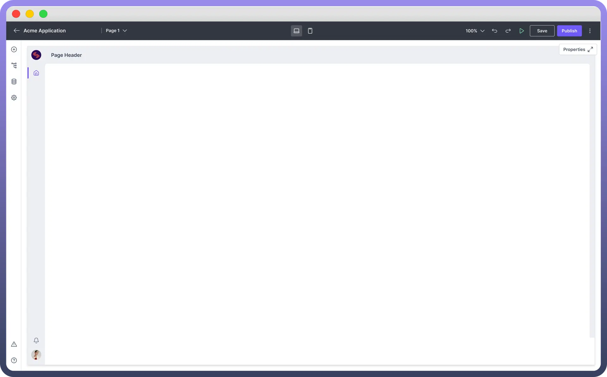
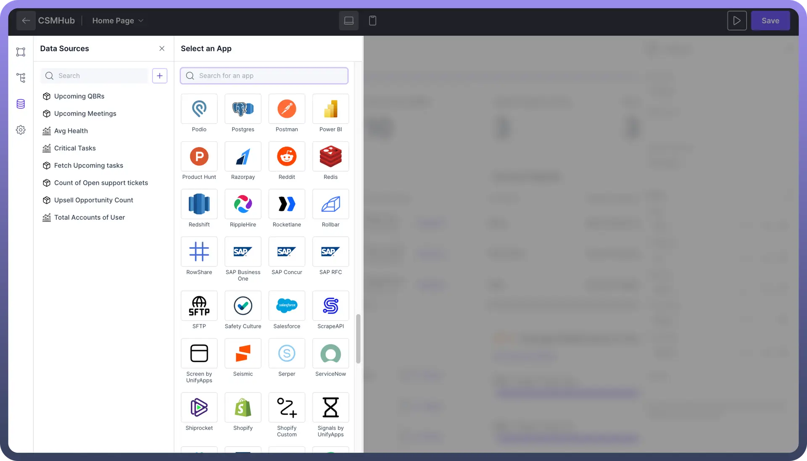

# Overview

Source: https://www.unifyapps.com/docs/unify-applications/overview
Section: applications

---

## Introduction

Unify Application is a **no-code application builder** that enables organisations to develop enterprise-grade applications rapidly without writing any code.

It allows teams to create secure, and scalable applications using a user-friendly interface with **drag-and-drop functionality.**
 
The application builder allows team members without extensive programming knowledge to contribute to software development.

## Types of Supported Application

Unify Applications supports the development of both **web based** applications and **mobile native** applications. These options allow businesses to choose the most suitable format for their specific needs and target audience.

1. **Web Applications**Web apps are accessible across devices through browsers. They automatically adapt to `desktop`, `mobile`, and `tablet` interfaces, ensuring full device responsiveness. "Web apps can be quickly updated and don't require users to download or install anything, ensuring all users access the latest version."
2. **Mobile Native Applications** Native apps for iOS and Android provide optimised mobile experiences, leveraging device-specific features like `cameras`, `GPS`, and `push notifications`. "Native apps are particularly suitable for businesses looking to provide a dedicated mobile solution with a highly responsive and intuitive user interface."

## Key Building Blocks of an Application

1. **UI Components:** These are prebuilt elements that form the building blocks of the application interface. They are categorized into four types:
  - **Layout Components:** These components are used to `structure` and `organise` other components within the interface.
  - **Rich Components:** These offer complex functionality like `data tables` or `charts`.
  - **Basic Components:** These are simpler components like `buttons` or `text fields`.
  - **Repeatable**: These elements are designed for repeating patterns, such as `lists` or `grids`, enabling dynamic data display. Each UI component comes with a property panel where users can define its content, interaction, and appearance. **Note:** You can add different types of components to make your application intuitive. Read more about Components [here](/docs/unify-applications/add-components-to-your-interface).

    

2. **Canvas:** The Canvas is the central workspace where users design and build their applications. It provides a visual, drag-and-drop interface where UI components can be easily `placed`, `arranged`, and `customised`.

  

3. **Data Sources:** These are the essential components that fetch and manage data for the application. They can retrieve information from external applications or from UnifyApps' **internal database**, providing flexibility in data integration.

> **Note:** Data sources are essential for connecting and utilizing various external applications. You can read more about Data Sources [here](/docs/unify-applications/adding-data-sources).

## Best Practices

1. **User-Centric Design**: Focus on designing applications with the end-user in mind. Ensure the interface is `intuitive` and `user-friendly.`
2. **Consistency**: Maintain consistency in design elements such as `fonts`, `colours`, and `button` styles across the application.
3. **Define Data Source and Schema**: Plan and define your data sources and schema on paper before implementing them in the app.
  - **API Keys and Credentials**: Ensure you have the necessary developer access, API keys, or admin credentials before integrating data from external applications.
  - **Naming Conventions:** Use clear and meaningful names for data connections, UI components, pages to make it easier to manage and understand the data flow within the application.
