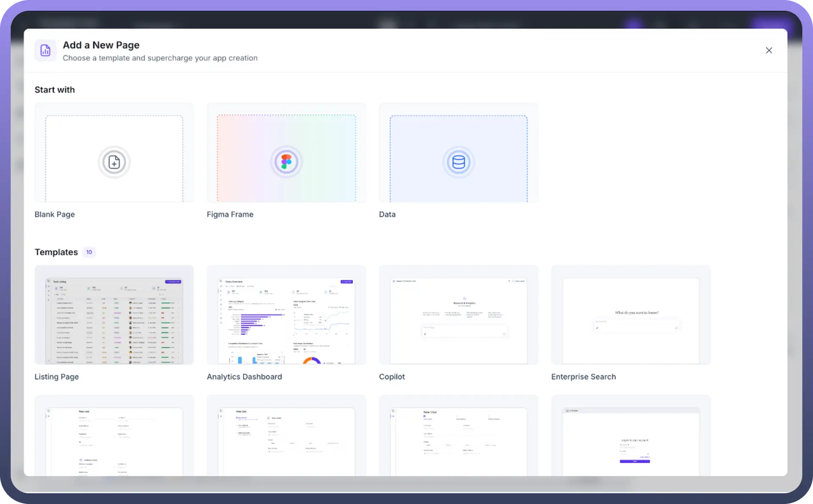
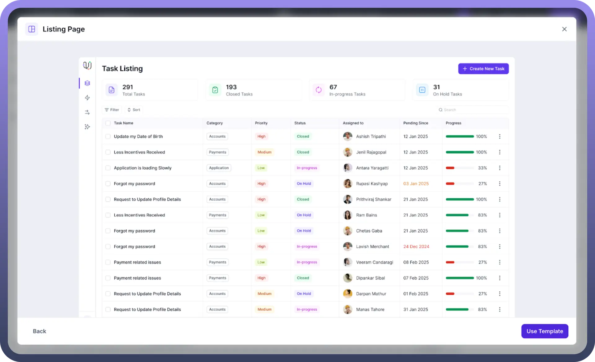
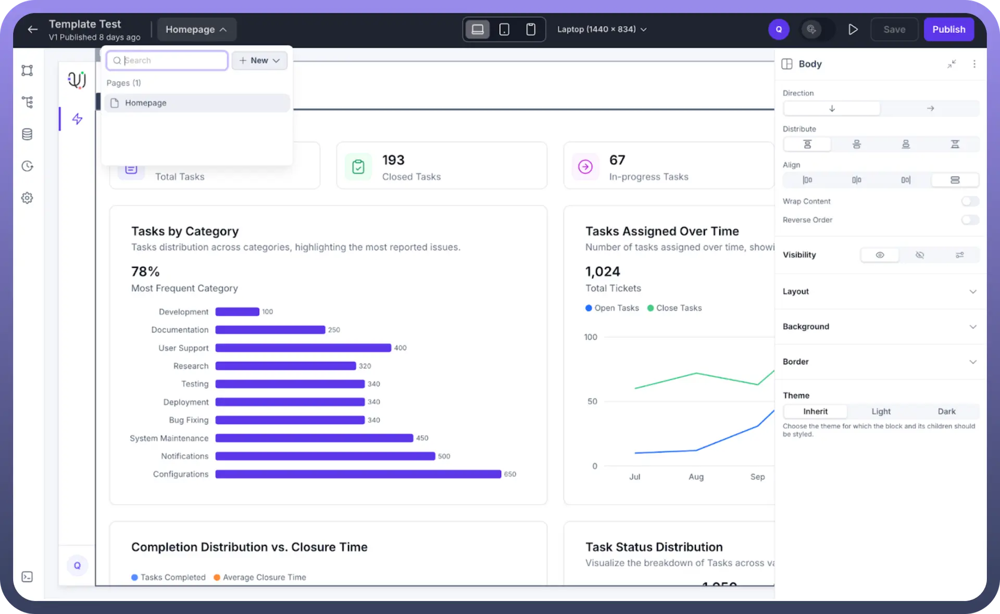
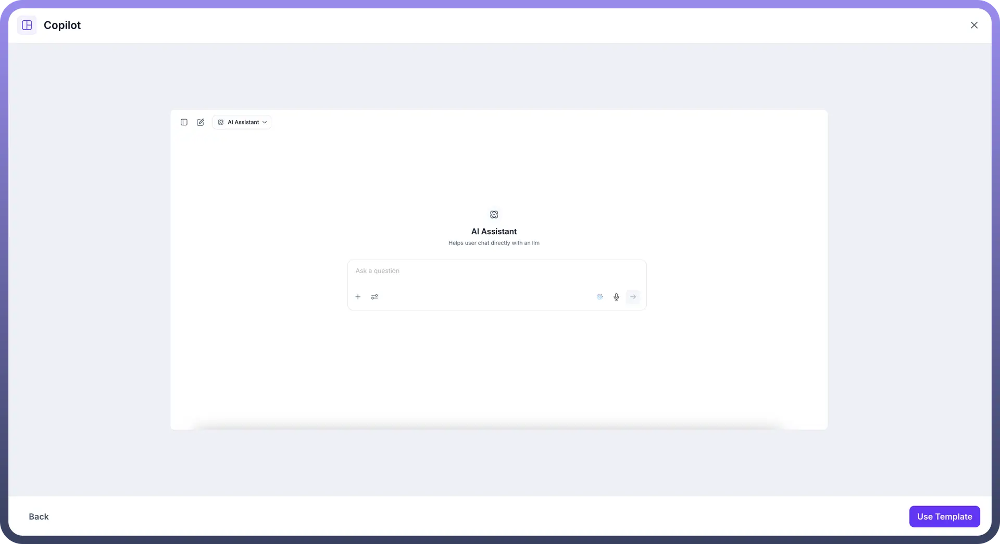
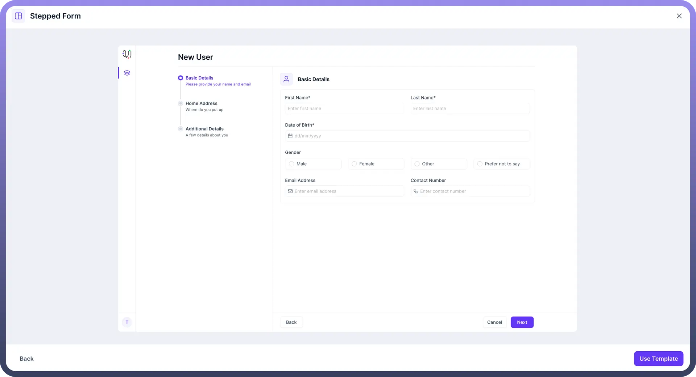
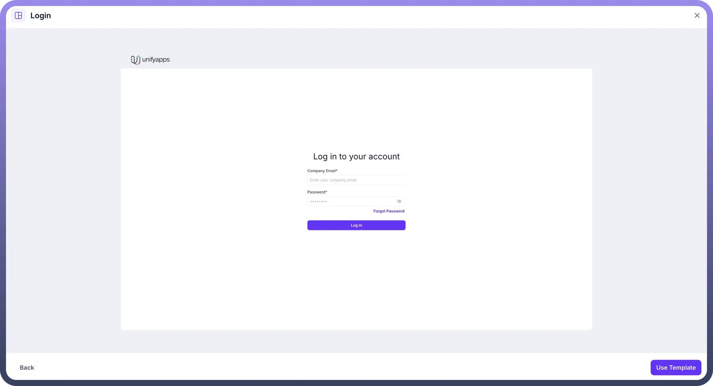

# Page Templates

Source: https://www.unifyapps.com/docs/unify-applications/page-templates
Section: applications

---

## Overview

Page Templates in the UnifyApps platform simplify application creation, allowing users to quickly build and configure applications by selecting from various pre-built, customizable page structures. These templates offer essential functionalities tailored for different user interactions.

## Available Templates

Below is an overview of each available template:

### Listing Page

- Provides a structured list view, ideal for managing tasks, tickets, or records.
- Includes quick-filtering, sorting, and status management features.

### Analytics Dashboard

- Offers visual analytics and insights via graphs and data summaries.
- Best suited for performance tracking and reporting metrics.

### Copilot

- Features an interactive AI assistant for quick query resolution.
- Designed for instant assistance and user engagement within applications.

### Enterprise Search

- A streamlined search interface for querying data across various entities.
- Ideal for quick and broad data retrieval.

### One Pager Form

- Compact, single-page layout for quickly capturing essential user details.
- Recommended for straightforward data entry processes.

### Stepped Form

- Multi-step structured form guiding users through detailed data submission.
- Suitable for scenarios requiring detailed, sequential data collection.

### Horizontal Stepped Form

- A horizontally organized step-by-step data entry form.
- Enhances clarity and progression through form sections horizontally.

### Login

- Standard user login interface.
- Basic fields for email and password with built-in security features.

### Update Password

- Secure template dedicated to updating user passwords.
- Clearly defined password confirmation fields for enhanced security.

### MFA Verification

- Simple yet secure multi-factor authentication interface.
- Designed for secure identity verification through emailed verification codes.

## How to Use Page Templates

1. Navigate to your application builder.
2. Select **"**`+ New`**"** and click on **"**`Add a New Page`**"**.
3. Choose the desired template from the available options.
4. Click **"**`Use Template`**"** to instantly load and customize it according to your requirements.
