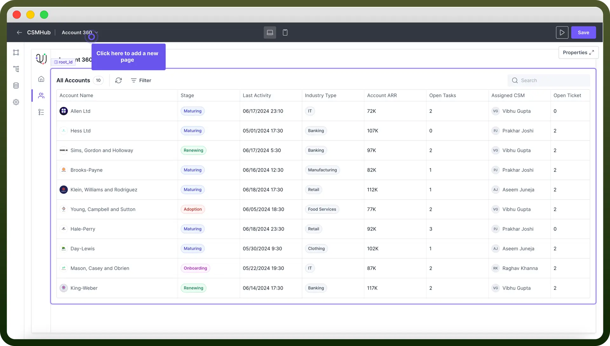
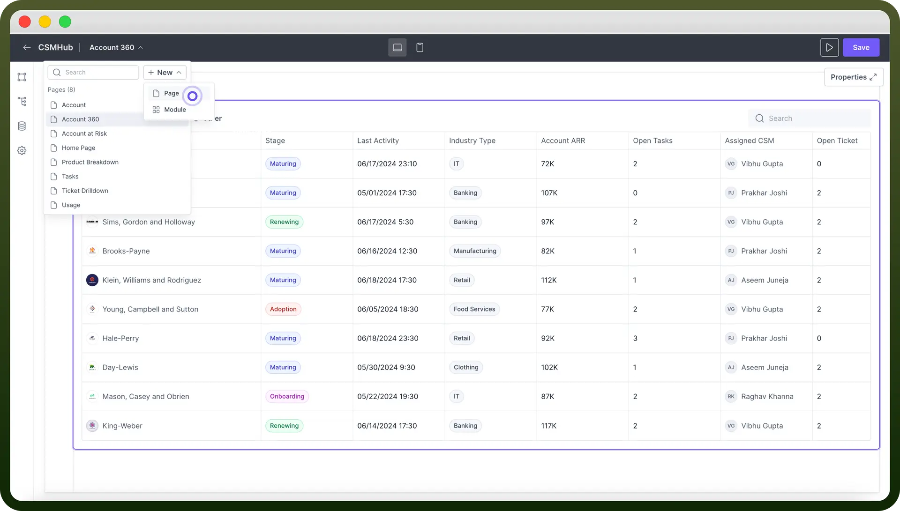
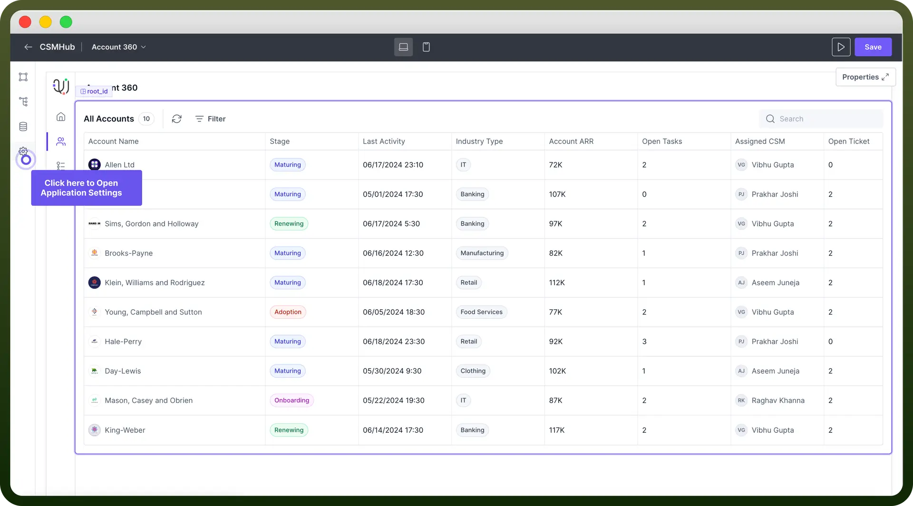
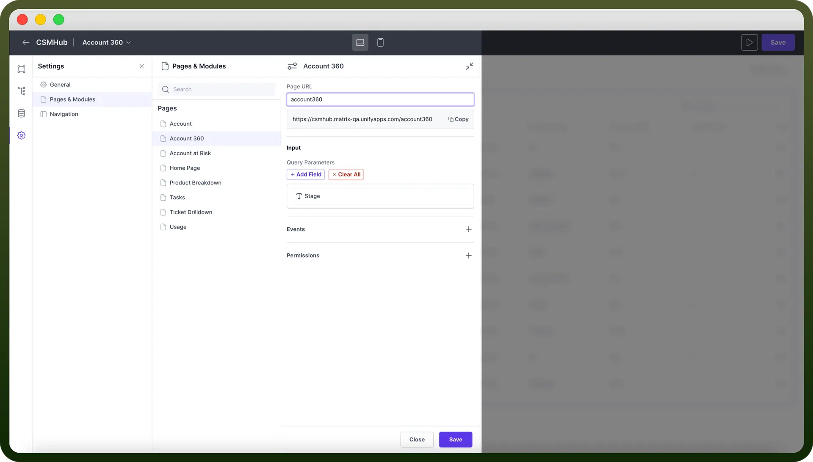
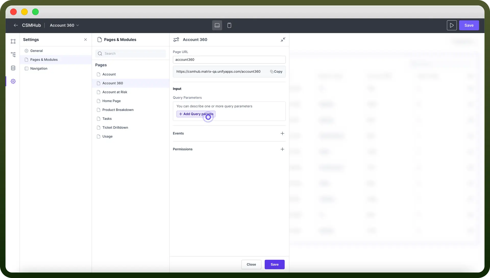
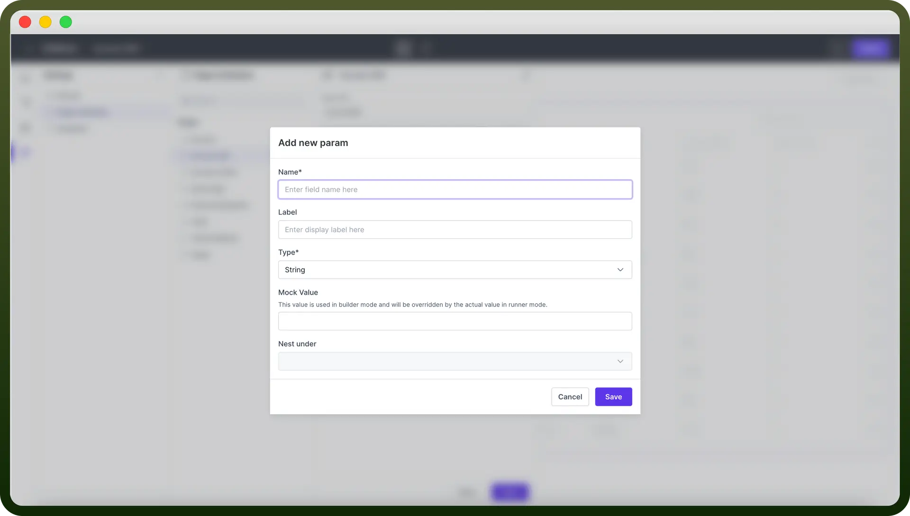
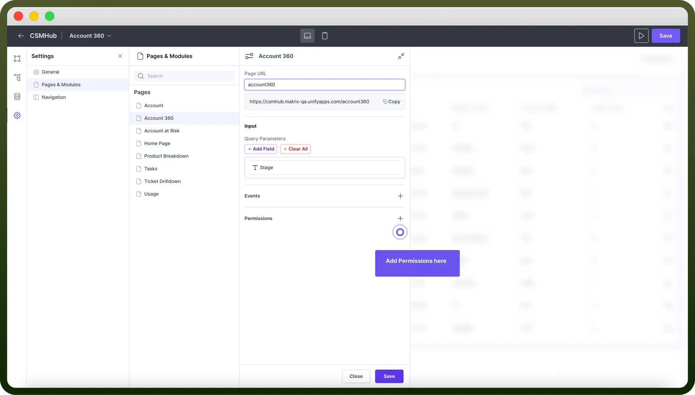
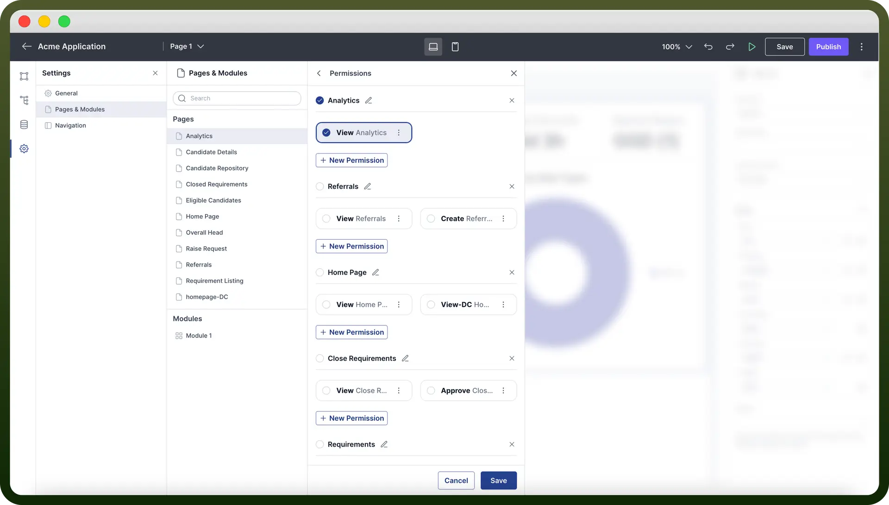

# Pages component

Source: https://www.unifyapps.com/docs/unify-applications/pages
Section: applications

---

## Overview

An application typically consists of multiple pages, each page containing various components. The platform allows users to **create** multiple pages, **define** custom page URLs for easy navigation and **manage** page-level permissions to control access.

This structure enables the creation of complex, multi-page applications with custom layouts and security settings.

## Create a New Page

By default, every new application starts with one page. To add more pages follow the below steps:

1. Click on the "`Top Toolbar`" as shown in the below image. The list shows all existing pages for the application.

  

2. Click on “`Add New`” and Select “`Page`”. A new Page will be created in the application. You can now drop components to this page and start building your layout.

  

## Customize Page URL

Configurators can define custom urls for their pages. This makes it easier for end users to navigate your app and understand the purpose of each page.

It also helps with creating a logical structure for your application and can improve its visibility in search engines.

To change the url for your page follow the below steps

1. Click on `Settings` icon in the left navigation of the application builder.

  

2. Select “`Pages & Modules`”
3. Select the "`Page`" for which you want to customise the URL
4. Input your new page slug. The system will automatically generate the full page URL. You can also copy this new URL for use elsewhere.

  

## Share Data Across Pages

You can share data between pages via **query parameters**. By using query parameters, you can create dynamic page content and maintain state across different parts of your application **without** any **coding**.

"This feature is useful for sharing information like user **selections**, **search terms**, or **contextual data**."

To define query parameter for a page follow the below steps:

1. In the “`Pages & Modules`” section select the page for which you want to define query parameters.
2. Under Input section click on “`Add Field`” as shown below.

  

3. Define the "`Type`" and "`Name`" of the query parameter. You can add multiple query parameters for a page. **Note:** You can also define mock value for a query parameter. The mock value will be only used in the builder.

  

## Add Permissions to a Page

Adding permissions to pages allows you to control who can access specific parts of your application.

"This feature is essential for maintaining security, protecting sensitive information, and creating role-based experiences. "

By setting page permissions, you can ensure that users only see and interact with the content they're authorised to access.

To **add** permissions to your page, follow the below steps:

1. In Application Settings. Click on “`Page & Modules`” and select the page for which you want to set permissions.
2. Click on "`Permissions`" as shown in the below example.

  

3. Select the permissions for the page. Only users having the set of permissions will be able to access the page. To know more about **Permissions** and **Roles** refer [this](/docs/unify-applications/pages) article.

  
