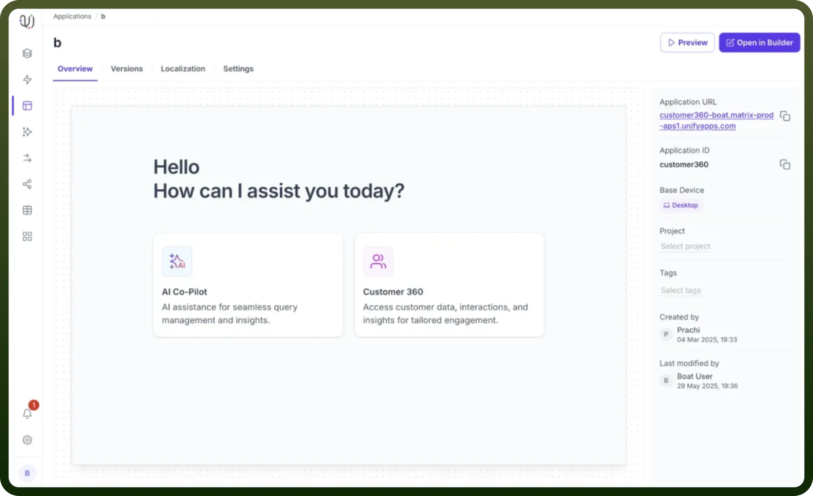
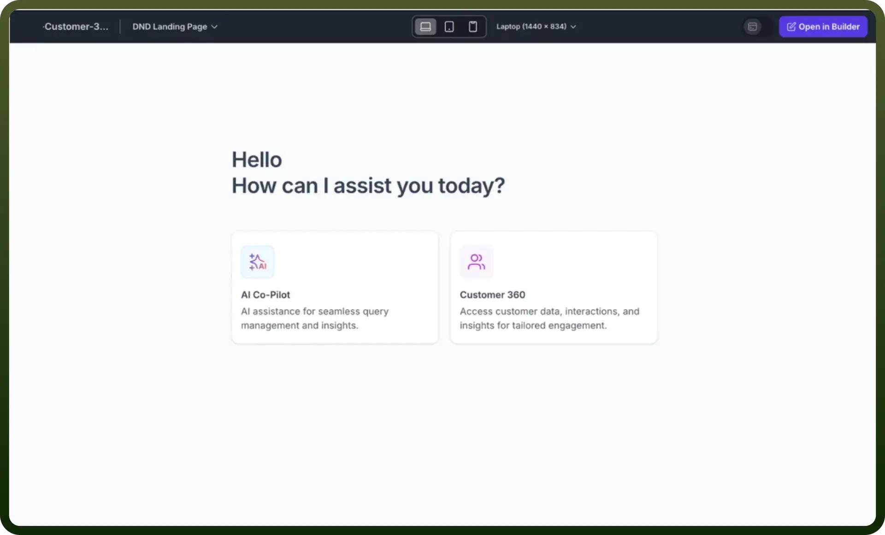
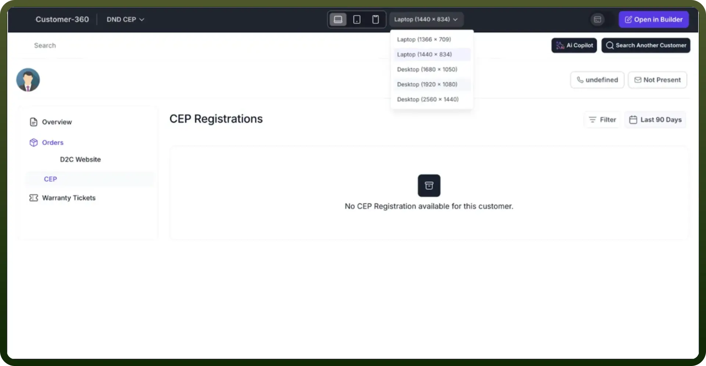
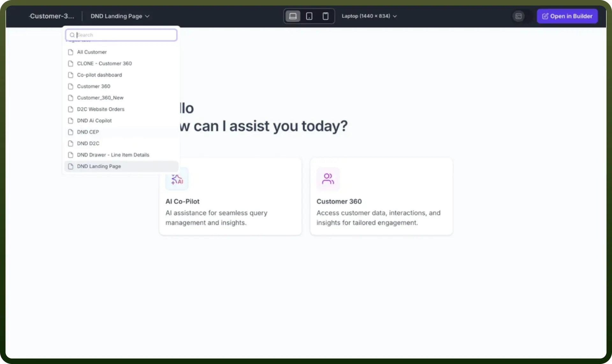
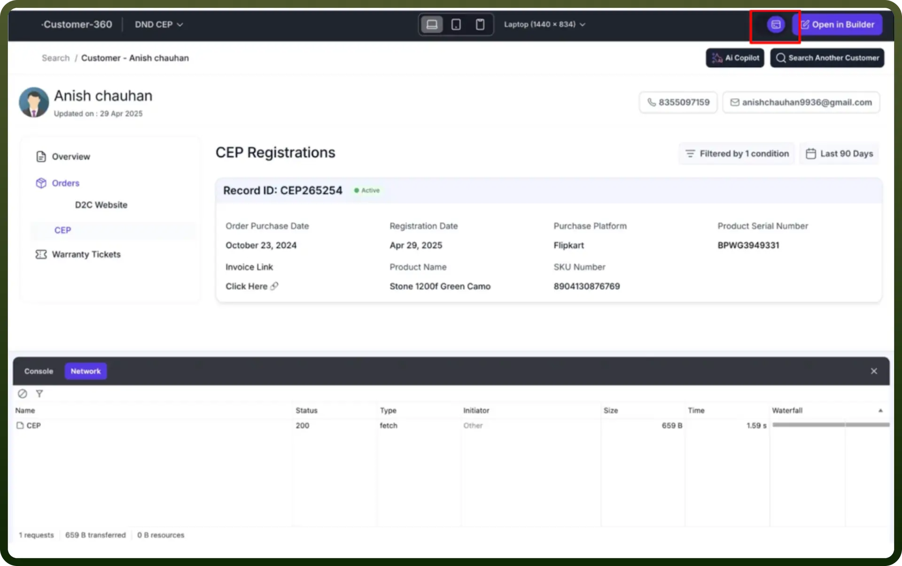

# Preview Application

Source: https://www.unifyapps.com/docs/unify-applications/preview-application
Section: applications

---

## Overview

The Preview Application feature in UnifyApps allows users to thoroughly examine and test their application before final deployment. This powerful tool provides a comprehensive environment to review the application's look, feel, and functionality across different devices and screen resolutions.

## Key Features

**User Interface**

The preview interface presents the homepage as it will be viewed by the intended user.

**Device Resolution Options**

Users can test their application across multiple screen sizes:

- Laptop (1366 × 709)
- Laptop (1440 × 834)
- Desktop (1680 × 1050)
- Desktop (1920 × 1080)
- Desktop (2560 × 1440)

**Navigation Features**

- Dropdown menu to switch between different pages of the application
- Search functionality to quickly locate specific sections
- Ability to open the application directly in the Builder

**Developer Tools**

The preview includes advanced debugging capabilities:

- Console tab for logging and debugging
- Network tab to analyze network requests and performance
- Ability to inspect application details and interactions

## How to Use the Preview Application

1. Navigate to the Applications section in UnifyApps
2. Select the application you want to preview
3. Click on the "`Preview`" button
4. Explore the application interface
5. Use the device resolution dropdown to test responsiveness
6. Utilize developer tools for deeper analysis

## Best Practices

- Test the application across multiple device resolutions
- Use the AI Co-Pilot and Console tabs for comprehensive debugging
- Verify user interface consistency and functionality
- Check network performance and request handling
