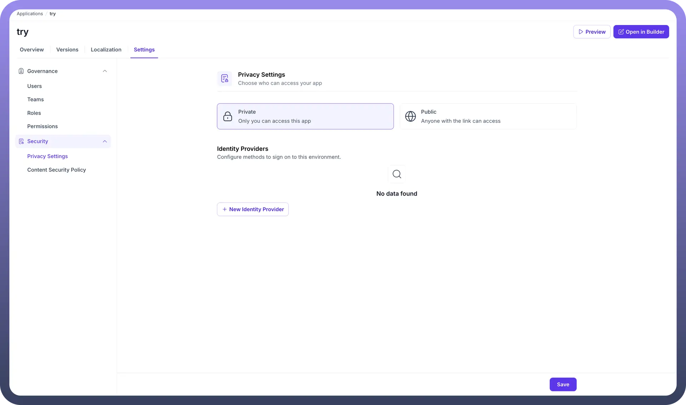
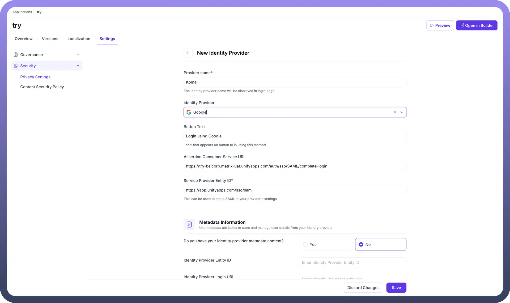
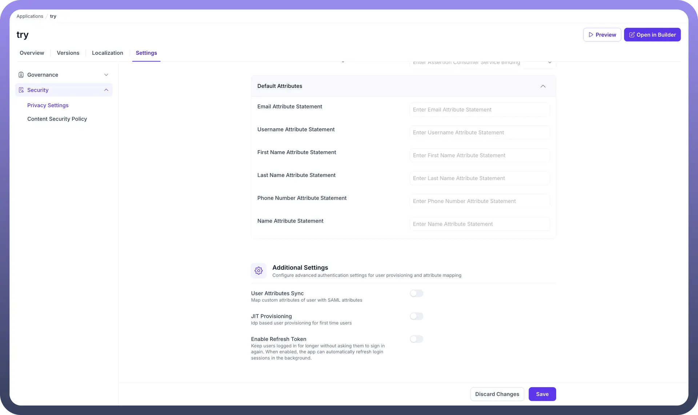

# Privacy Settings

Source: https://www.unifyapps.com/docs/unify-applications/privacy-settings
Section: applications

---

## Overview

The Privacy Settings section within your application's settings allows you to control who can access your application and to configure third-party Identity Providers for authentication. This ensures that you can manage your application's accessibility, making it either private for internal use or public for wider access, while also providing secure and streamlined sign-on experiences for your users.

## Navigating to Privacy Settings

To access the Privacy Settings for your application:

1. Navigate to the `Applications` section.
2. Select your application (e.g., `try`).
3. Click on the `Settings` tab.
4. From the left-hand menu, expand the `Security` section.
5. Select `Privacy Settings`.

## Privacy Settings Configuration

Within the Privacy Settings, you have two main areas of configuration: defining the application's access level and managing identity providers.

**Access Level**

You can choose who can access your app with two distinct options:

- `Private`**:** When selected, only explicitly invited users can access the application. This is the default and recommended setting for applications intended for internal teams or a specific set of users.
- `Public`**:** This option makes your application accessible to anyone with the link. This is suitable for applications intended for a general audience.

## Identity Providers

Identity Providers (IdP) allow you to configure different methods for users to sign on to your application. This enables integration with external authentication services like Google, Okta, or other SAML-based providers for a seamless Single Sign-On (SSO) experience.

### Adding a New Identity Provider

To add a new authentication method:

1. Click the `+ New Identity Provider` button. This will open a configuration page for the new provider.

### Identity Provider Configuration Fields

When you create a new Identity Provider, you will need to configure several fields:

**Basic Information**

- **Provider Name:** A user-friendly name for the identity provider that will be displayed on the login page (e.g., `Komal`).
- **Identity Provider:** A dropdown menu to select the provider you want to configure (e.g., `Google`).
- **Button Text:** The text that will appear on the login button for this method (e.g., `Login using Google`).

**SAML Configuration**

- **Assertion Consumer Service URL:** This is a read-only field containing the URL that receives the SAML assertion from the Identity Provider.
- **Service Provider Entity ID:** A read-only unique identifier for your application that is used for setting up SAML in your provider's settings.

**Metadata Information**

- **Do you have your identity provider metadata content?:** You can choose `Yes` to paste metadata directly or `No` to manually enter the details below.
- **Identity Provider Entity ID:** The unique identifier for the external Identity Provider.
- **Identity Provider Login URL:** The URL where the application should send SAML requests to initiate login.
- **Identity Provider Logout URL (Optional):** The URL to redirect users to after they log out.
- **Public Certificate:** The X.509 certificate from your IdP to verify the authenticity of the SAML responses.

**Attribute Mapping**

- **Default Attributes:** Map the attributes from the IdP's SAML assertion to the user attributes in your application.
  - `Email Attribute Statement`
  - `Username Attribute Statement`
  - `First Name Attribute Statement`
  - `Last Name Attribute Statement`
  - `Phone Number Attribute Statement`
  - `Name Attribute Statement`

**Advanced Settings**

- **User Attributes Sync:** Map custom attributes of the user with SAML attributes.
- **JIT Provisioning:** Enable `Just-In-Time` provisioning to automatically create and log in users the first time they sign in through this provider.
- **Enable Refresh Token:** Allows users to stay logged in for longer without being asked to sign in again. When enabled, the application can automatically refresh login sessions in the background.

Once you have filled in all the required details, click the `Save` button to save your Identity Provider configuration.
