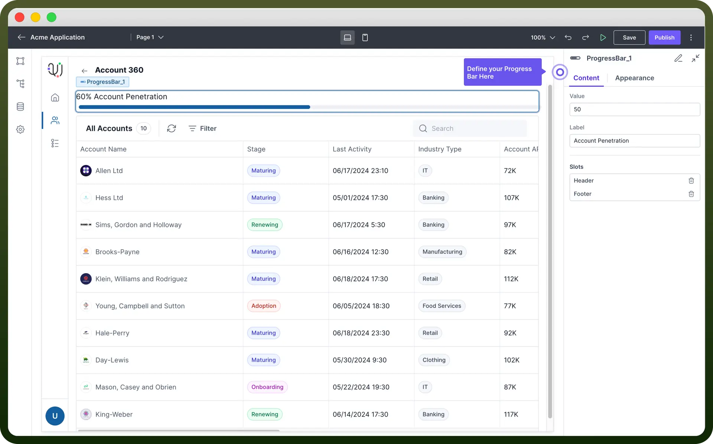
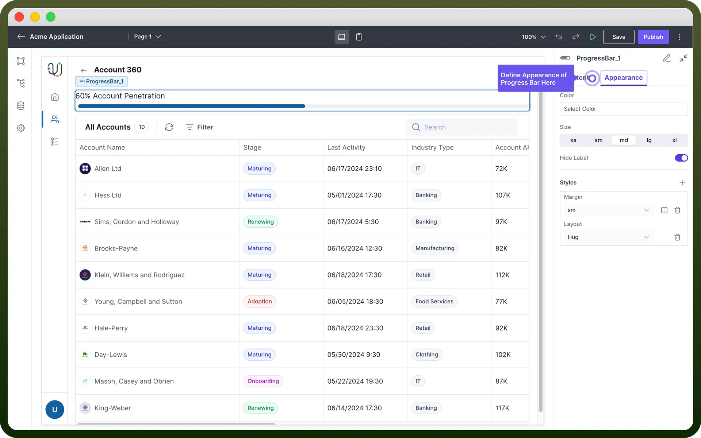

# Progress Bar component

Source: https://www.unifyapps.com/docs/unify-applications/progress-bar
Section: applications

---

## Overview

Progress Bar component is a visual element that displays the **completion status** of a task or process.

This article will guide you on how to configure the Progress Bar component.

## Key Properties

To set up a Progress Bar in your application:

1. **Drag** and **drop** the Progress Bar component onto your canvas.
2. Set the "`Value`" property to determine the progress level (e.g., 60 for 60% completion).
3. Add a "`Label`" to describe what the progress bar represents.

> **Note:** Use dynamic values for the "**Value**" property to reflect real-time data from your application.

## Add Header & Footer

Like a layout component, you can **add Slots** in Progress Bar. This allows you to add any additional component inside a progress bar.

1. Use the "`Header`" slot to add a title above the progress bar.
2. Utilize the "`Footer`" slot to include additional information or explanatory text below the bar.

> **Note:** Headers and footers are optional but can greatly enhance user understanding of the displayed progress.

## Appearance Customization

You can customize the appearance of the Progress Bar by navigating to the Appearance section in the Properties panel.

Here are the available options for customizing the Progress Bar:

| Property | Description |
|---|---|
| `Color` | Set the **color** of the progress bar. You can choose from given options & set conditional coloring as well. |
| `Size` | Determines the **height** of the progress bar. |
| `Hide Label` | Toggles **visibility** of the progress bar label. |
| `Styles` | Custom **CSS** styles for additional formatting. |
| `Margin` | Sets the external **spacing** around the progress bar. |
| `Layout` | Defines how the **progress** bar fits within its container. |

## Best Practices

- Ensure the progress bar accurately reflects the **current state** of the process it represents.
- Use **clear** and **concise** labels to describe what the progress bar is measuring.
- Choose **colors** that provide sufficient contrast for accessibility.
