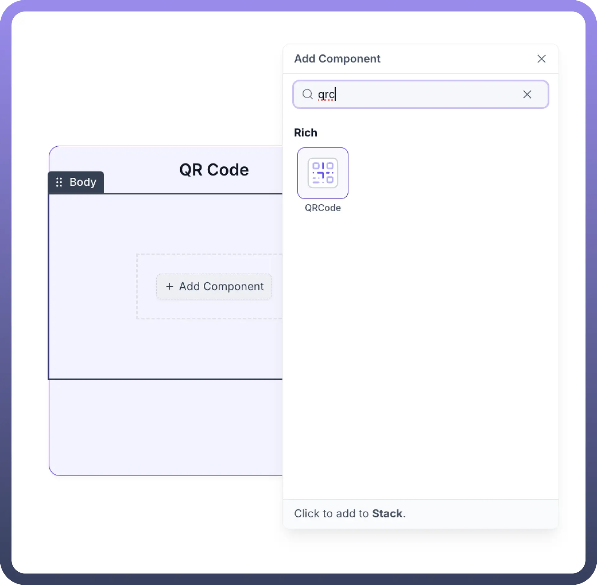
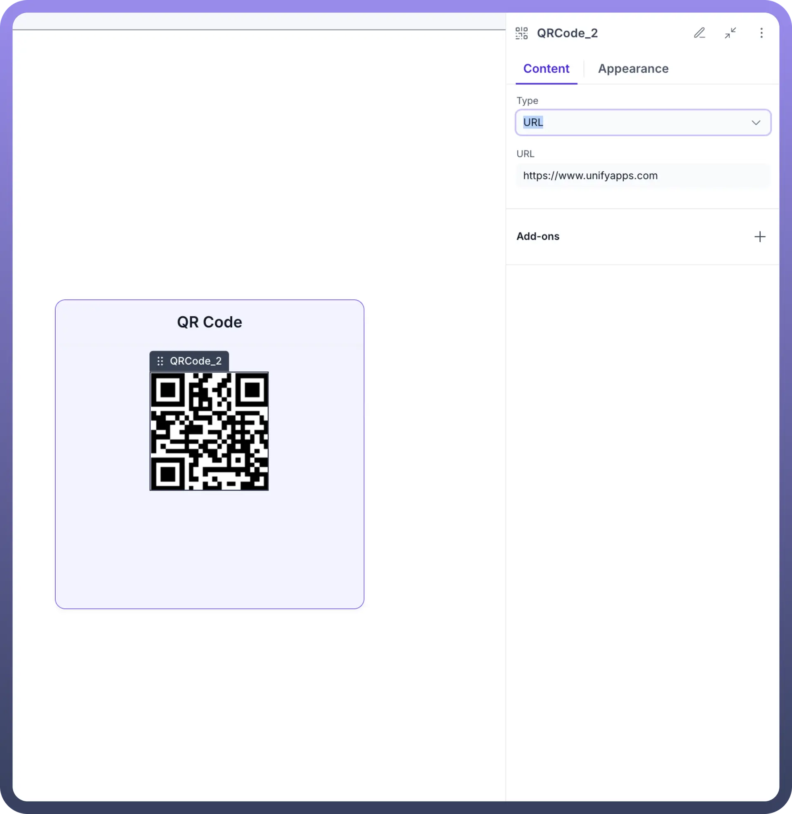
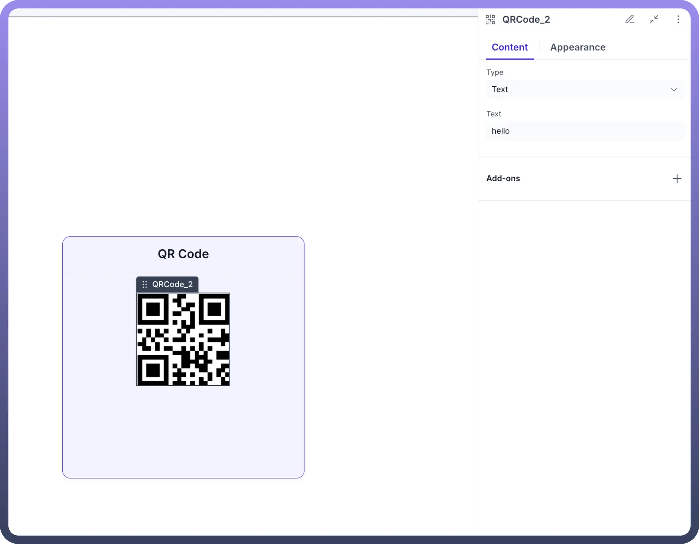
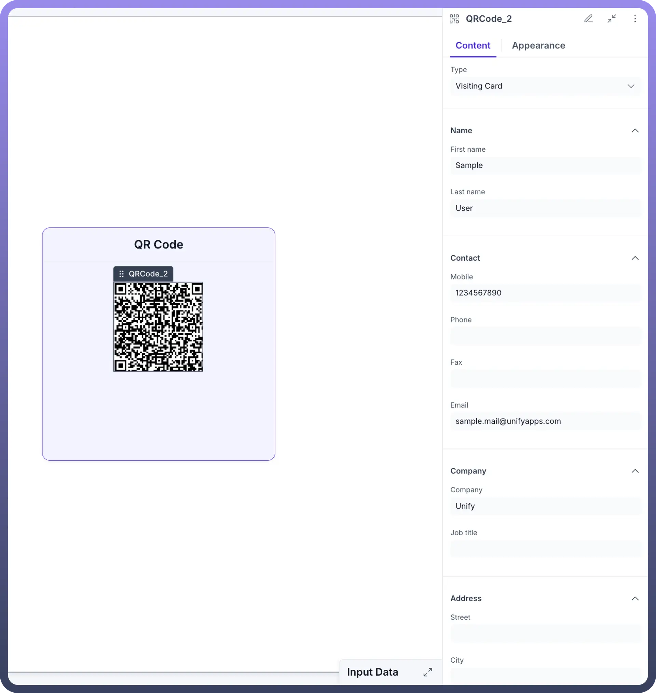
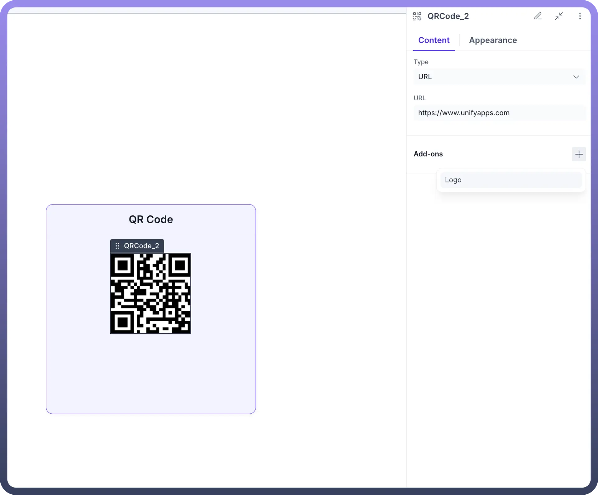
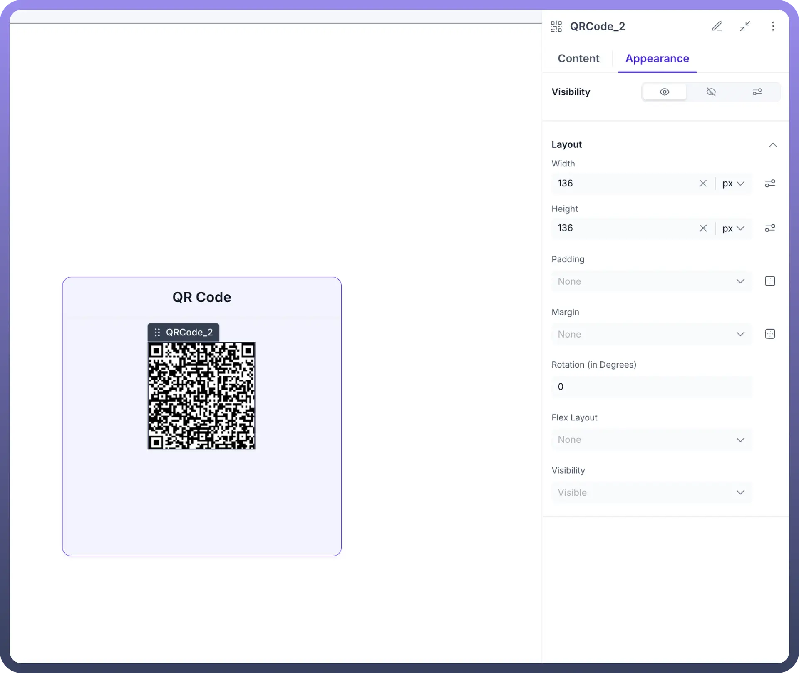

# QR Code

Source: https://www.unifyapps.com/docs/unify-applications/qr-code
Section: applications

---

## Overview

The **QR Code** component in UnifyApps lets you embed scannable codes anywhere in your pages or Stacks. Whether you need to surface a link, display a short message, or package up contact details, QR codes provide a quick, reliable way for end users to scan and act on your content.

## Key Use Cases

UnifyApps supports three main QR Code data types:

- `URL`: Instantly direct users to any web address—perfect for linking to help articles, product pages, or external dashboards.
- `Text`: Embed up to 1 KB of arbitrary text, such as an order ID, a promo code, or a brief announcement.
- `Visiting Card`: Encode contact fields (name, phone, email, company, address) so users can tap “Create New Contact” upon scanning.

By choosing the right type, you can turn any part of your app into an interactive gateway—no custom code required.

## Configuring the QR Code Component

1. **Add Component**
  - Click `+ Add Component` on your page or Stack.
  - Search for “`QRCode`” and select the **QRCode** tile.

    

2. **Content Types** Switch to the `Content` tab and pick your type:
  - `URL`
    - **Type:** URL
    - **URL field:** Enter any link (e.g. https://www.unifyapps.com)

      

  - `Text`
    - **Type:** Text
    - **Text field:** Enter your string (up to 1 KB)

      

  - `Visiting Card`
    - **Type:** Visiting Card
    - **Fields:** Populate Name, Mobile, Email, Company, Address, etc.

      

3. **Add-ons** Optionally overlay a logo on your QR code:
  - Under `Add-ons`, click `+ Logo`.
  - Provide an `Image URL`, `Alt Text`, and choose `Image Fitting`.

    

4. **Appearance** Fine-tune layout and visibility in the **Appearance** tab:
  - **Width / Height** (px or %)
  - **Padding / Margin**
  - **Rotation** (degrees)
  - **Visibility** toggles (static or rule-based)

    
