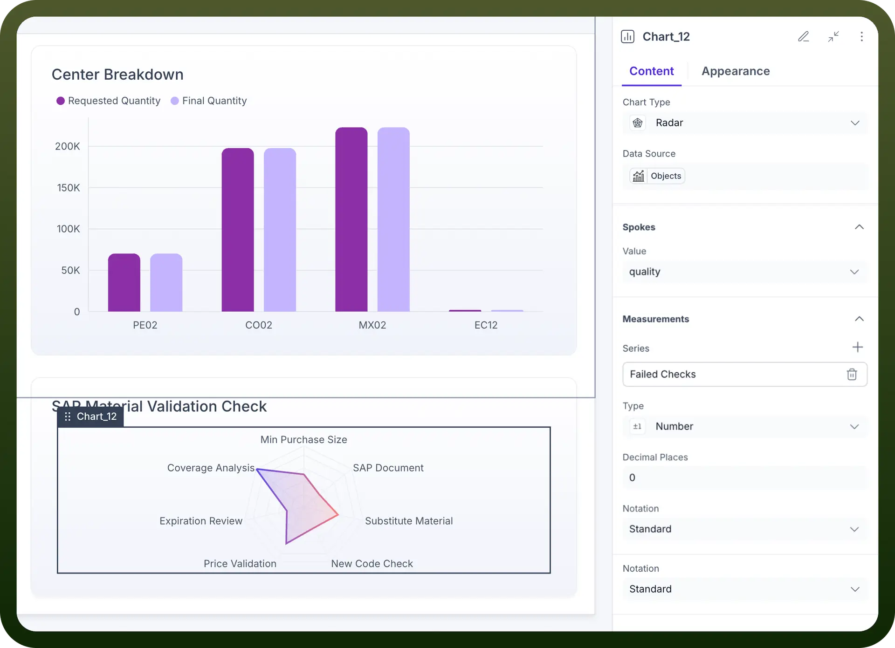
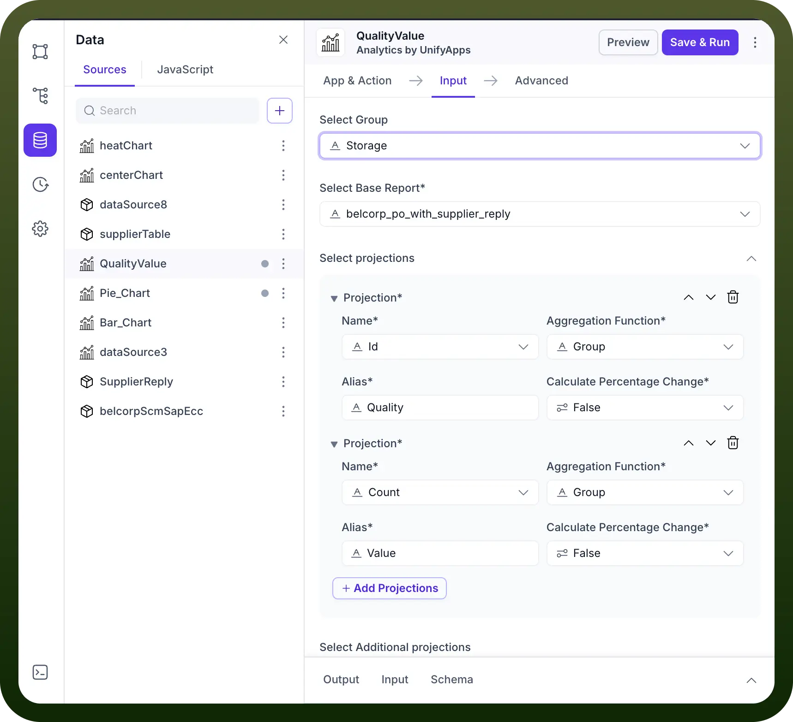

# Radar chart component

Source: https://www.unifyapps.com/docs/unify-applications/radar-chart
Section: applications

---

## Overview

The Radar Chart component is a versatile data visualization tool designed to display multivariate data in the form of a two-dimensional chart of three or more quantitative variables represented on axes (spokes) starting from the same point. This chart type excels at visualizing performance, strengths, and weaknesses across various attributes or categories, making it ideal for skill assessments, product comparisons, and analytical reporting.

Radar charts are particularly effective for visualizing multi-faceted performance, comparing entities based on several criteria, and identifying areas of strength or areas needing improvement.

## When to Use a Radar Chart

Radar charts are particularly valuable when you need to:

- **Skill Assessment:** Display an individual's or team's proficiency across various skills (e.g., communication, technical expertise, problem-solving) to identify strengths and areas for development.
- **Product Comparison:** Compare different products or services based on multiple features or attributes (e.g., cost, performance, ease of use, durability) to help in decision-making.
- **Performance Evaluation:** Visualize performance against various key performance indicators (KPIs) for a specific entity (e.g., a project, a department) to get a holistic view of its standing.
- **Customer Feedback Analysis:** Show customer satisfaction levels across different service aspects or product features to pinpoint areas requiring improvement based on feedback.
- **Risk Assessment:** Illustrate the level of risk across multiple categories (e.g., financial, operational, strategic, compliance) to highlight potential vulnerabilities.

## How to configure a Radar chart

Below are the details mentioned which describe each configuration option for Radar charts in Unify’s Application builder:

### Basic Configuration

**Chart Type**

- `Radar`: Defines the visualization type as a multi-axis, radial chart. This determines how your data will be displayed (points plotted along spokes, connected to form a polygon)

**Data Source**

- This is where the input values for the chart can be mapped
- For e.g. in the screenshot below, we have mapped a data source “`QualityValue -> Object`”, to display the values
- In turn the data source “`QualityValue`” uses "`Analytics by Unifyapps`” to fetch the values.

  

  

### Spokes Configuration

The "Spokes" section defines the categories or attributes that radiate from the center of the radar chart.

- `Value`: Defines what data field is used for the spokes (the labels around the perimeter of the radar chart). In the provided screenshot, "`quality`" is selected, meaning each distinct "`quality`" value from your data source will form a spoke on the chart.
- All the datapoints/projections available in your data source will be available for you to select under Value here

### Measurements Configuration

The "Measurements" section defines the quantitative values that are plotted along each spoke.

- `Series`: Defines what metric is being measured and displayed along the spokes. This is the primary data being visualized (the radial values). In the screenshot, "Failed Checks" is used as a series. You can add multiple series to compare different sets of measurements on the same radar chart.
- `Type`: Here, the output type can be defined in which form the numbers on the chart need to be displayed. Different options are available like:
  - **Number**: Displays values as plain numbers.
  - **Percent**: Displays values as percentages.
  - **Currency**: Displays values with currency symbols.
  - **Duration**: Displays values as durations.
  - **Decimal Places**: Allows you to specify the number of decimal places for the displayed values.
  - **Notation**: Controls the display format of large numbers. Options include:
    - **Standard**: Displays the full number (e.g., 100,000).
    - **Compact**: Displays a shortened, more readable format (e.g., 100K).
    - **Scientific**: Displays numbers in scientific notation.

### Tooltip Configuration

- `Header`: Allows you to set a title for the tooltip that appears when hovering over data points.
- `Body`: Allows you to configure the content of the tooltip body.
  - **Series Title**: Defines the title for the series within the tooltip.
  - **Data Title**: Defines the title for the data point value within the tooltip.

### Summary & Interactions

- `Summary`: This section allows you to define summary elements for your chart.
- `Interactions`: Enables you to trigger data sources, control components, or set variables in response to component events on the chart.

### Appearance Tab Parameters

The appearance tab allows you to customize the visual aspects of your radar chart.

- `Chart Colors`:
  - **Color by**: Determines how colors are applied to the chart elements. While the column chart offered "Series," "X axis value," and "Conditions", for radar charts, coloring often applies to individual series or based on conditions.
- `Legend Position`: Controls where the chart legend appears. Options include top, bottom, left, right, or hidden.
- `Axis Appearance (Radial and Angular)`: Unlike the X and Y axes in a column chart, radar charts have radial axes (spokes) and an angular axis (the circular perimeter).
  - **Ticks**: Toggle to show/hide tick marks on the axes, providing reference points for reading values.
  - **Axis Line**: Toggle to show/hide the main axis lines, providing visual structure.
  - **Grid Lines**: Toggle to show/hide the grid lines (often concentric circles and radial lines), making it easier to read values across different spokes.

## Key Configuration Tips

- **Data Source Connection**: Ensure your Output data source provides the correct data structure with fields mapped to "Spokes" and "Measurements" settings.
- **Meaningful Spokes**: Choose data fields for your spokes that clearly represent the different categories or attributes you are comparing.
- **Clear Measurements**: Define your measurement series appropriately, and utilize the "Type" and "Notation" settings for clear numerical representation.
- **Visual Clarity**: Use appropriate color schemes and enable grid lines for better readability, especially when multiple series are plotted or many spokes are present.
- **Responsive Design**: Consider how the chart will appear on different screen sizes when setting dimensions and text sizes.
