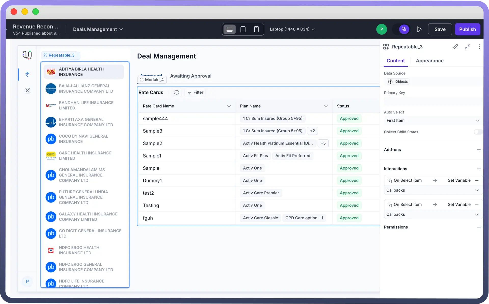

# Repeatable List

Source: https://www.unifyapps.com/docs/unify-applications/repeatable-list
Section: applications

---

## Overview

The **Repeatable List** component allows you to render a list of items based on a dynamic data array. It’s ideal when you want to loop through an array of records (such as users, products, or roles) and display each in a consistent layout block. Each repeated block can contain nested components that are automatically bound to the corresponding item in the list.

This component is useful for:

- Displaying repeated form fields or detail blocks for multiple data records
- Creating dynamic UIs that update as the data array changes
- Binding nested interactions or states to individual items

## How to Use?

1. **Add the Component:** Drag and drop the Repeatable List from the components panel onto your canvas.
2. **Bind a Data Source:** Under the Content tab, paste a JavaScript array or bind an external source (API, database, etc.) into the Data Source fields
3. **Set the Primary Key:** Use the Primary Key field to define a unique identifier (e.g., id) for each item. This is recommended to maintain stable rendering and avoid flickering when the data changes.
4. **Configure Auto Select:** You can choose to automatically select one item in the list:
  - **None** – No item selected by default
  - **First Item** – The first item is pre-selected
  - **Last Item** – The last item is pre-selected
5. **Enable Collect Child States:** Toggle Collect Child States to aggregate the states of nested components (e.g., inputs, toggles) into a single array, enabling easier batch processing or validation.
6. **Add Nested Components:** Drag UI components inside the repeatable list block to bind them to each repeated item. Each nested component will automatically refer to the current item’s fields

## Best Practices

- **Use a consistent key:** Always assign a stable and unique Primary Key if your data array changes over time.
- **Avoid heavy nesting:** Keep child components lightweight to maintain performance across large lists.
- **Leverage collected states:** Use the Collect Child States option when you need to capture form-like inputs from all repeated rows at once.
- **Control layout spacing:** Use containers or dividers inside each repeat block to manage visual consistency.
